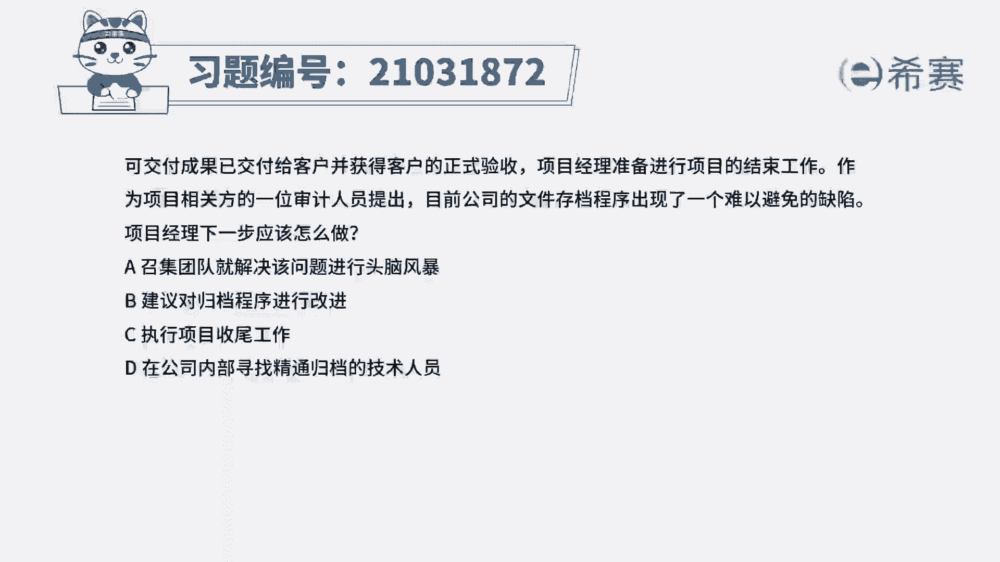
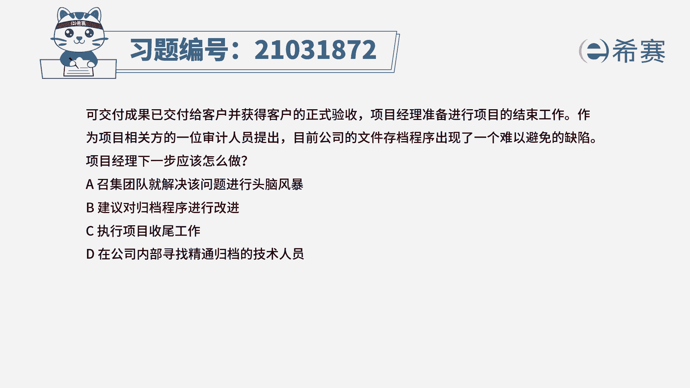
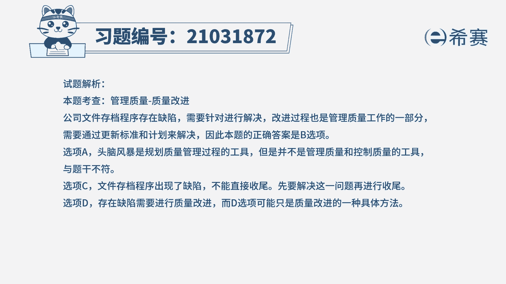
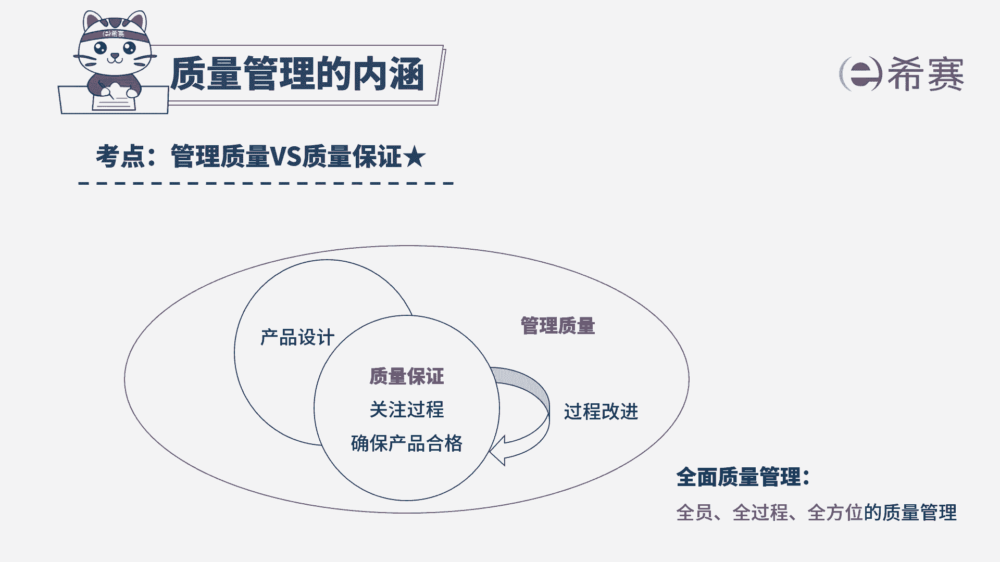

# 24年PMP考试模拟题200道，题目解读+知识点解析，1道题1个知识点（预测+敏捷） - P26：26 - 冬x溪 - BV17F411k7ZD

可交付成果已交付给客户，并获得客户的正式验收，项目经理准备进行项目的结束工作，作为项目相关方的一位审计人员，提出，目前公司的文件存档程序，出现了一个难以避免的缺陷，项目经理下一步应该怎么做。

A召集团队就解决该问题进行头脑风暴，建议对归档程序进行改进，C执行项目收尾工作，D在公司内部寻找精通归档的技术人，音乐读完题目，回答题干，我们来看一下这道题目的关键词，可交付成果，他已经交付给客户。

并且获得了客户的验收，但是审计人员发现，公司文件存档程序出现了缺陷，项目经理下一步应该怎么做，虽然可交付成膜，他已经获得了客户的验收，但是现在文件存档程序出现问题，文档它没有办法保存。

会影响到收尾阶段的进行，所以要先解决这个问题，对存档程序进行改进，才能够进行下一步的工作，所以这道题正确答案是B选项，建议对归档程序进行改进，我们再来看一下其他三个选项。

A召集团队就解决该问题进行头脑风暴，在规划质量管理活动当中，通过头脑风暴，他可以向团队成员或主题专家收集数据，用来制定最适合这个项目的质量管理计划，但是现在已经到了管理质量与控制质量的过程，题干当中。

他并不是问的事先应该怎么做，所以A选项不合适，C选项执行项目收尾工作，现在遇到问题应该解决问题了之后再进行收尾，不能够忽略这个问题，直接进行收尾工作，所以C选项排除，最后看一下D选项。

在公司内部寻找精通归档的技术人员，存在质量缺陷，它是要去进行质量改进的，寻找相关的技术人员，他只是在质量改进当中的一种可能的方法，B选项它会包含的更全面，更广泛一些，所以更为合适。

所以这道题最佳选项是B选项，这是这道题的文字解析。

有需要的同学可以暂停看一下，这道题目考察的知识点是管理质量，出现质量缺陷。

