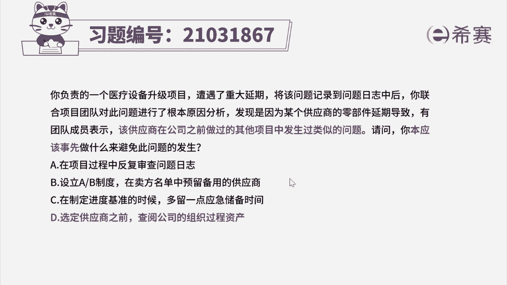
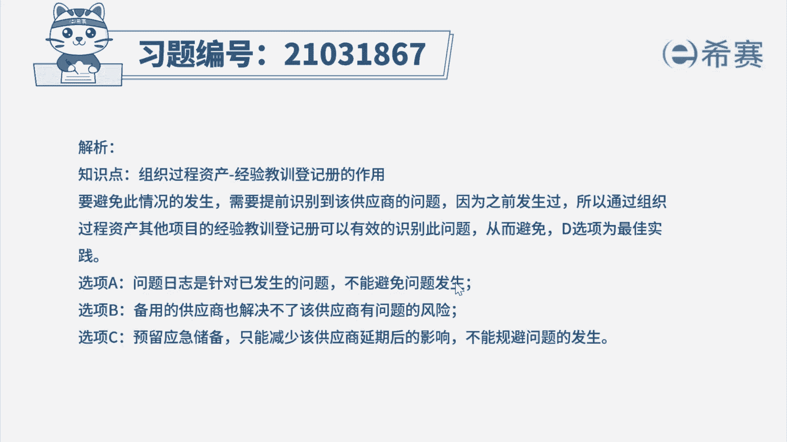
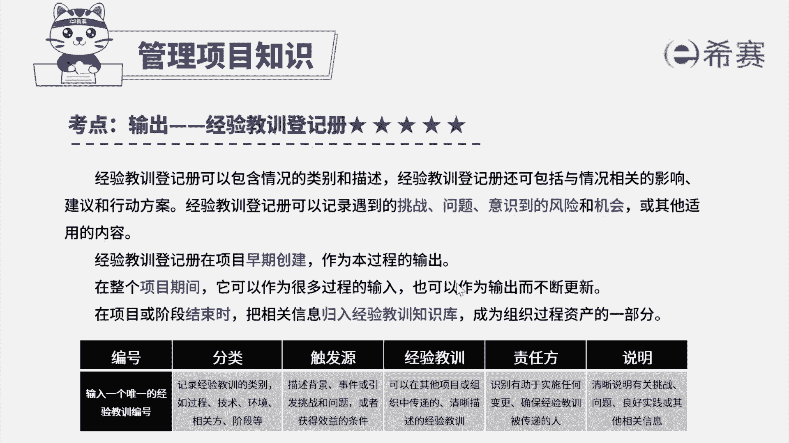

# 24年PMP考试模拟题200道，题目解读+知识点解析，1道题1个知识点（预测+敏捷） - P27：27 - 冬x溪 - BV17F411k7ZD

你负责的一个医疗设备升级项目，遭遇了重大延期，将该问题记录到问题日志中后，李联合项目团队对此问题进行了根本原因分析，发现是因为某个供应商的零部件延期，导致有团队成员表示。

该供应商在公司之前做过的其他项目中，发生过类似的问题，请问以本应该事先做什么来避免此问题的发生，A在项目过程中反复审查问题日志，B设立ab制度，在卖方名单上预留备用的供应商，C在制定进度基准的时候。

多留一点应急储备时间，D选定供应商之前查阅公司的组织过程，资产好，读完题目，我们先来看一下问题，你本应该事先做什么来避免此问题的发生，唉，再回到题干，可以看到一些关键词，供应商零部件延期。

导致项目重大延期，而且该供应商在公司之前做过的其他项目中，发生过类似的问题，要避免此情况的发生，需要提前识别到该供应商的问题，因为之前发生过，所以通过组织过程，资产其他项目的经验教训登记册。

可以有效的识别到此问题，从而进行避免，让，因此这道题的最佳选项应该是D好，再来看看其他选项，选项A问题日志是针对已发生的问题啊，不能避免问题发生，但是已经实际发生的问题，才会记录到问题日志中，选项B。

备用的供应商也解决不了，该供应商有问题的风险啊，选项C预留应急储备，只能减少该供应商延期后的影响，唉也不能避免问题的发生。

因此综合分析选项D是最佳答案，好啦，这道题我们就先讲解到这里。

大家可以自行参考一下相关的文字解析，整个题目讲解下来，我们可以知道，本题考察的知识点就是项目整合管理。

制定项目管理计划。