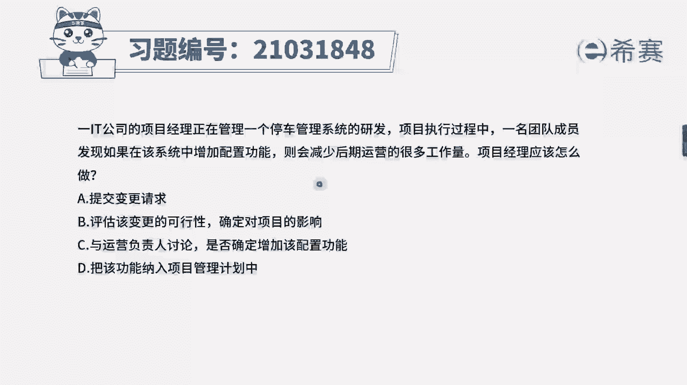
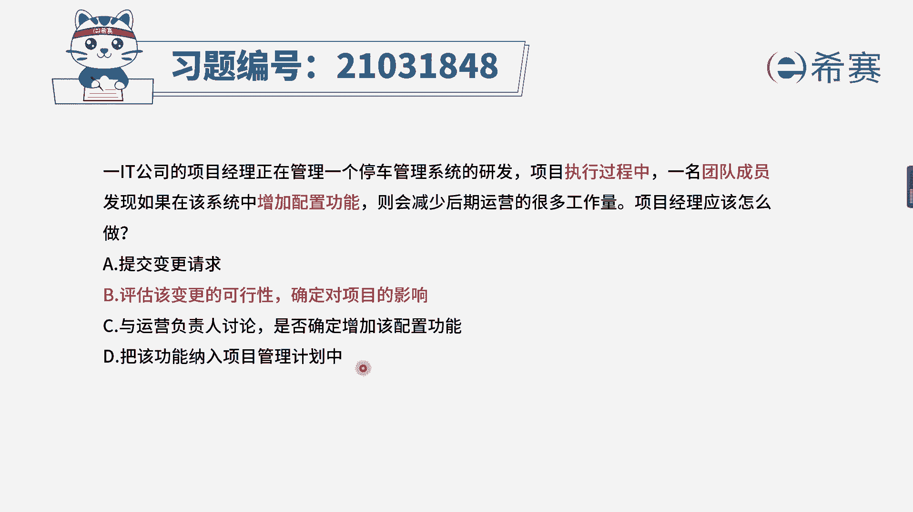
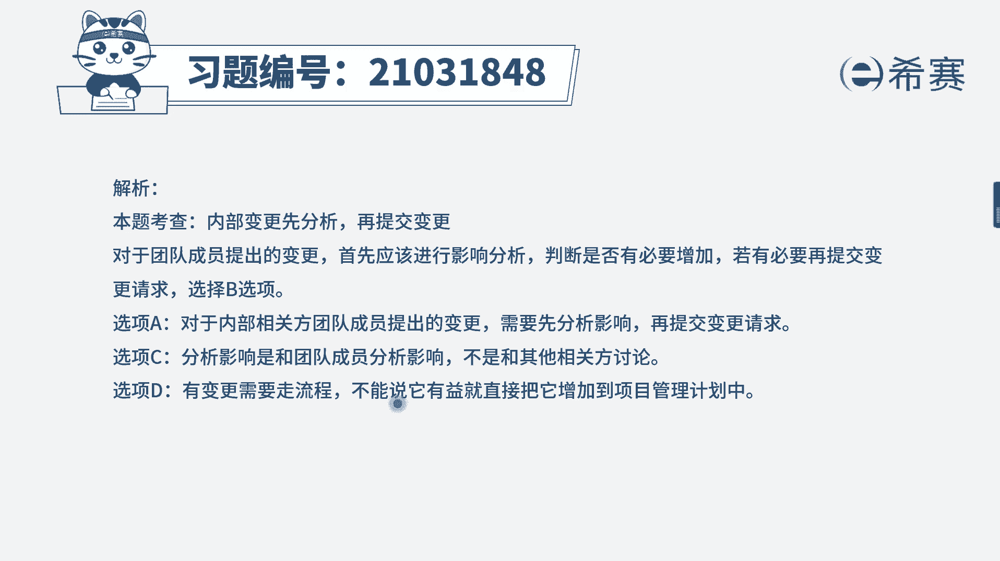
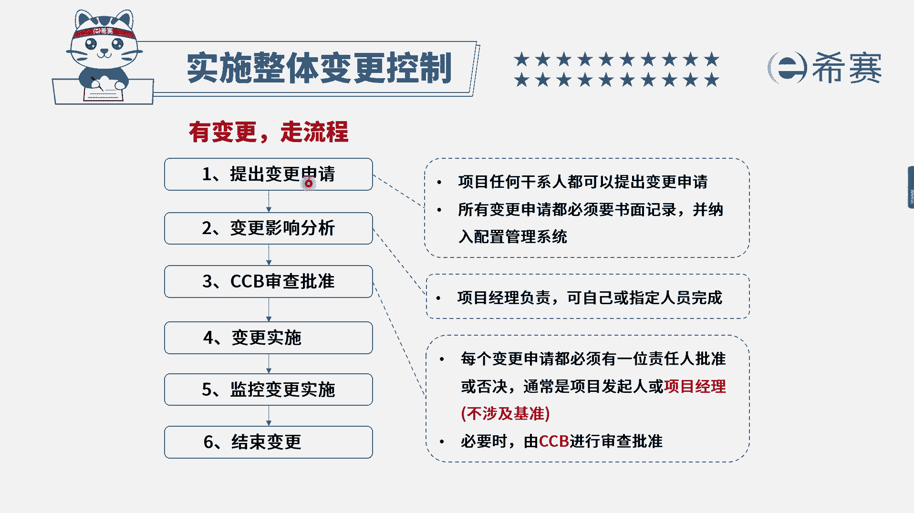

# 24年PMP考试模拟题200道，题目解读+知识点解析，1道题1个知识点（预测+敏捷） - P29：29 - 冬x溪 - BV17F411k7ZD

1it公司的项目经理，正在管理一个停车管理系统的研发，在项目执行过程中，一名团队成员发现，如果在该系统中增加配置功能，则会减少后期运营的很多工作量，项目经理应该怎么做，选项A提交变更请求选项B。

评估该变更的可行性，确定对项目的影响，选项C与运营负责人讨论，是否确定增加该配置功能选项D，将该功能纳入项目管理计划中，我们来看一下关键词，现在的时间节点是不是执行过程，谁提出变更，是团队成员内部。

相关方提出了一个增加配置功能的变更，我们注意在考试中一定要记住这两点，变更题考的很多，而变更的对象大部分都是外部相关方，少部分情况会考到内部相关方，它们的区别是外部相关方先提交变更，再分析内部相关方。

我们先分析有没有必要做，可行性如何，如果确定有必要做，再去走变更流程，回到这个第一步，这里的内部相关方是指的团队成员，注意一下，所以说，这里一名团队成员提出了一个增加功能的变更。

我们应该先分析看一下哪个选项是不是B选项，评估该变更的可能性，确定对项目的影响就符合，所以为正确答案，再来看一下其他选项，A选项提交变更请求，这是很多同学容易选错的，注意A选项在这个题目中。

它是B之后的内部先分析再提交，再来看C选项，与运营负责人讨论是否增加该配置功能，这就是一个坑，因为题干确实说了，他的目的是为了减少后期运营的一个工作量，你去问一下别人，好像是有必要。

但是到底是不是应该增加功能，不是运营负责人和项目经理讨论就可以决定的，我们还是应该有变更，走流程，最后D选项打开功能纳入项目管理计划中，相当于是直接接受了这个功能，项目经理是无权直接决定的。

所以综合分析下来。

我们选择B选项，大家可以看一下文字解析部分。

这是一个常规的变更流程，在这个基础上变更请求提出之前，如果是内部团队成员提出的，我们在这个之前应该还有一个步骤。

