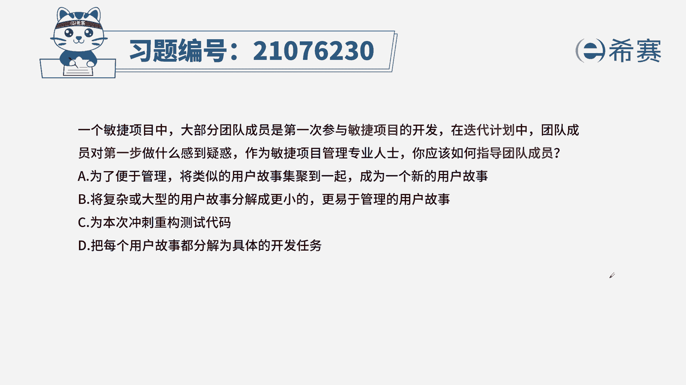

# 24年PMP考试模拟题200道，题目解读+知识点解析，1道题1个知识点（预测+敏捷） - P3：3 - 冬x溪 - BV17F411k7ZD

一个敏捷项目中，大部分团队成员是第一次参与到，敏捷项目的开发，在迭代计划中，团队成员对第一步做什么感到困惑，作为敏捷项目管理专业人士，你应该如何指导团队成员诶，为了便于管理，将类似的用户故事集聚到一起。

成为一个新的用户故事，将复杂或大型的用户故事分解成更小的，更易于管理的用户故事，C为本次冲刺重构测试代码，D把每一个用户故事都分解成具体的开发任务，本题的考法是最佳实践，首先通过题干找到关键信息。

敏捷项目我们在做迭代的计划，确定一下本次迭代要做哪些事情，我们来看四个选项，为了便于管理，我们将类似的用户故事变成一个用户故事，那此项的描述是有问题的，他们即便是类似，也代表了不同的需求和功能。

你放到一起就会造成我们到底如何去做呢，因为他们还有优先级的排序，B将复杂或大型的用户故事分解成小的，更易于管理的用户故事，那这项描述是在我们迭代计划会议上要做的，就是当大的不好管理。

我们需要把它细分细化，再进行优先级排序，这样一来也便于我们在本次迭代中的工作，C为本次冲刺重构测试代码，这一项是在我们确定完本次用户故事之后，要做的事情，D将每一个用户故事分解成任务。

这也是在B项内容之后要做的。

从而我们选出正确选项为B选项，这是本题的解析。

本题的相关知识点，冲刺计划会议，针对这个知识点，我们一定要从内容上去下手，同时我们要知道这次会议上我们要做哪些事情，有哪些人参加，什么时候召开，再了解一下其他会议的内容。

