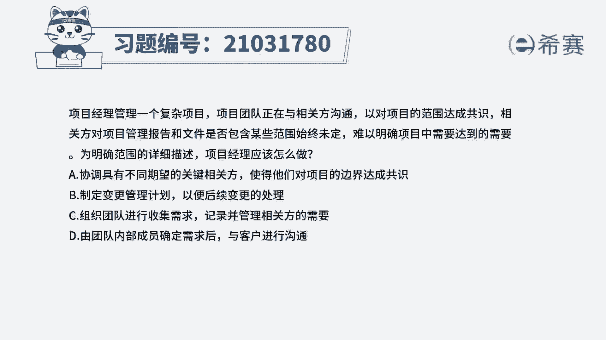
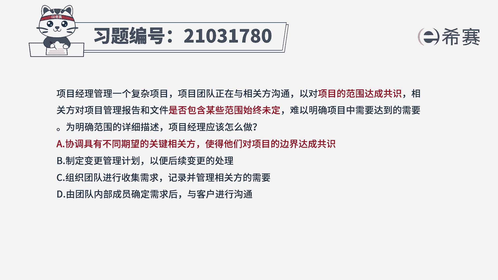
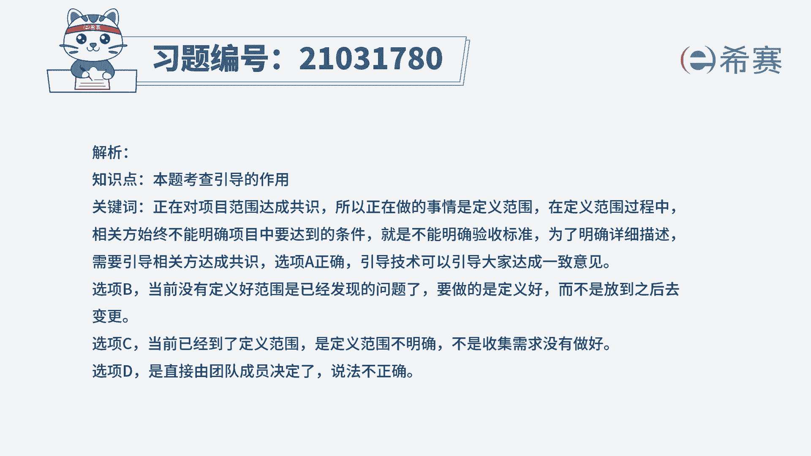
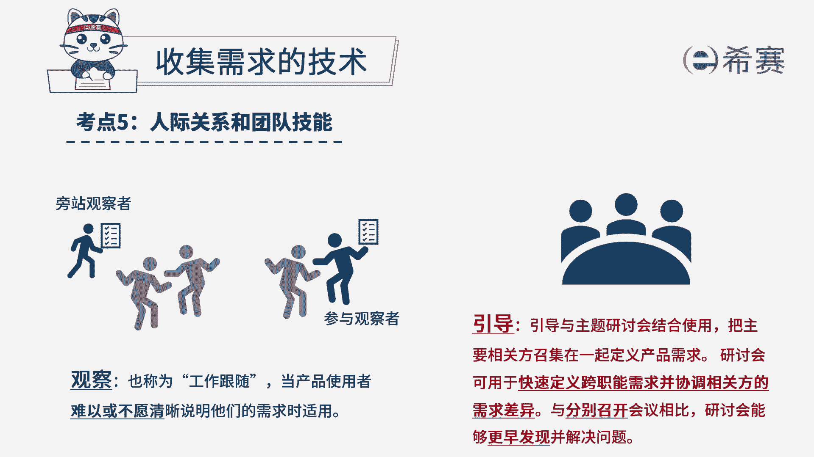

# 24年PMP考试模拟题200道，题目解读+知识点解析，1道题1个知识点（预测+敏捷） - P32：32 - 冬x溪 - BV17F411k7ZD

项目经理管理一个复杂项目，项目团队正在与相关方沟通，以对项目的范围达成共识，相关方对项目管理报告和文件，是否包含某些范围始终未定，难以明确，项目中需要达到的需要，未明确范围的详细描述。

项目经理应该怎么做，协调具有不同期望的关键相关方，使得他们对项目的边界达成共识，制定变更管理计划，以便后续变更的处理，C组织团队进行收集需求记录，并管理相关方的需要，D由团队内部成员确定需求后。

与客户进行沟通，好回答题干，我们来看一下关键词，对项目的范围达成共识，也就是说我们现在正在做的事情是在定义范围，在定义范围的过程中，相关方他始终不能明确项目中要达到的条件。

也就是说它不能够明确验收的标准，所以为了明确详细的描述，需要引导相关方达成共识，所以这道题我们选择A选项，下面我们来看一下其他选项，选项B制定变更管理计划，以便后续变更的处理，当前没有定义好范围。

是已经发现的问题，要做的就是定义好范围，而不是放到我们之后再去变更，所以这一个选项不是特别的积极，有点被动，再来看C选项，组织团队进行收集需求记录，并管理相关方的需要，现在已经到了定义范围。

是定义范围不明确，不是收集需求没有做好，所以C选项也排除，D选项，由团队内部成员确定需求后与客户沟通，那这个选项，他直接就是说由团队成员内部决定了，然后再去跟客户进行沟通，那这个说法不正确。

所以这道题最佳时间是A选项。

这是这道题的文字解析，有需要的同学可以暂停看一下。

那这道题考察的知识点是项目范围管理当中。

