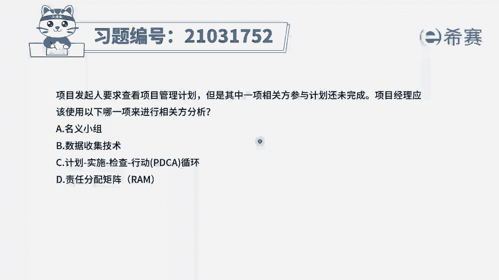
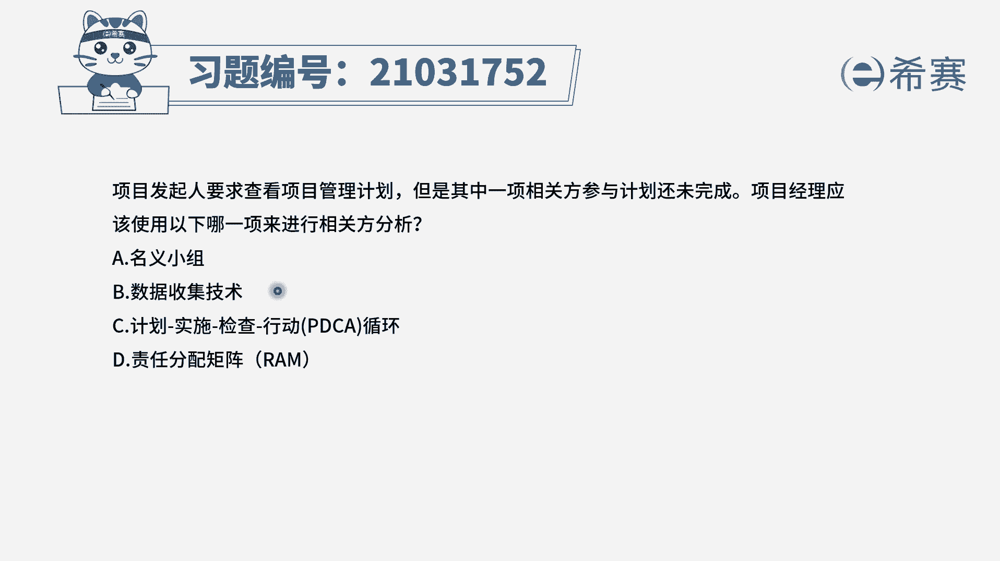
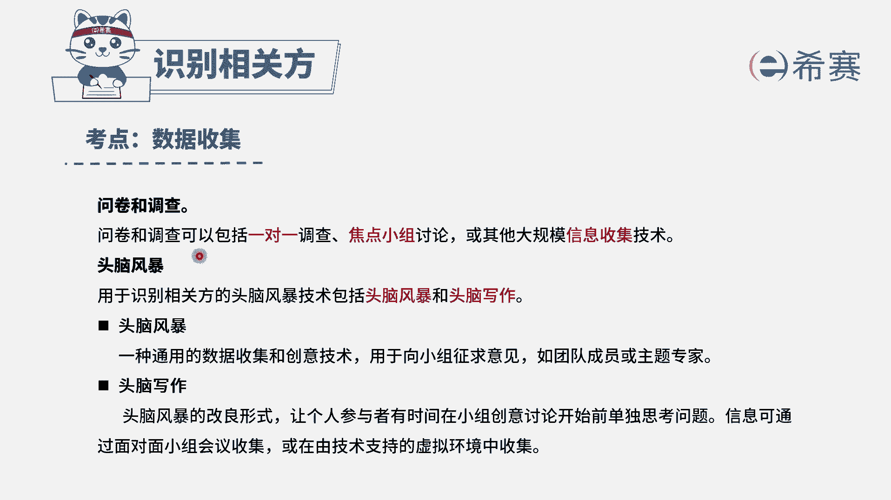
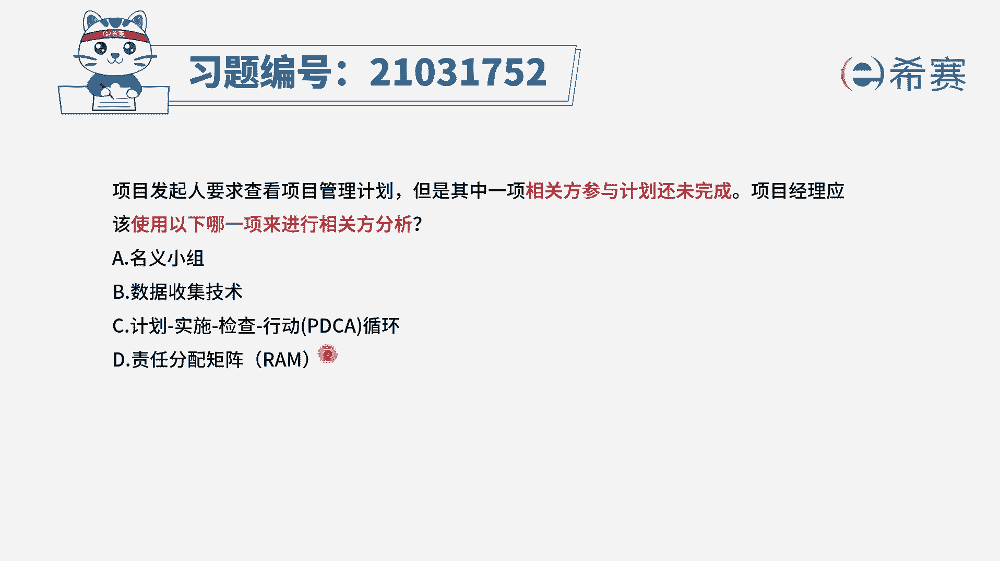
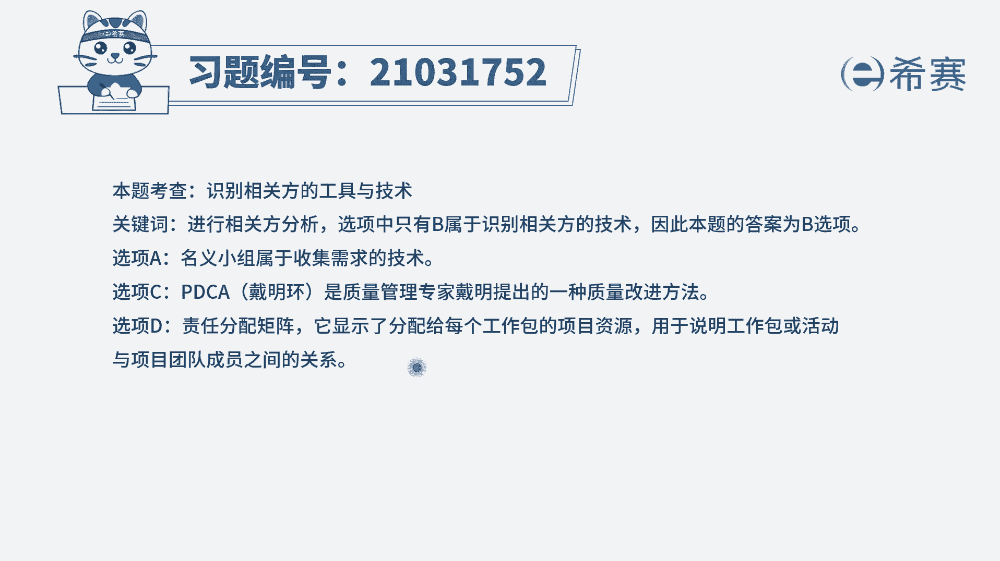

# 24年PMP考试模拟题200道，题目解读+知识点解析，1道题1个知识点（预测+敏捷） - P33：33 - 冬x溪 - BV17F411k7ZD

项目发起人要求查看项目管理计划，但是其中一项相关方参与计划还未完成，项目经理应该使用以下哪一项来进行，相关方分析，选项A名义小组选项，B数据收集技术选项，C计划实施检查行动。

PDCA循环选项D责任分配举证RAM好，我们先来看一下题干问的是什么，他问的是，我们应该使用以下哪一项来进行向官方分析，什么是相关方分析，相关方分析，它是指我们如果要得到关于相关方的各种信息。

比如说在组织内的位置，在项目中的角色，包括与项目的利害关系，期望对项目的知识程度，对项目的兴趣等等，如果需要知道这些信息，我们就要进行相关方的分析，那么哪个选项跟相关方分析有关呢，相关方分析。

它本身是识别相关方的一个工具技术，那么我们定位到的就是识别相关方，这个过程组，看一下四个选项做排除，只有B选项，数据收集，它是属于识别相关方的工具技术，那么数据收集技术它包含哪几项呢。

包括问卷调查以及头脑风暴这两种形式，我们可以通过这两种形式，对相关方的信息进行收集，然后再去基于这些信息进行相关方的分析。

因此B选项是可选的，再来看一下其他几个选项，A选项民意小组，名义小组，他是我们进行头脑风暴之后，我们经过清河图梳理，得到一些有用的价值之后，我们去对头脑风暴中的信息进行一个投票。

所以说A选项它是对信息进行投票的一个工具，技术一般是在收集需求时使用，跟识别相关方本身没有关系，C选项pd c，我们看到这个就知道它是一种质量改进的方法，与题干无关，最后D选项责任分配矩阵。

大家可能会被这个误导，责任分配矩阵它的对象是资源，而并不是相关方的职责，所以说D选项也是错误的，因此综合分析下来，只有B选项是正确的。

