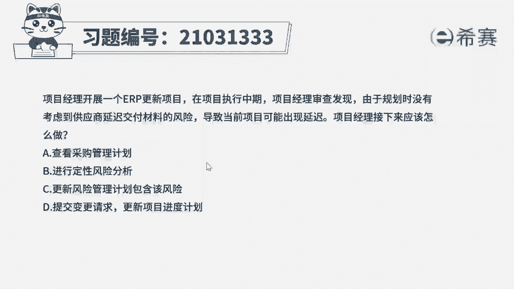
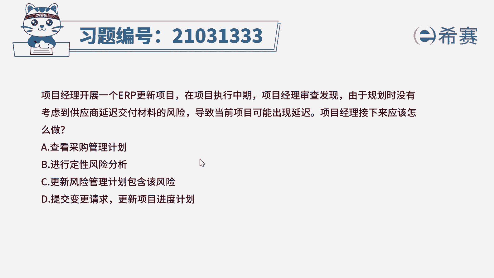
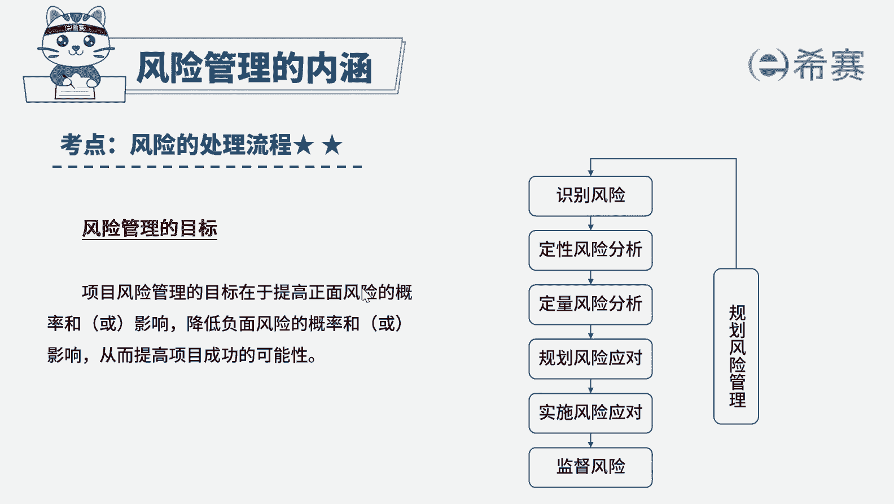
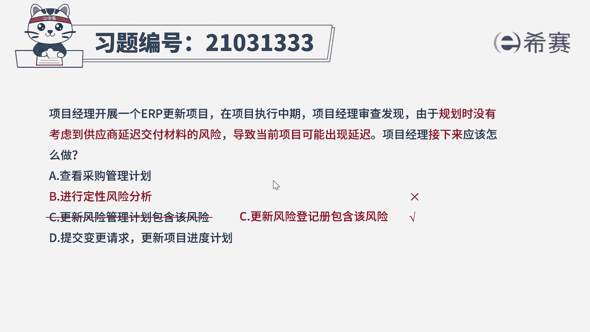

# 24年PMP考试模拟题200道，题目解读+知识点解析，1道题1个知识点（预测+敏捷） - P35：35 - 冬x溪 - BV17F411k7ZD

项目经理开展一个ERP更新项目。

在项目执行中期，项目经理审查发现，由于规划时没有考虑到供应商，延迟交付材料的风险，导致当前项目可能出现延迟，项目经理接下来应该怎么办，A查看采购管理计划，B进行定性风险分析。

C更新风险管理计划包含该风险，B提交变更请求，更新项目进度计划好，读完题目，我们先来看一下问题，项目经理接下来应该怎么做，哎回到提高，我们可以看到一些关键词，由于之前没有考虑供应商会延迟交付。

导致我们的项目可能出现延迟，这个可能非常抢眼，说明是识别到了危险，那识别到危险，下一步做什么哎，说明考察的是风险的处理流程。

我们先来回顾一下风险的处理流程，先识别风险，然后定性风险分析得有必要的风险，我们可以进行定量分析好，那再规划风险应对，如果风险发生了，哎，我们去实时飞行应对，大家对这个流程一定要非常熟悉啊。

那我们再回到题干中，这道题的答案就直接定位到选项B，定性分析分析唉，再来看看其他选项，选项A采购管理，计划是指导采购管理的指南性文件，题干中虽然有提到供应商，那若要与供应商沟通。

也不是参考采购管理计划啊，和沟通有关好，所以A选项不合适，选项C本身说法是错误的，风险管理计划是风险管理的指南性文件，并不会记录具体的风险，好选项D当前题干只是说可能会延迟。

目前还是风险还不需要提交变更请求好，接下来我们思考一下啊，如果选项C改为更新风险登记册，包含该风险，那我们该选哪一个呢，那我们这个时候就应该选更新风险登记册了，虽然我们刚刚说风险处理有一个流程。

但是大家一定要记住我们的每一步做完之后，都需要更新风险登记册，所以如果有更新风险登记册，那就优先选风险登记册好了，我们这道题就先讲解到这里。

