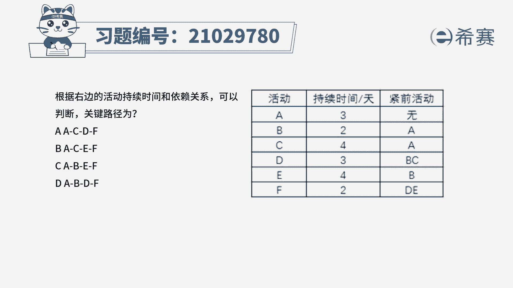
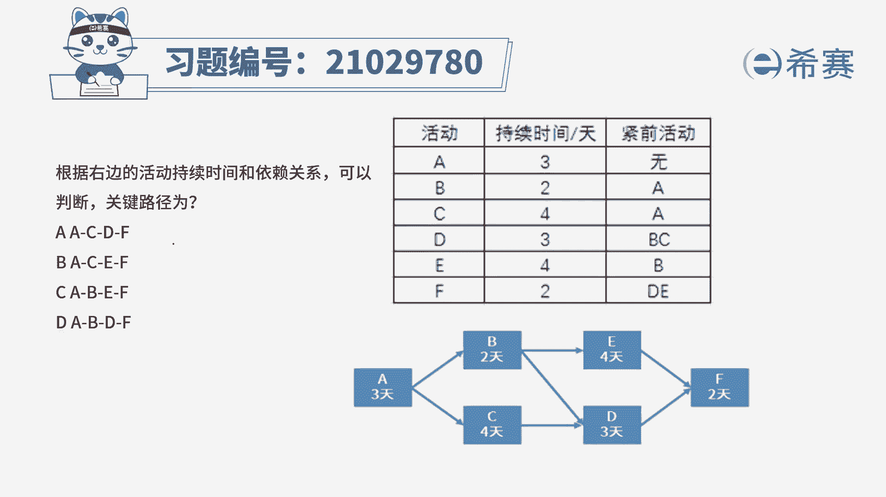
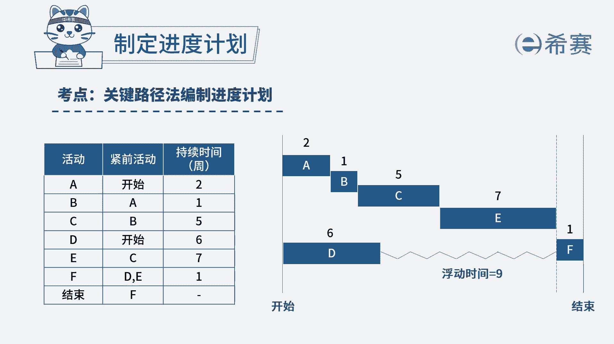
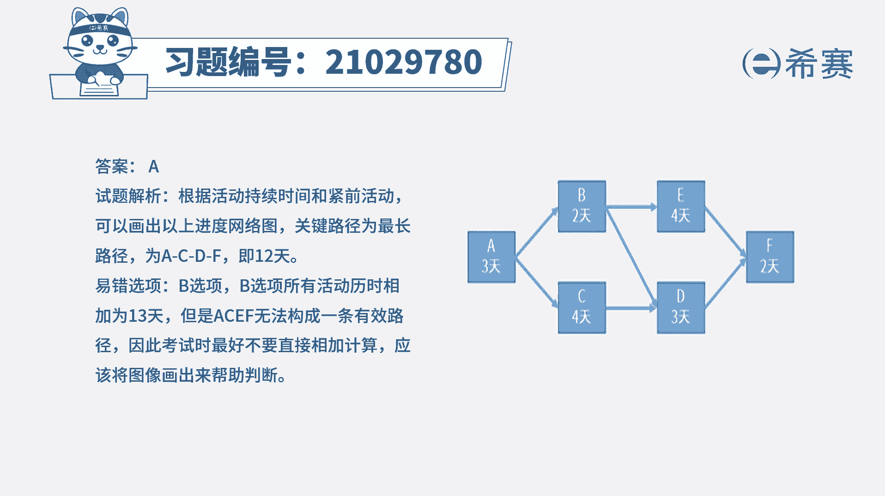

# 24年PMP考试模拟题200道，题目解读+知识点解析，1道题1个知识点（预测+敏捷） - P38：38 - 冬x溪 - BV17F411k7ZD

根据右边的活动持续时间和依赖关系，可以判断关键路径为AACDFBACEF，C a b e f a b d f，读完题目，我们可以知道这道题是在考察关键路径。

所以我们先根据图表信息来画出进度，网络图，我们可以看到下面的网络图总共是有三条路径，分别是ABEFABDF，还有ACDF，所以我们分别算出三条路径的总耗时，首先第一条路径ABEF的总耗时。

可以算出来是11天，第二条路径ABDF的总耗时，可以算出来是十天，最后一条AC df总耗时是12天，所以这里问关键路径是什么，关键路径就是总耗时最长的那条路径，就是12天，那对应的就是ACDF这条。

所以A选项正确，所以本题的答案就是A选项。

本题考察的知识点是项目进度管理中。

