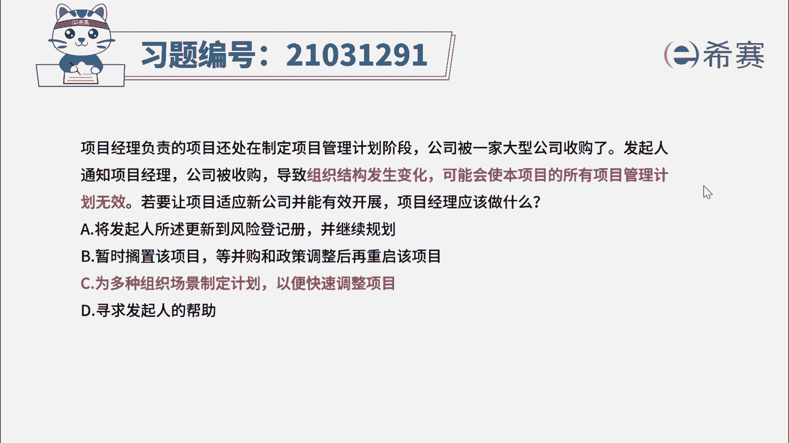

# 24年PMP考试模拟题200道，题目解读+知识点解析，1道题1个知识点（预测+敏捷） - P39：39 - 冬x溪 - BV17F411k7ZD

项目经理负责的项目，还处在制定项目管理计划阶段，公司被一家大型公司收购了，发起人通知项目经理，公司被收购，导致组织结构发生变化，可能会使本项目的所有项目管理计划无效，若要让项目适应新公司并能有效开展。

项目经理应该做什么，A将发起人所述更新到危险登记册，并继续规划，B暂时搁置该项目，等并购和政策调整后再重启该项目，C为多种组织场景制定计划，以便快速调整项目，D寻求发起人的帮助，好读完题目。

我们先来看一下问题，若要让项目适应新公司，并能有效开展项目经理应该怎么做，唉再回到题干，可以看到一些关键词，公司被收购，组织结构发生变化，可能使项目管理计划无效。

大家注意组织变更是属于事业环境因素的变更，应该要做一些可能的备选方案，所以我们把答案直接定位到选项C好，再来看看其他选项，选项A更新到风险登记册中，注意风险登记册是识别了风险才去更新的。

但是本题更侧重在如何应对和解决问题唉，所以相比之下，选项C会更优，谁上B太过于消极，不能完全不准备直接放弃好选项D，找发起人帮助是一种消极做法，除非超出项目经理自己权限的。

否则项目经理应该主动去想办法解决事情。

好了，这道题我们就先讲解到这里，大家可以自行参考一下相关的文字解析。

整个题目讲解下来，我们可以知道，本题考察的知识点就是项目整合管理。

