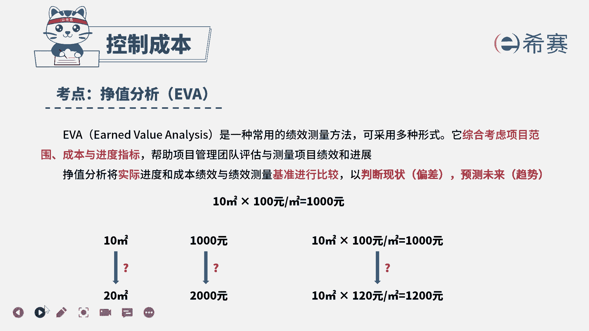

# 24年PMP考试模拟题200道，题目解读+知识点解析，1道题1个知识点（预测+敏捷） - P40：40 - 冬x溪 - BV17F411k7ZD

项目经理正在管理一个设计项目，在项目中期，项目团队成员报告项目经理，项目关键路径上的进度绩效指数pi为0。91，项目整体的SPI为1。13，项目经理如何判断该项目的状态，A项目没有风险且符合进度。

B项目有风险但符合进度，C项目有风险且进度落后，第一项目没有风险且进度超前，首先看到题干的关键词，项目关键路径上的进度绩效指数，SPI为0。91，但是项目整体的SPI为1。13，问项目的状态如何。

我们可以知道进度绩效指数SPI小于一，说明进度落后，SPI等于一，说明进度和基准保持一致，SPI大于一，说明进度是超前的，虽然项目的整体的SPI等于1。13，但是关键路径上的SPI等于0。91。

是小于一的，那么说明非关键路径上的进度是超前的，但是关键路径上的进度却是落后的，只有关键路径才可以决定项目的工期，所以项目的进度是落后的，进度落后说明准时完成项目就是有风险的。

因此本题的正确答案就是C选项。

看一下本题的解析，本题的考察点是成本管理，控制成本政治分析的内容，政治分析是将实际进度和成本，绩效与绩效测量基准进行比较，从而可以实现判断现状和测量基准之间的偏差。

