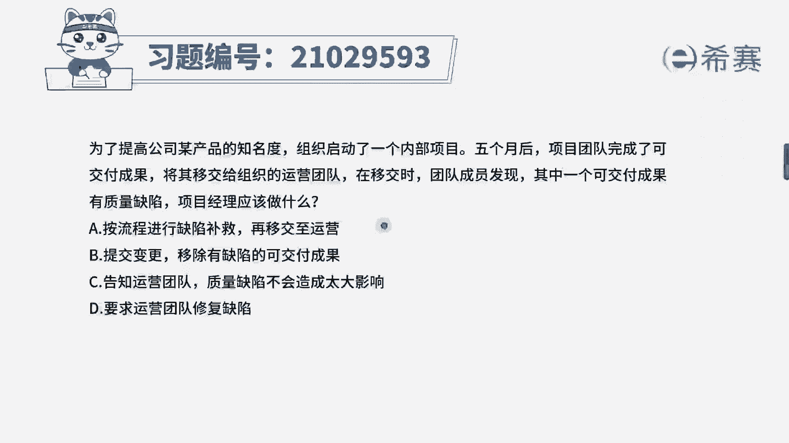
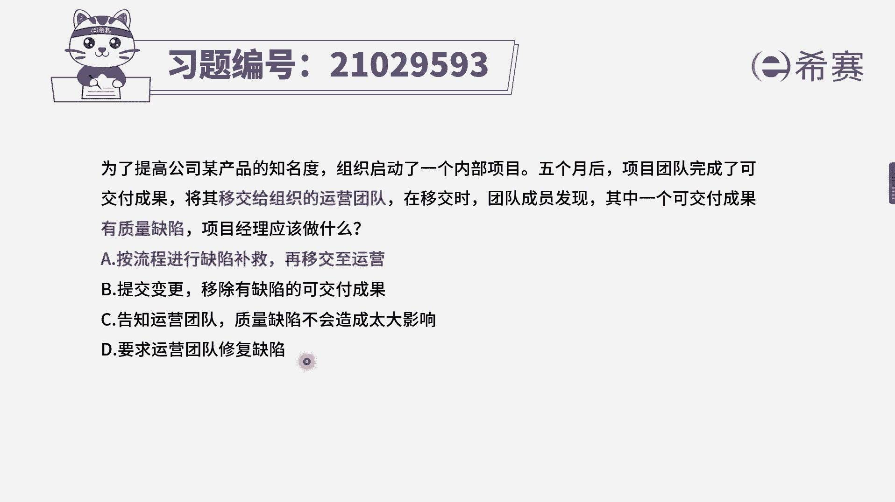
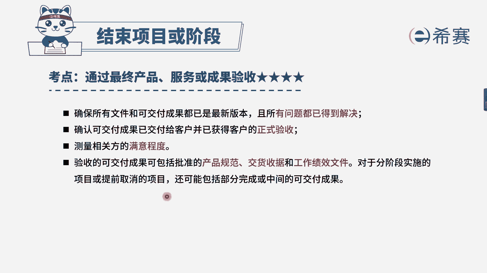

# 24年PMP考试模拟题200道，题目解读+知识点解析，1道题1个知识点（预测+敏捷） - P42：42 - 冬x溪 - BV17F411k7ZD

为了提高公司某产品的知名度，组织启动了一个内部项目，五个月后，项目团队完成了可交付成果，将其移交给组织的运营团队，在移交时，团队成员发现其中一个可交付成果有质量缺陷，项目经理应该做什么。

选项A按流程进行缺陷补救，再移交至运营选项B提交变更请求，移除有缺陷的可交付成果，选项C，告知运营团队质量缺陷不会造成太大影响，选项D要求运营团队修复缺陷，我们来看一下关键词。

现在的时间节点是不是正在进行移交，还没有移交完成，这个时候发现可交付成果有质量问题，那我们应该要进行缺陷补救，要进行确认，不就应该要走流程，看一下选项A是按流程进行缺陷补救，再移交至运营。

这个说法是对的，B选项提交变更请求，A前半句是没有问题的，但是它的目的是什么，是移除有缺陷的可交付成果，相当于有质量问题，我干脆不要了，这个做法肯定是不行的，C选项告知运营团队质量缺陷。

不会造成太大的影响，在考试中，这种选项是不符合项目经理的职业道德的，我们肯定不会选，最后D选项要求运营团队修复缺陷，这个选项它的时间节点不对，因为我们还正在移交，并不是已经归由运营去管理了。

如果说已经移交完成了，并且项目团队已经收尾完成，都已经解散了，这个时候才有运营来进行一个质量问题的负责，所以说综合来说，在这个时间节点，我们应该按照流程去进行缺陷补救，然后再进行营销。

大家可以看一下文字解析部分，本题考察的是。

