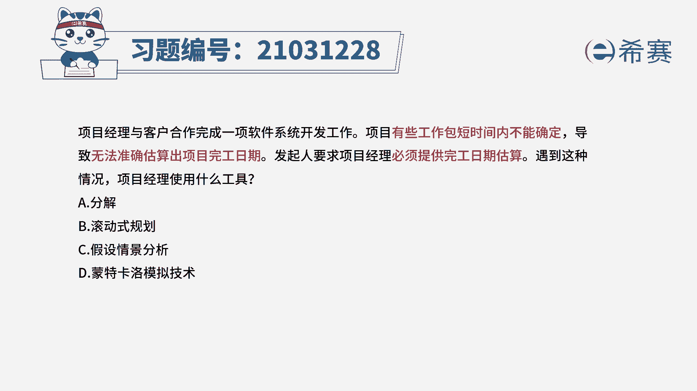
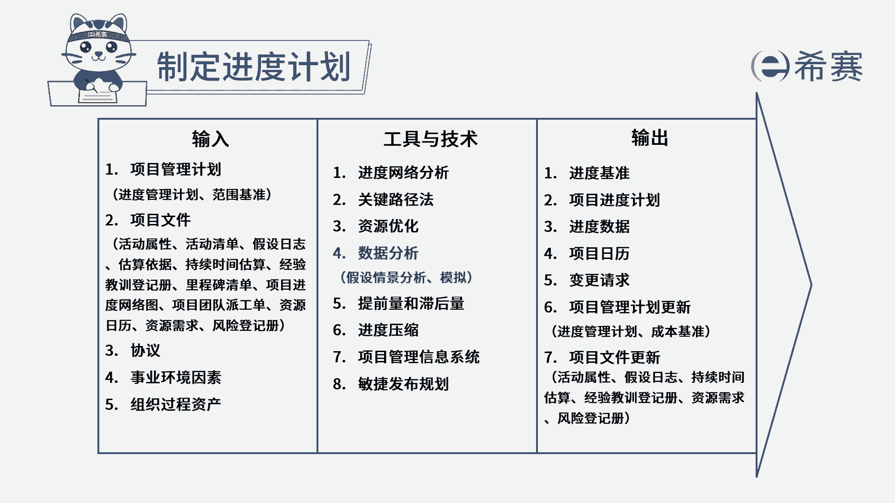
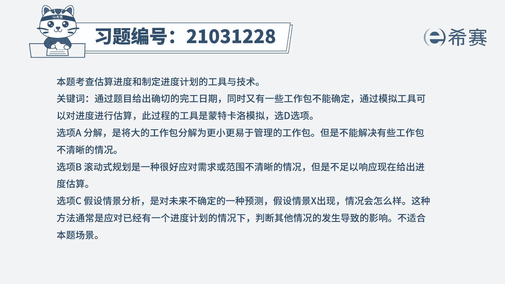

# 24年PMP考试模拟题200道，题目解读+知识点解析，1道题1个知识点（预测+敏捷） - P43：43 - 冬x溪 - BV17F411k7ZD

项目经理与客户合作，完成一项软件系统开发工作，项目有些工作包短时间内不能确定，导致无法准确估算出项目完工日期，发起人要求项目经理必须提供完工日期估算，遇到这种情况，项目经理使用什么工具。

A分解B滚动式规划，C假设情景分析，蒙特卡洛模拟技术，读完题目，我们可以找到题干中的关键句，题干说现在有些工作包短时间内不能确定，所以无法准确估算出项目的完工日期。

但是现在发起人要求必须提供完工日期估算，问项目经理要使用什么工具，其实也就是问的用什么来确定进度计划，制定进度计划中，会使用到各种工具技术来进行进度估算，比如关键路径法，假设情景分析和模拟分析等。

这些进度网络分析的方法，都是制定进度计划会用到的，所以我们先看CD选项C选项，假设情景分析是对未来不确定的一种预测，假设情景一出现情况会是怎么样，而且假设情景分析一般是在有了进度计划之后。

去判断其他情况的发生会带来什么影响，以此来调整进度计划，但是与本题题干没有关系，我们再看D选项，D选项是可选的，蒙特卡洛模拟技术是制定进度计划中，通常会使用的模拟技术，就是通过使用一个模型。

计算项目各细节方面的不确定性，对项目目标的潜在影响，以此来估算项目的进度，我们再看ab选项，ab两个选项都与制定进度计划无关，分解只是将大的工作包分解成更小，更易管理的工作包。

不能解决题干中说的工作包不清晰的问题，而滚动式规划一般是用于应对需求或范围，不清晰的情况，不能去估算时间，所以ab都不选，因此本题最佳的答案就是D选项。

本题考察的知识点是项目进度管理中。

