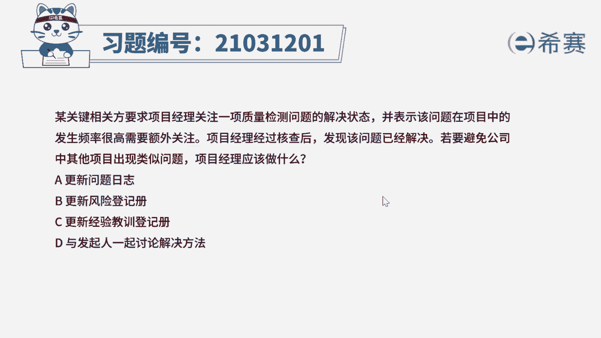
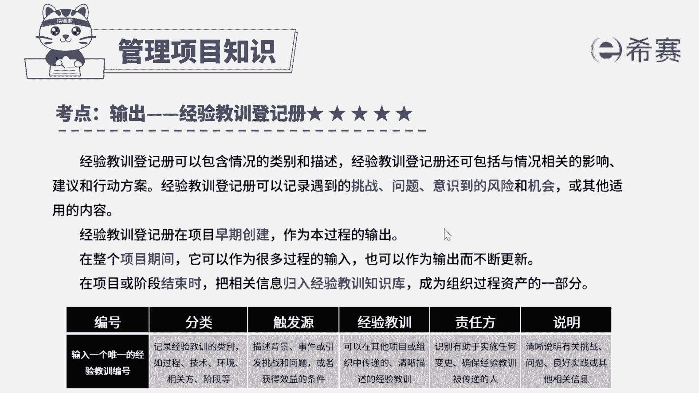

# 24年PMP考试模拟题200道，题目解读+知识点解析，1道题1个知识点（预测+敏捷） - P45：45 - 冬x溪 - BV17F411k7ZD

某关键相关方，要求项目经理关注一项质量检测问题，的解决状态，并表示该问题在项目中的发生频率很高，需要额外关注，项目经理经过核查后发现该问题已经解决，若要避免公司中其他项目出现类似问题。

项目经理应该做什么，A更新问题日志D更新风险登记册，C更新经验教训登记册，D与发起人一起讨论，解决方法好，读完题目，我们先来看一下问题应该做什么，唉，再回到题干，可以看到一些关键词。

质量检测问题需要高度关注，但此项目中该问题已经被解决，若要避免公司中其他项目出现类似问题，注意避免这两个字，就是说希望未来其他项目不会出现这个问题，那么就需要更新经验教训。

根据测总结经验教训为其他项目做参考啊，确保有效吸取经验教训，不出现类似的问题啊，所以这道题的最佳选项应该是选项C好，再来看看其他选项，选项A问题日志并不能为其他项目提供参考，只用作记录问题状态。

选项B这里是已经发生的问题，并不是风险，不需要更新风险登记册啊，神上D除非超出项目经理自身权限，才考虑找发起人，这里还在项目经理解决范围内，所以不需要找发起人好了，这道题我们就先讲解到这里。

大家可以自行参考一下相关的文字解析，整个题目讲解下来。

我们可以知道本题考察的知识点就是经验教训。