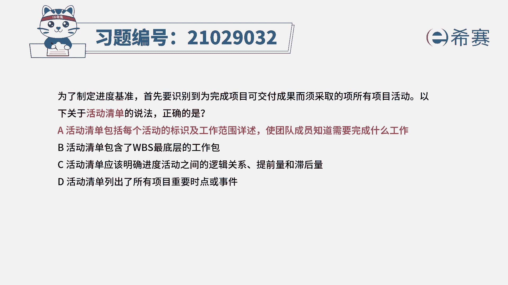
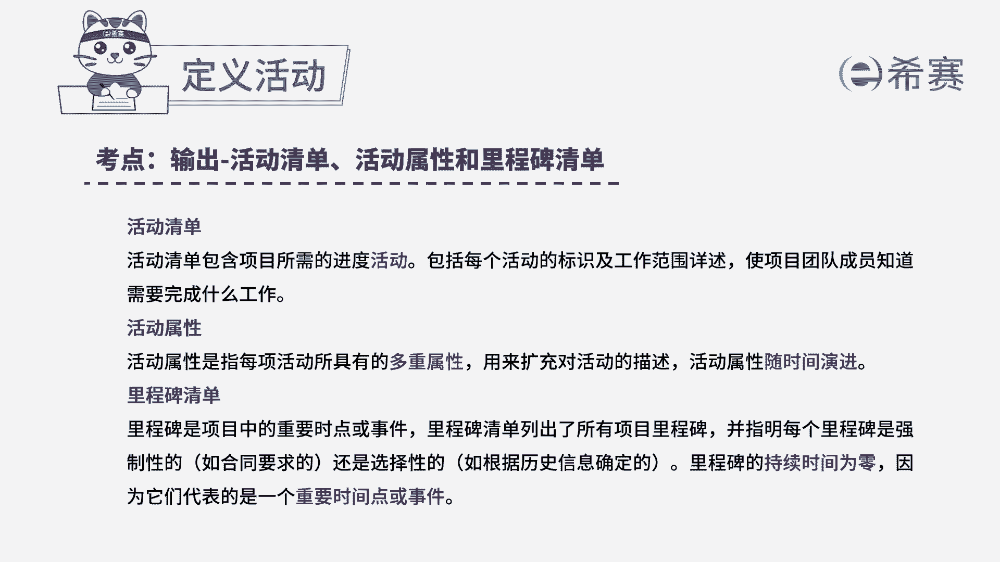
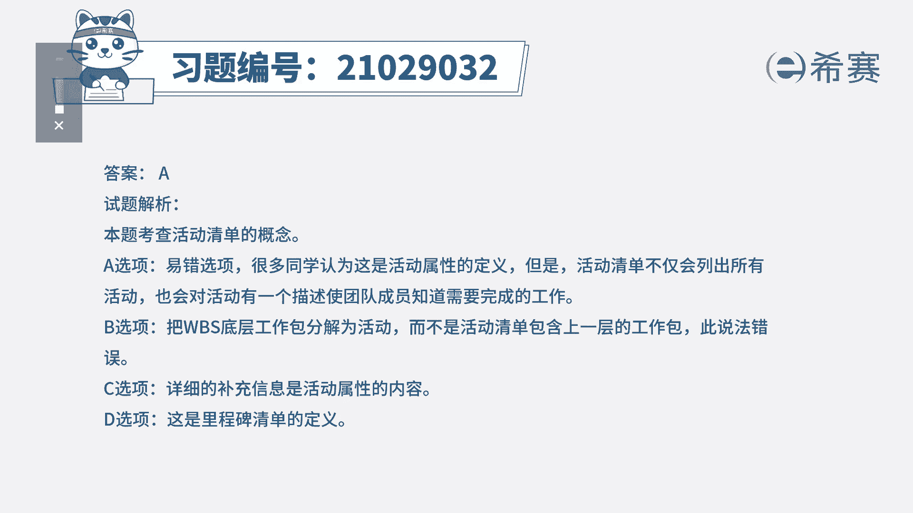
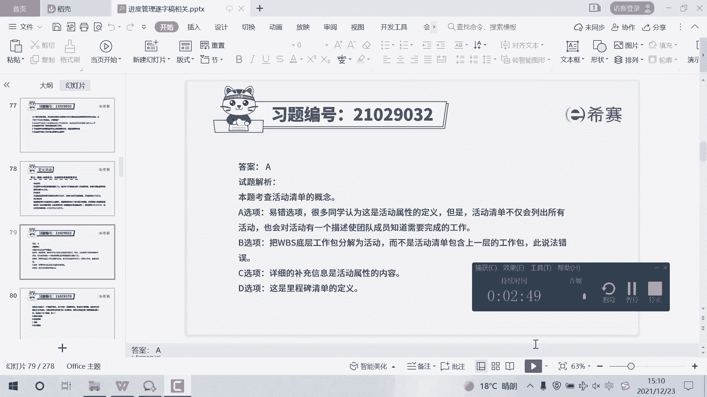

# 24年PMP考试模拟题200道，题目解读+知识点解析，1道题1个知识点（预测+敏捷） - P49：49 - 冬x溪 - BV17F411k7ZD

为了制定进度基准，首先要识别到未完成项目可交付成果，而需采取的所有项目活动，以下关于活动清单的说法正确的是，A活动清单包括每个活动的标识及工作范围，详述，使团队成员知道需要完成什么工作。

B活动清单包含了WBS最底层的工作包，活动清单应该明确进度活动之间的逻辑关系，提前量和滞后量，D活动清单列出了所有项目重要时点或视线，D活动清单列出了所有项目重要时点或事件，读完题目。

我们可以找到题干中的关键句，题干说的是关于活动清单的说法，正确的是什么，所以这道题考察的就是活动清单的概念，活动清单包含项目所需的进度，活动以及每个活动工作范围的详细描述，使团队成员能够知道。

需要完成什么工作，所以A选项就是活动清单的定义，所以A选项正确，我们再看其他选项，先看B选项，定义活动，可以将WBS最底层的工作包继续分解，而在定义活动之后才能去得到活动清单，所以这里说活动清单包含。

所以这里活动清单包含了工作包的，这个说法是错误的，我们再看C选项，C选项属于活动属性的内容，不是活动清单的内容，C不选，最后看D选项，D选项是属于里程碑清单的内容，也不选，因此本题最佳的答案就是A选项。

本题考察的知识点是项目进度管理中。

