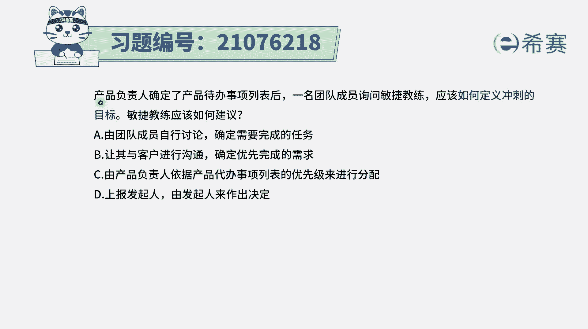
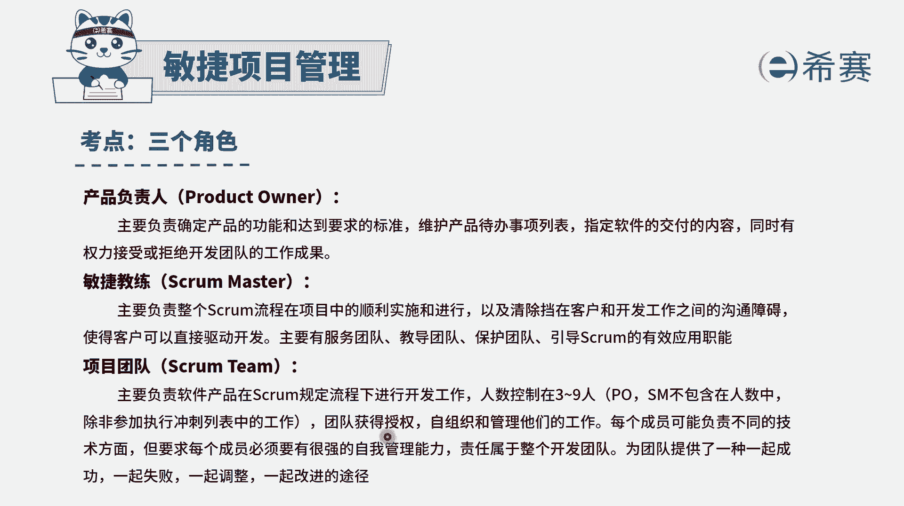
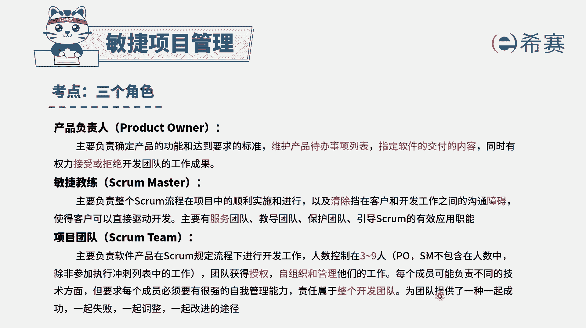
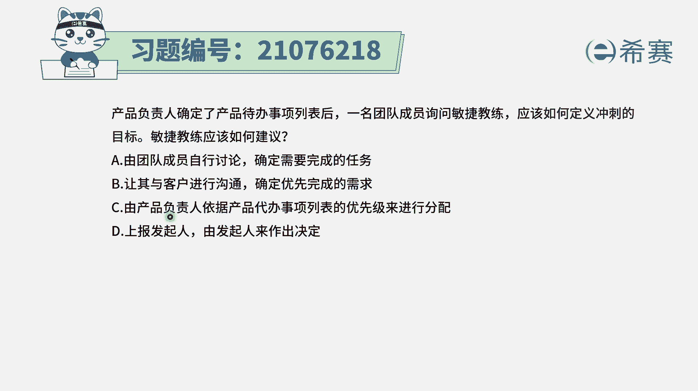
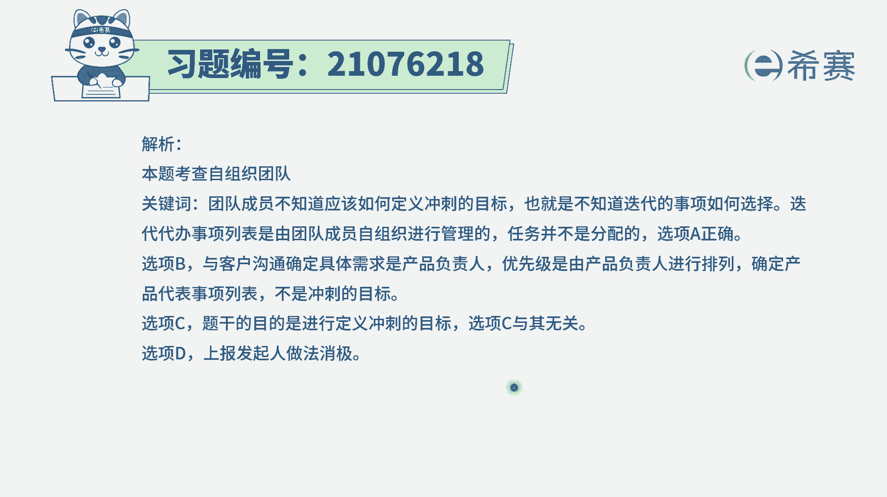

# 24年PMP考试模拟题200道，题目解读+知识点解析，1道题1个知识点（预测+敏捷） - P5：5 - 冬x溪 - BV17F411k7ZD

产品负责人确定了产品待办事项列表以后，一名团队成员询问，敏捷教练应该如何定义冲刺的目标，敏捷教练应该如何去建议呢，那这里其实会有一个问题啊，就是说已经告诉你有了这个产品代办事项列表。

那产品富人已经是对这些产品代办事项列表，进行排序以后呢，我们其实有一个基本的行为举措的方式，这个基本的行为举措，就是由团队的成员和产品负责人一起来协商，来说，这一次的冲刺都要做哪些事情。

同时在敏捷项目中会有这样一个信息，就是项目团队成员是一个自组织团队，他这个自主谈的是获得授权的。

是自我组织，自我管理的是大家一起去成功，一起去历经的。

有了这些信息以后，我们来看一下，那到底谁来去定义这个冲刺的目标呢，学校由团队成员自行讨论，来确定需要完成的任务，也就是说我们一起来共同讨论，决定哪些事情优先完成，这个其实是一个可选项啊。

选项B让其与客户来进行沟通，来确定优先级，这个就不合适了对吧，这是你自己内部的事情，反正客户说我要什么，我要什么，我要什么，那具体哪些事情怎么样去做，其实是产品负责已经是排了顺序以后。

团队就开始去做选项，C，由产品负责人，依据产品待办事项列表的优先级来进行分配，那这样的话呢，团队成员他其实就是没有这种自主性在里面，就完全由产品负责人，这个选项呢其实不合适，隋炀帝善报发起人。

由发起人来决定发起人，他才没那个闲工夫来管理这些很细节，具体的事情呢，所以这里的话只有A选项可以选，其实最合适的是什么，最合适的应该是产品负责人和产品团队，一起来共同讨论。

说这一个冲刺中需要去完成是哪些事情，那为什么不能是直接由这个产品负责人，来去确定呢，因为要做的事情有很多，那到底哪一些用户故事，他需要花多少时间，这一次从事能做多少，只有做的人才会最清楚。

在座的人才会最清楚的这个前提下，那肯定优先选的是让座的人，由团队成员来自行讨论决定，比起由领导来去派任务会更好一些。

答案选A，那解析呢在这边需要的同学可以自行查看一下。

