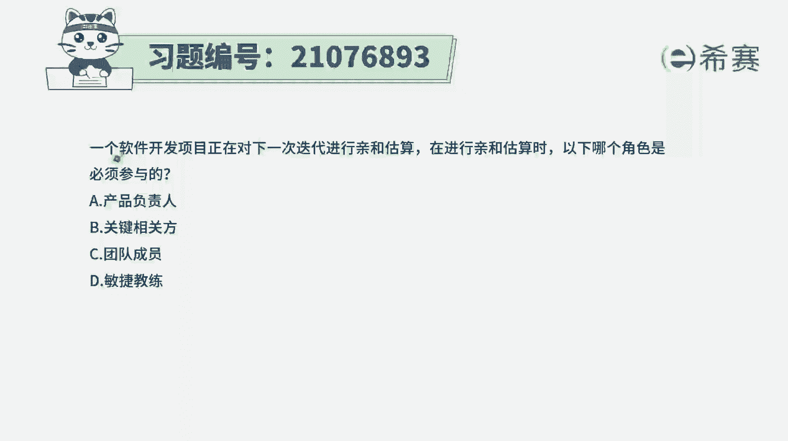
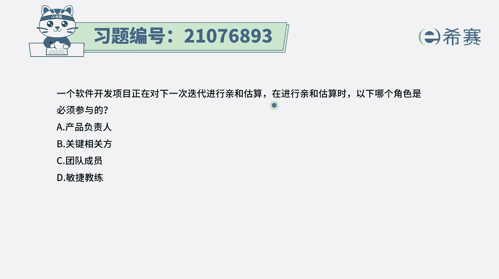
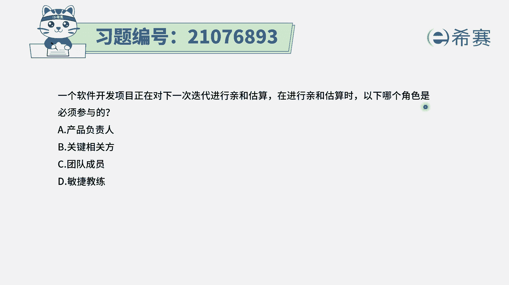
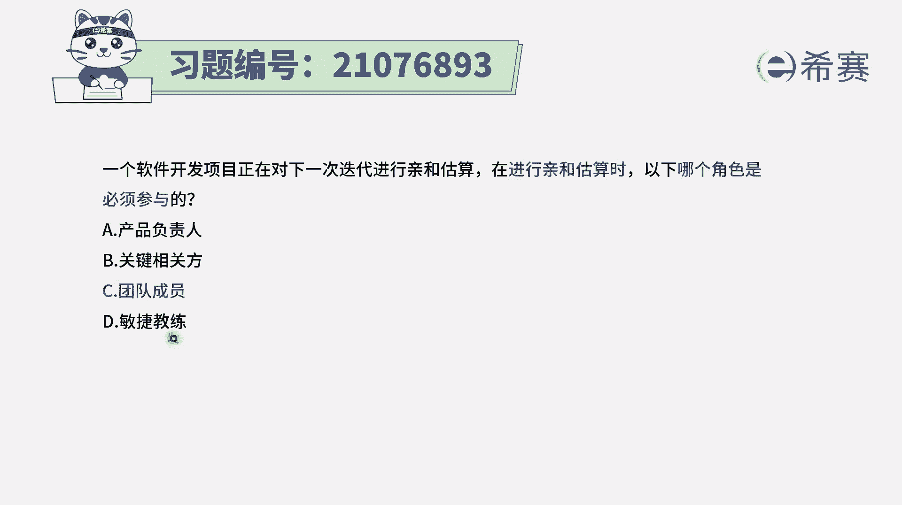
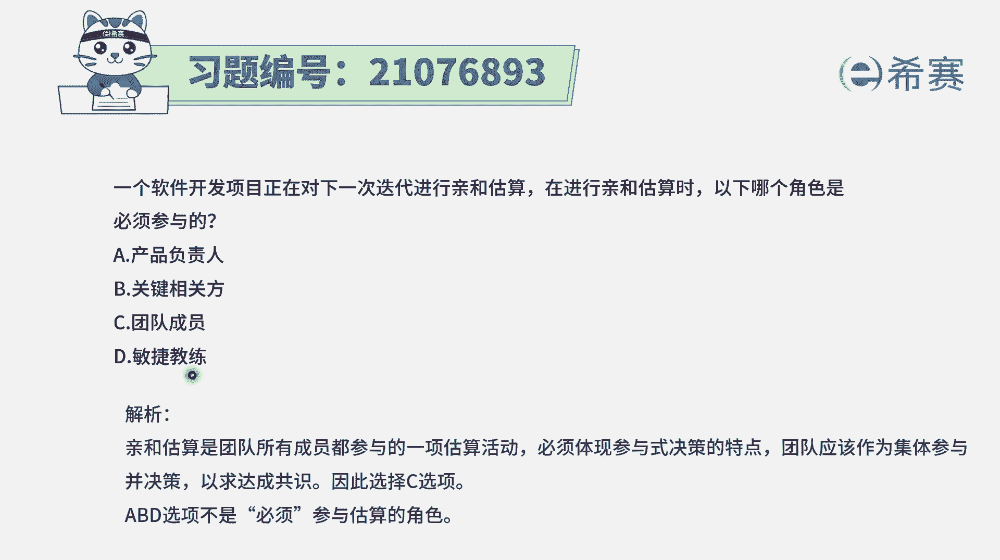

# 24年PMP考试模拟题200道，题目解读+知识点解析，1道题1个知识点（预测+敏捷） - P52：52 - 冬x溪 - BV17F411k7ZD

一个软件开发项目，正在对下一次迭代进行亲和估算。

在进行氢和估算时，以下哪一个角色是必须参与的。

那我们得要知道一个很重要的点，通常情况下去估算这样一些用户故事，那是谁去具体执行，他就一定是需要去参与，而这几个选项中，选项A产品负责人他呢可以旁听，可以参与，但是他不参与也没关系。

因为他的重点是对于产品待办事项列表，来进行维护，选项B关键相关方，那么这里面给的关键相关方，更多的是给的是需求方，需求方它更多是提需求，而具体你如何去实现，你需要花多长时间去实现，这是你团队的事情。

而选项C项目团队成员，这是一定要参与的，因为是你们自己去亲自做事情，那你的这样一个结论，或你的建议会更具有代表性，至于最后一个选项，敏捷教练，敏捷教练可以参与做，但是不是必须选项。

那有一个点我们需要去了解，就是在敏捷中，具体去负责这样一个用户故事开发的人员，他一定要去参与估算，因为他的这一个估算会更有代表性，因为是他亲自要去完成的。

其他人的估算肯定也重要。

