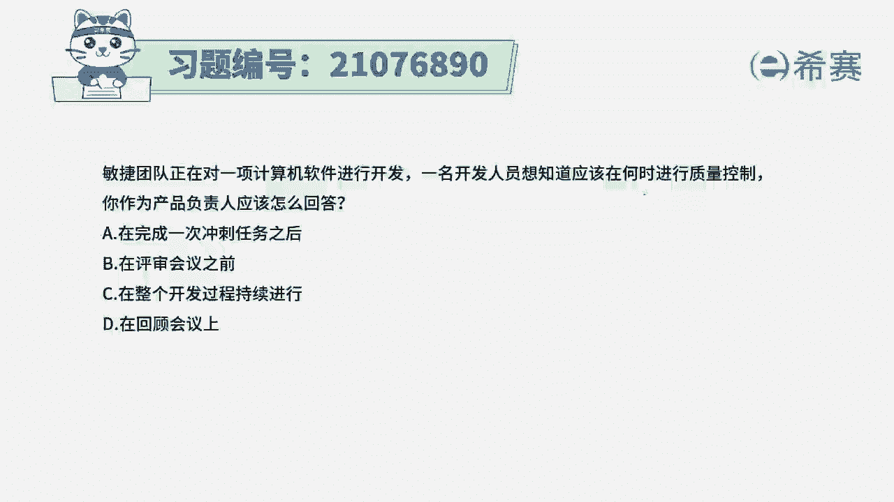
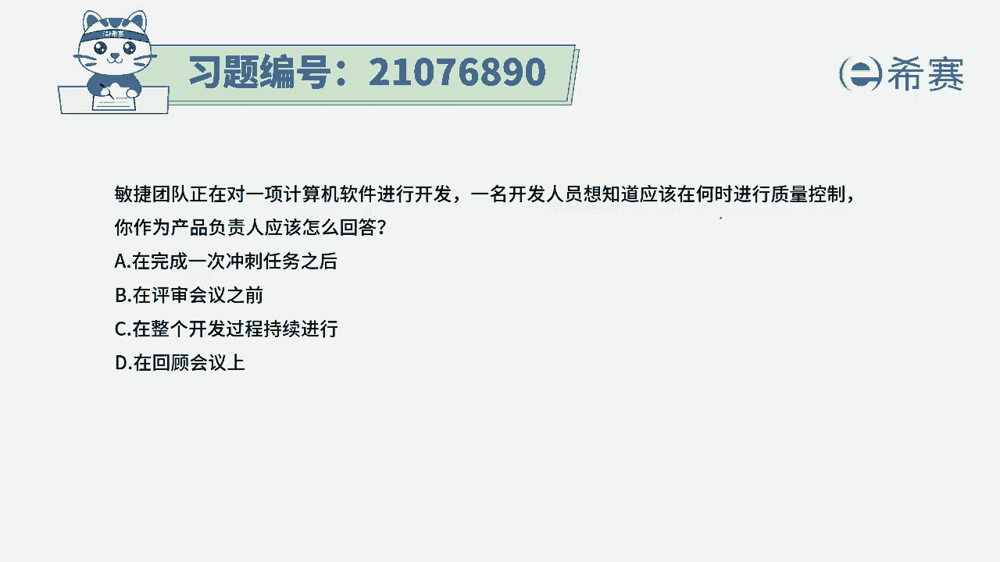
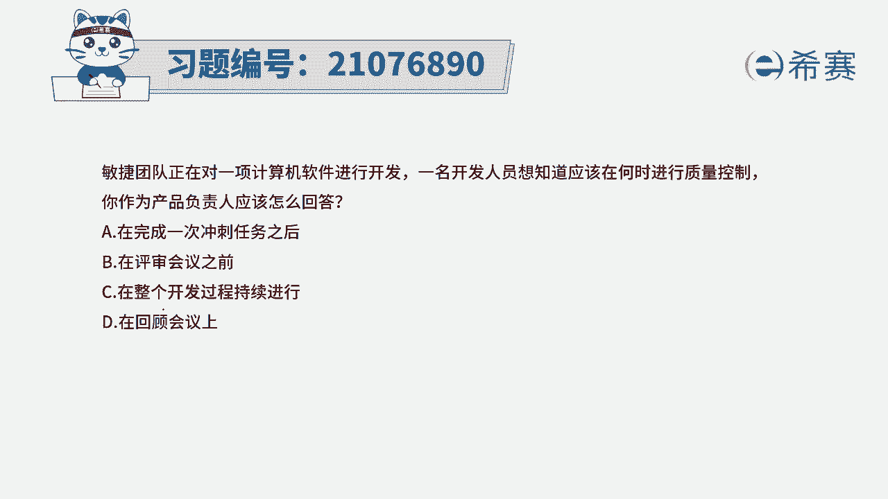
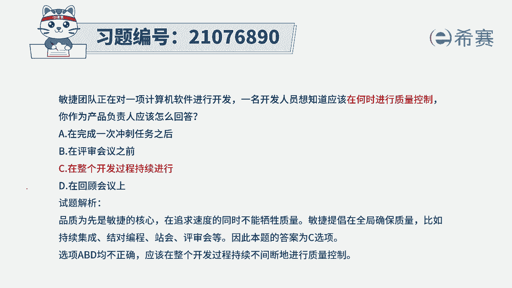

# 24年PMP考试模拟题200道，题目解读+知识点解析，1道题1个知识点（预测+敏捷） - P53：53 - 冬x溪 - BV17F411k7ZD

敏捷团队正在对一项计算机软件进行开发，一名开发人员想知道应该在何时进行质量控制。

你作为产品负责人应该怎么回答这个题目呢，坦白说其实我们在讲敏捷的过程中，有讲过一个叫啊价值驱动，那价值驱动中给到一个很重要的信息，是可工作的软件胜过了完整的文档，那什么叫可工作软件呢。

是质量方面已经过关，并且是能够提供客户所需要的功能，所以其实在敏捷中，虽然没有明明确确的去讲到质量，但它整个过程就一直会关注质量，所以在什么时候去关心质量，应该是在整个开发的过程中。

都会持续关心质量的问题，那这个解析其实大家可以看一下，我们需要去知道，整个在敏捷过程中是全方位关注质量，每一次的冲刺迭代所交付的这样一个增量，都应该是质量达标的，所以答案选C。

