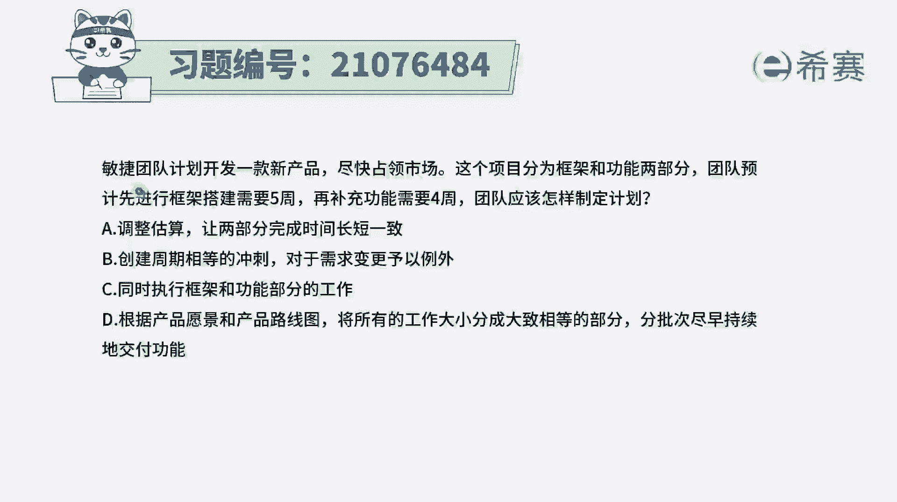
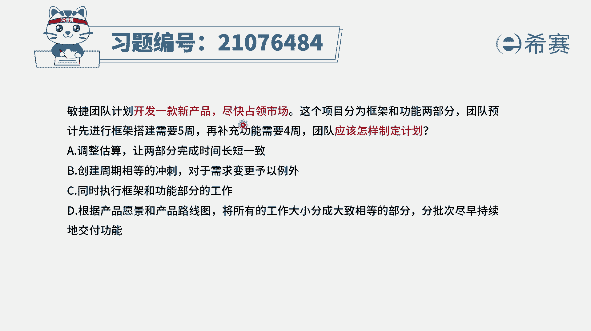
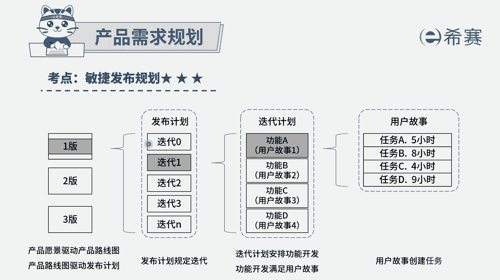
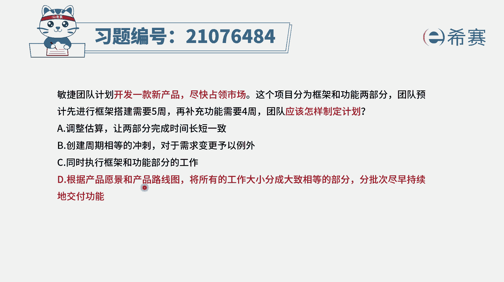
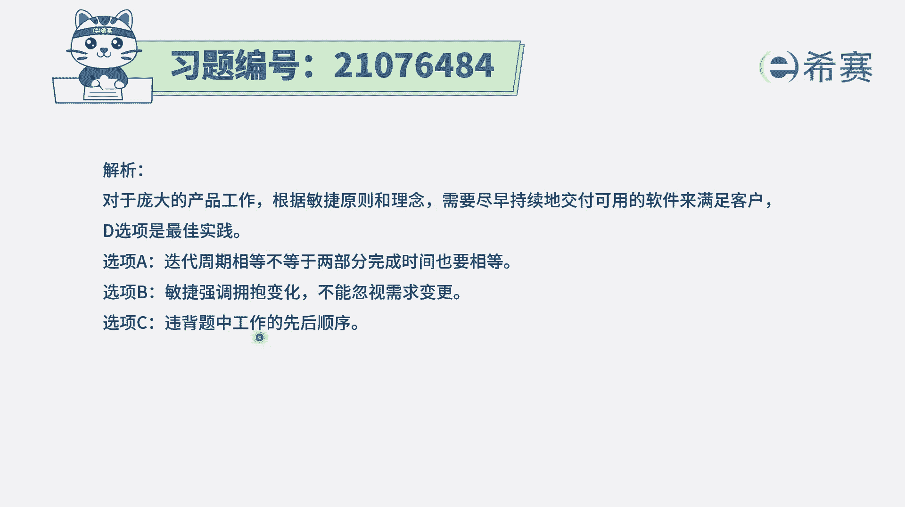
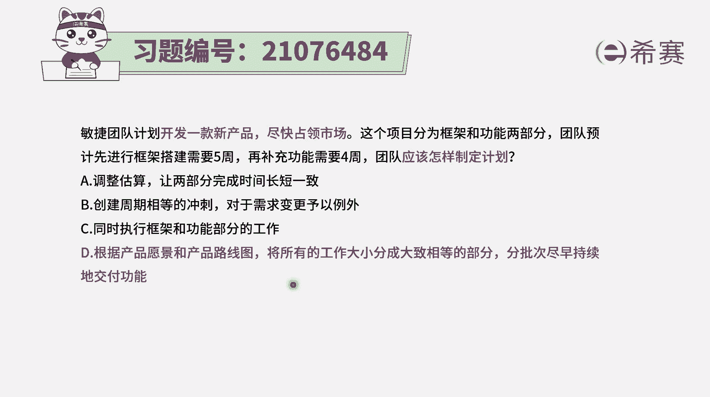

# 24年PMP考试模拟题200道，题目解读+知识点解析，1道题1个知识点（预测+敏捷） - P57：57 - 冬x溪 - BV17F411k7ZD

敏捷团队计划开发一款新产品，尽快占领市场，这个项目分为框架和功能两部分，团队预计先进行框架搭建，需要五周再补充功能，需要四周，团队应该怎样来制定计划，这个题目中其实有几个重要的词，大家需要去了解。

首先呢是一个敏捷团队在做项目，然后这个项目的希望能够尽快占领市场，所以我们应该是，不要等到所有东西都全部做完以后才交付，应该是找钱就去交付，另外呢这个事情它内容中有两部分，然后再补充功能。

这个如果说题目中没有讲，你也要有这个认识，在软件开发过程中，通常是我们先要去搭建一个框架，然后在里面去把这些功能内容给填充下来，写这样一些具体的功能啊，函数啊，有这样一个认识以后。

我们再来看一下四个选项，选项A调整估算，让两部分完成时间长短相一致，这个就完全没有必要了，因为本身搭建框架就是搭建框架，它的工作量，它的难度是它有它特定的这样一个情况。

而完成功能功能有功能的这样一个特性，所以呢把两个东西本来是有各自的特点的东西，你非得搞的是时间一致，这个说法是不正确啊，是不正确，选项B创建周期相等的冲刺，对于需求变更来予以例外，前半句没有问题。

我们通常做项目的话呢，都是会把它分到很多个周期，每一轮周期呢都会是有相同的这样一个时间和，但是后半句不对了，说对于需求变更语义例外，什么叫对于需求变更语义例外，在敏捷中他是要拥抱变化的。

所以不会说是有变更请求过来以后，再去走流程来去应对，所以这后半句是不正确啊，它不适合于敏捷的这种方式来做项目，选项C同时执行框架以及功能的这些工作呃，一般来讲做软件它本身就是要先完成框架。

然后再去做功能，所以这个说法本身就不适合于这种软件，你可以把它简单类比为修，是我们要去搭建一栋楼房的话，先要打地基，然后再去打框架，然后再去呃，把那些钢筋水泥混凝土搞搞进去以后，然后再去搞墙壁。

它有它的先后的逻辑关系，所以不能够说是去打破这个原有的逻辑关系，去搞事情，而最后一个选项根据产品的愿景和产品路线图，将所有的工作内容大小分成大致相等的部分，分批次尽早持续的交付功能。

就是说分批次进展的交互功能，持续的交互功能，这刚好就是符合敏捷的这样一个思路，并且呢它也能够满足这个尽快占领市场的事情，并且敏捷中一般来讲是会把整个做项目的内容，分到多个迭代，每一轮迭代做一部分的内容。

所以这是完全满足的，在敏捷里面的话，我们一般来讲就是基于这个产品愿景，会有一个产品路线图，然后对于产品路线图，我们会去做出一个非常细致具体的发布计划，而这个发布计划中说包含什么功能。

那这一轮发布一般可能会是六个月算下啊，那对于这样一个发布中的那些内容呢，我们又会分成多次迭代，每一轮迭代要完成一些具体的故事，这也就是我们通常说把这个项目，它的这个迭代周期会比较相近的去划分。

划分成多个迭代周期。

就是有这个时间和的概念，这刚好就是D选项跟它完全相匹配。

所以答案就是选D，那解析呢在这边需要同学可以自行查看一下。

那我们需要做一个巩固，就是如果说要去做一个软件产品，一般来讲怎么样去制定一个大的计划呢，就是先有这样一个产品愿景，然后有产品路线图，然后呢再有这个发布计划，发布计划中，又会把这样一个整个产品做的过程中。

要分成多个迭代。

