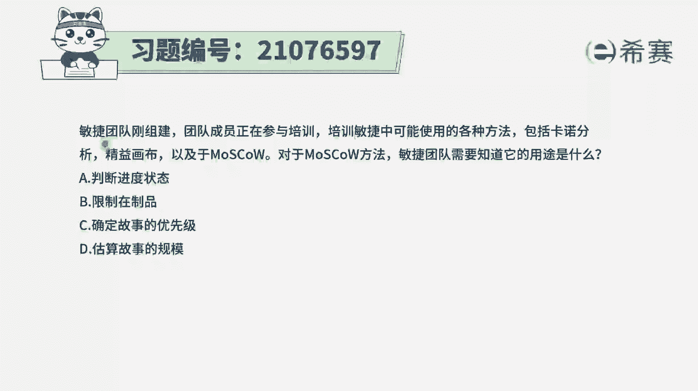
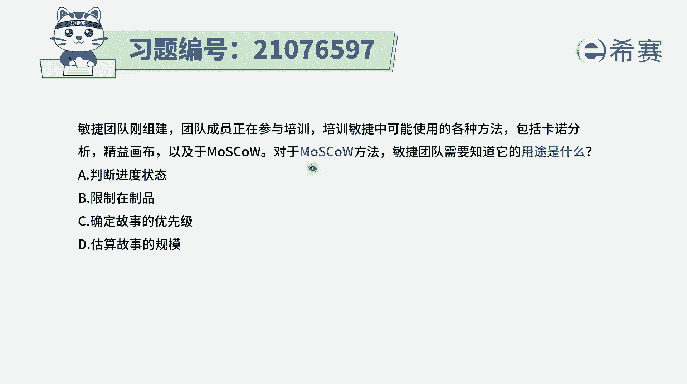
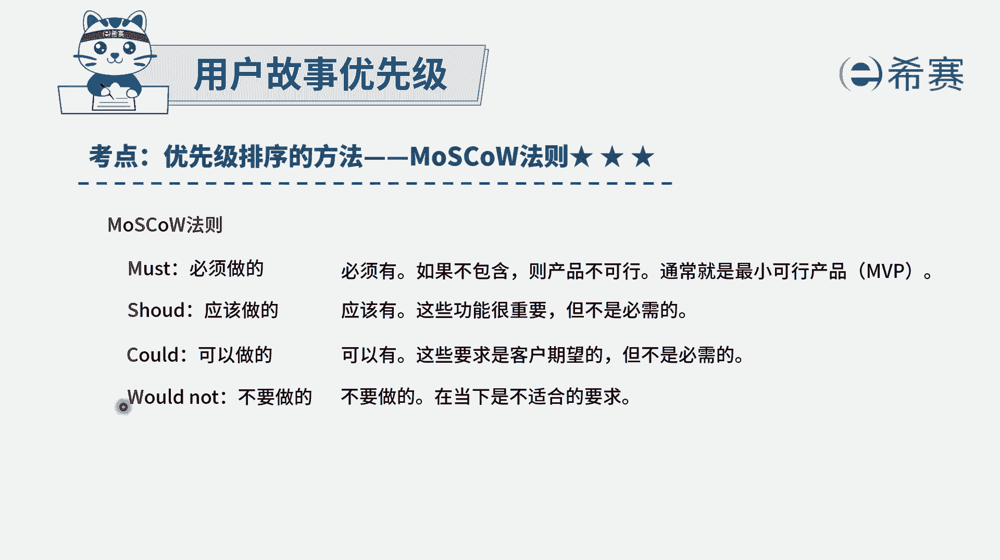
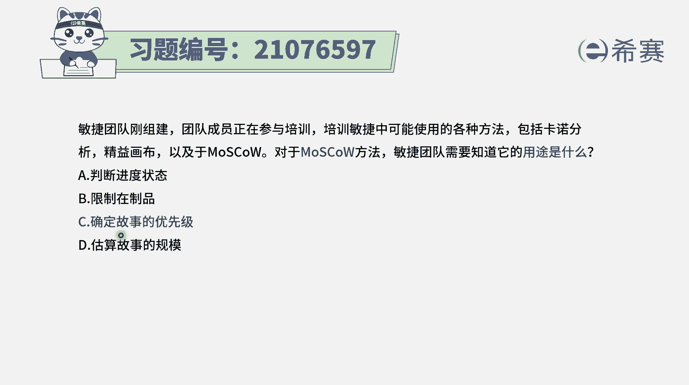
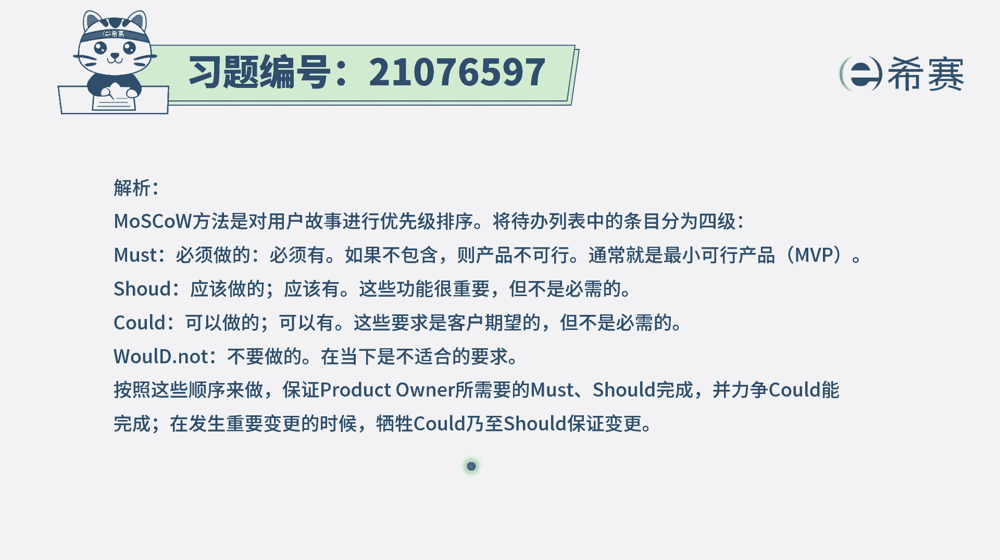

# 24年PMP考试模拟题200道，题目解读+知识点解析，1道题1个知识点（预测+敏捷） - P58：58 - 冬x溪 - BV17F411k7ZD

敏捷团队刚组建，团队成员正在参加培训培训，敏捷中可以使用的各种方法，包括卡洛分析，经营画布以及莫斯科，对于莫斯科方法，米尼团队需要知道它的用途是什么啊，这个的话呢其实就是一个比较简单的。

就是问这个工具它的作用呢，那莫斯科方法呢，它其实就是一个对于需求进行。

优先级排序的方法，它会把需求从这四个维度来去划分，一维度是必须做的，那么肯定是优先级最高的，然后一个维度呢是应该做的，是shoot，是应该做的，那优先级比较高，还有一个维度的是could是可以做的。

那优先级是相对来讲排的最低，还有最后一个是would not，或者wouldn't是不要做的，那这一部分是完全不要做，把舍弃掉的，OK通过这种方式，那么我们就大概能够对于各个用户故事。

知道它是属于M还是属于S还是C还是属于W，就可以对它进行一定的排序。

所以呢莫斯科法他的这些作用呢，就是确定这个用户故事的优先级，而至于其他几个选项，简单来解释一下啊，卡洛分析，他也是对这一个用户故事来进行，优先级排序的一种方法，它会是关注啊，像包括啊基本的需求呀。

然后期望的需求呀，以及呃这种惊喜需求呀，还有这种反向需求啊，会是通过这种方式来去对需求进行排序，能够知道这些性能和客户满意度，他们之间的一些关系，而精益画布呢，它会是呃就有点像商业画布一样的。

做一个精英画布，其实就是会对于这个产品本身，来进行一个分析啊，这个产品它的建议定位是什么人群，然后它能够去交付什么一些功能或特质，而他能够去跟进对手的区分是什么，他的关注的关键焦点是什么。

它的成本以及他的这个收入，这些内容，通过精英画布，基本上是能够知道这个产品的完整，通常这个东西是给老板去讲解的时候，用到的一个工具，而至于这里面还有一个叫限制站制品，WIP限制在制品B选项。

它更多的是说我们如果同时做的东西太多的话，可能每一个都比较分散精力，就不会做得太好，那如果我们能够去限制站制品，就同时在做的东西不要太多的话呢，我们可能就是可以去每一个都做得更好一些，是这个意思。

至于说A选项判断项目的一个进度的状态，那这个的话可以用燃尽图，燃起图的方式来进行，而估算故事的一个规模的话呢，我们通常会用这种故事点法呀，相对故事的这种方式啊，用呃像计划扑克一样呃。

宽带的飞扬这种方式都是可行的，所以这里面问莫斯科，莫斯科，它就是一个确定不是优先级的这样一种方法啊，就是这个，所以答案是选C。

