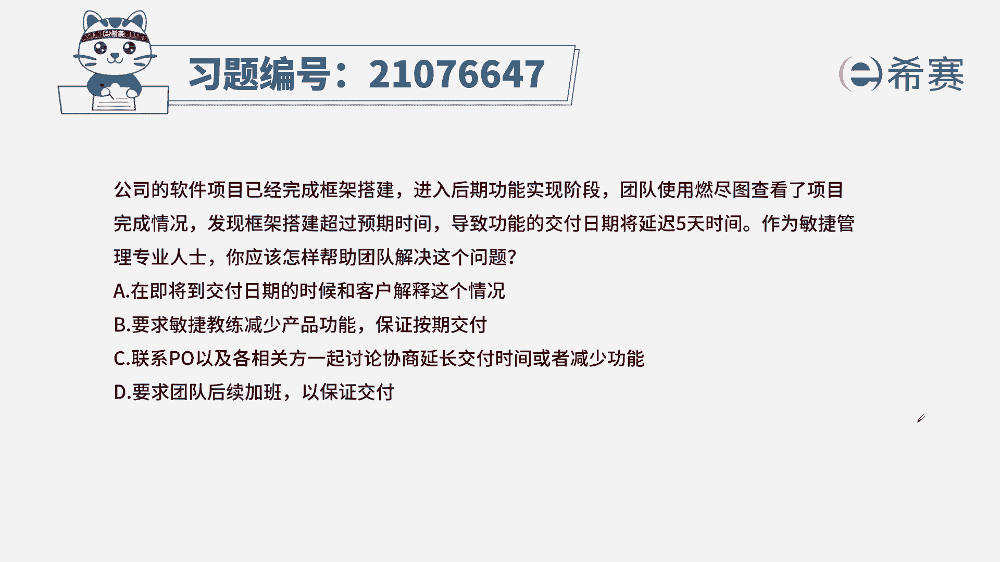
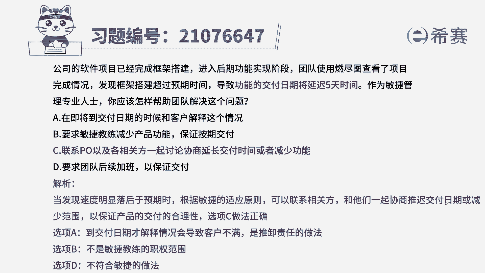

# 24年PMP考试模拟题200道，题目解读+知识点解析，1道题1个知识点（预测+敏捷） - P59：59 - 冬x溪 - BV17F411k7ZD

公司的软件项目已经完成架构搭建，进入后期功能实现阶段，团队使用燃尽图查看项目完成情况，发现框架搭建超过预期时间，导致工人的交付日期将延迟五天时间，作为敏捷管理专业人士，你应该怎么帮助团队解决这个问题。

A在即将到达交付日期时和客户解释这个情况，B要求敏捷教练减少产品功能，保证按期交付，联系PO以及相关方一起讨论协商，延长交付时间或减少功能，要求团队后续加班，以保证交付，本题的考法，最佳实践。

找到题干中的关键信息，因为搭建框架延期了，导致工人的交付会延期五天，这种时候应该如何处理，作为敏捷教练，我们是帮助团队践行敏捷原则，排除组织障碍的，在原则里面最有效的方式出现问题。

最有效的方式是面对面沟通，基于这个分析，我们来看此面向A在即将到达日期的时候，告知客户，那一般客户会报啊，所以不合适，要求敏捷教练减少产品功能，敏捷教练不具体负责功能性的东西。

它只是辅助团队践行敏捷原则，所以也不选C联系PO以及各相关方一起讨论，来确定后期是延长时间还是减少功能，这种方式符合刚才的分析，最有效的方式是面对面沟通啊，包括信息共享，D要求团队后续加班。

以确保交付与尼教练也无法要求团队加班，因为团队是自组织团队，从而选出最佳实践答案C选项。

这是本题的解析。

