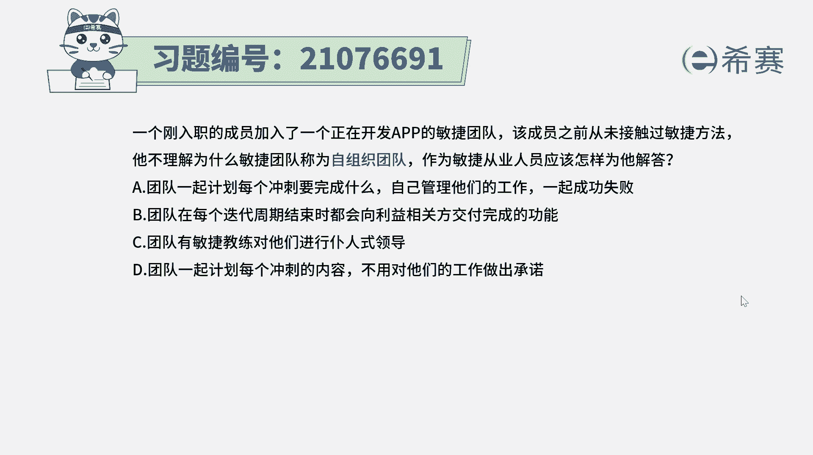
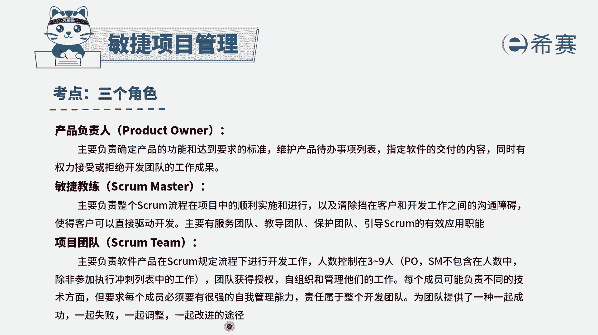
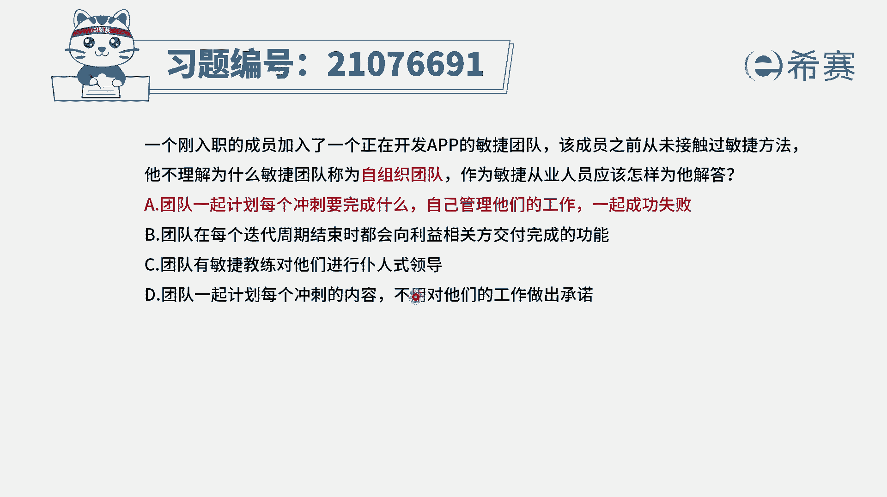
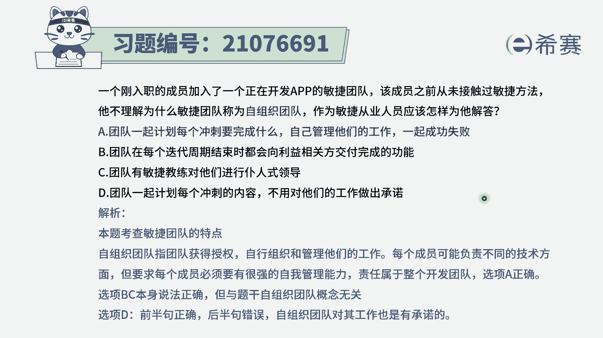

# 24年PMP考试模拟题200道，题目解读+知识点解析，1道题1个知识点（预测+敏捷） - P60：60 - 冬x溪 - BV17F411k7ZD

一个刚入职的成员，加入了一个正在开发app的敏捷团队，该成员之前从未接触过敏捷方法，他不理解为什么敏捷团队称为是自组织团队，作为敏捷从业人员应该怎样为他解答，那我们知道一下，就是。

首先其实我们在敏捷中会说到一个很重要的词。

说是我们的敏捷团队呢是一个叫自组织团队，那团队是获得了公司的授权，是自我组织，自我管理工作，大家是主动去认领工作，来，一起成功，一起失败，一起调整，一起改进。

是这样的一个团队，所以工作内容不是由别人分配给我们，而是我们自己主动去认领。

主动去做事情，有了这样一个星期以后，我们来看一下这四个选项，选项A团队一起计划，每一个冲刺要完成什么，自己管理他们的工作，一起成功，一起失败，这很显然刚好就是关于自组织团队的这个解释。

那它就是正确答案啊，答案选A，其他几个选项我们也来看一下错在哪里，选项B团队在每一个迭代周期结束的时候呢，都会向利益相关者交付完成的功能，这个交付完成的功能并没有展现出，它叫自组织的这样一个事情。

那你不管是不是自组织，每一次你做完事情以后，都应该是要去交付的，选项C团队由敏捷教练对他们进行仆人式领导，这只是说别人嗯是一个仆人式领导，对你并没有说我们是什么样的一种工作方式。

选项D团队一起计划每一个充实的内容，不用对他们的工作做出承诺，不用吗，这个是错误的啊，虽然是敏捷团队，虽然是自己去认领任务，还是要去承诺的啊，比方说在这一次的冲刺中啊，我要做这20个故事点。

然后嗯张三说他要做类18个故事点，那每个人还是要去对这个工作做出承诺的，所以这个选项是错误选项，所以我们知道一下，整个自主谈的就是团队一起来去安排任务，一起来去自己认领任务。

一起成功，一起失败。

