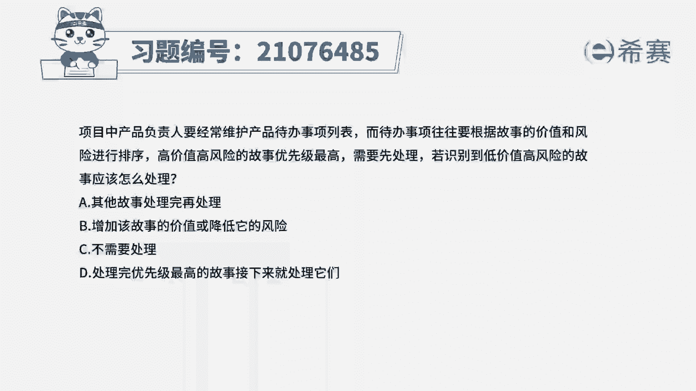
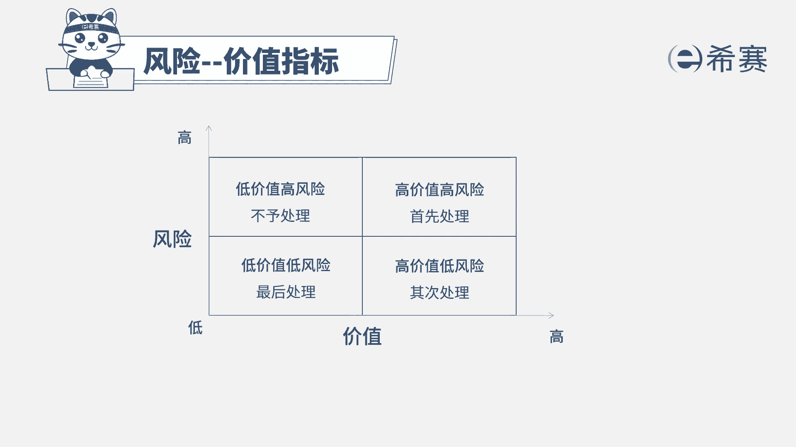

# 24年PMP考试模拟题200道，题目解读+知识点解析，1道题1个知识点（预测+敏捷） - P63：63 - 冬x溪 - BV17F411k7ZD

项目中，产品负责人要经常维护产品待办事项列表，而待办事项往往要根据故事的价值和风险。

进行排序，高价值高风险的故事。

优先级最高需要先处理，若识别到低价值高风险的故事应该怎么处理，其他故事处理完再处理B增加该故事的价值，或降低它的风险，C不需要处理D处理完优先级最高的故事，接下来就处理他们，本题考法是考概念考内容。

首先通过题干找到关键信息，提前告诉我们，产品待办市场列表中的用户故事，有优先级的排序，是按照我们的价值和风险，这两个因素来进行排序的，所以我们高价值和高分解一定是先做，因为它符合我们的敏捷价值观。

我们是以价值为导向，为客户创造最大的价值，那相对应的识别出来的低价值，高风险的故事呢，我们如何处理，既然是低价值，我们一般是尽量避免出现了，也是不予处理，所以我们选出正确选项为C选项。

我们来看看其他三个选项，其他故事处理完再处理，此项目的处理方法是针对于我们低价值，低风险的用户故事B增加该故事的价值，或降低它的风险，我们针对于我们的用户故事，是无法调整它的价值和风险的。

D处理完优先级最高的故事，接下来就处理它，D项描述是处理我们的高价值，低风险的用户故事。

这是本题的解析，大家可以看一下，本题的相关知识点，风险价值指标，那这张图我们就可以看出来，四种不同分类的用户故事。

