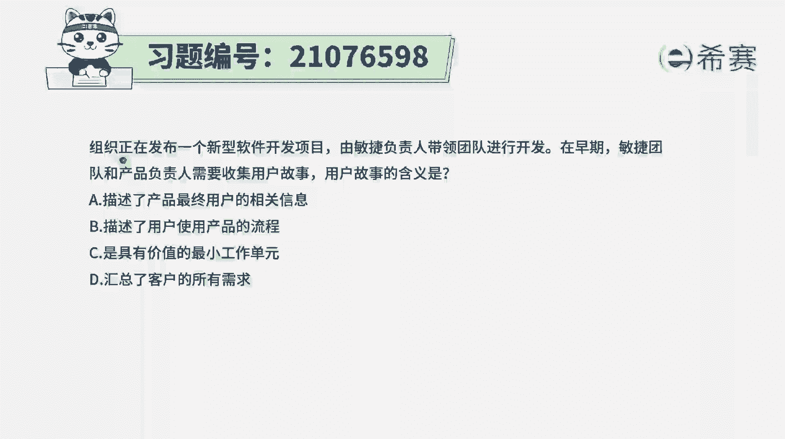
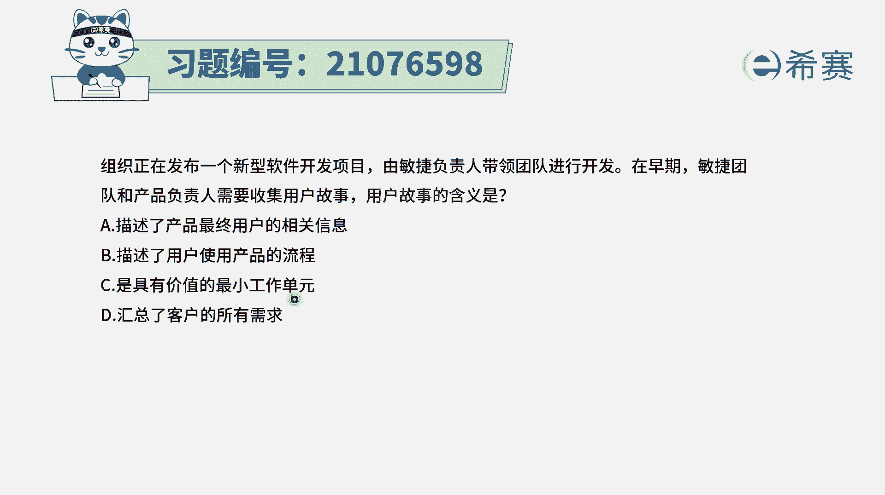
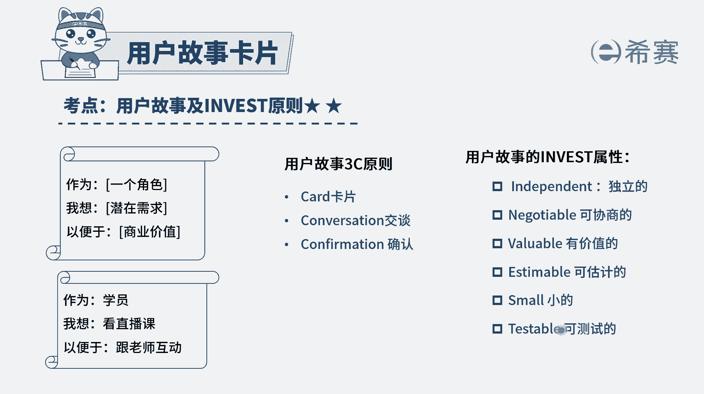
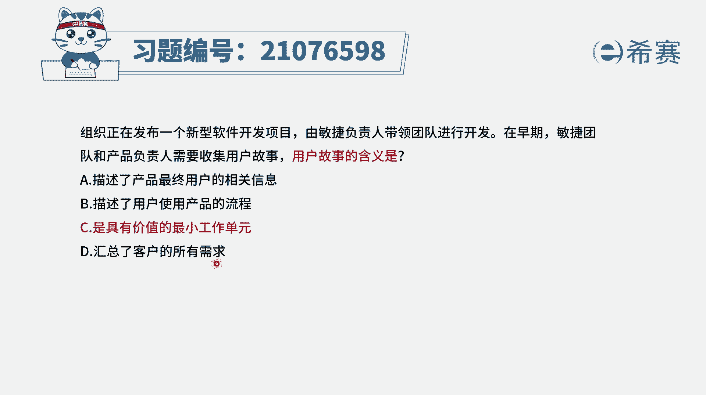
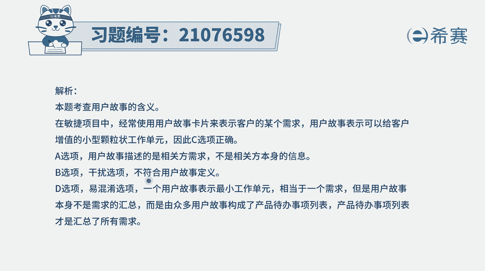
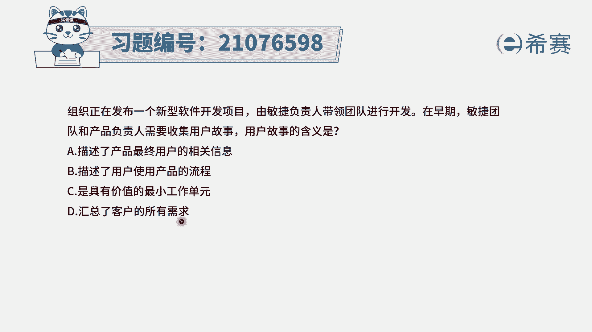
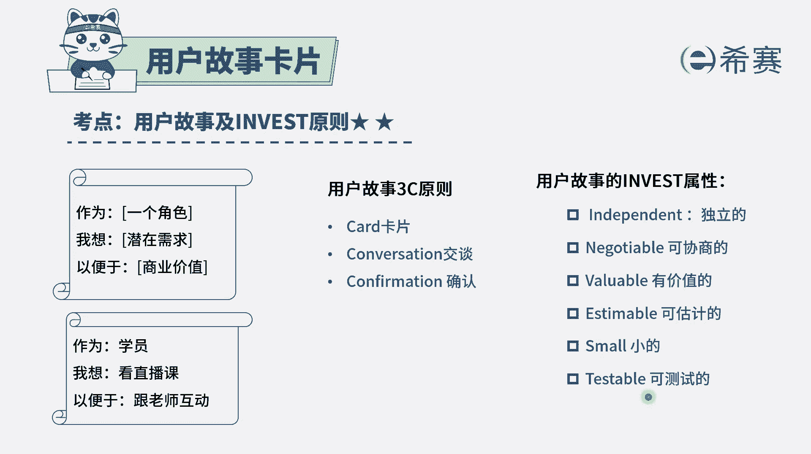
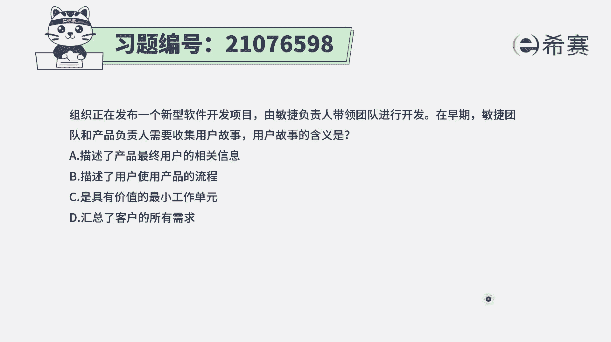

# 24年PMP考试模拟题200道，题目解读+知识点解析，1道题1个知识点（预测+敏捷） - P65：65 - 冬x溪 - BV17F411k7ZD

组织正在发布一个新型软件开发项目，由敏捷负责人带领团队进行开发，在早期，敏捷团队和产品负责人需要去收集用户故事，那用户故事的含义到底是什么呢，其实这个题目的问题就是到底什么是用户故事，我们来看一下选项。

A说是描述产品最终用户的相关信息，那很显然不是对吧，用户的相关信息我们可能会去收集整理以后，最后来做出这个用户画像，但是这个跟用户故事没什么关系，我们是获取用户画像以后，再去了解他的需求。

从而去把这样一个需求，转变为用户故事的方式来展现选项，B描述了用户使用产品的流程，不是啊，这个流程的话它通常是一种操作流程，可以是用这种系统交互图的方式来展现选项，C是具有价值的最小工作单元。

这个最小工作单元说的是在敏捷开发中，能够去做的这样一些最小的颗粒度，那事实上用户故事它就是需求。

而需求呢它有一个原则是有价值的，用户故事还有一个invest原则，那些故事他们之间是相互独立的，可以协商的，然后其中有一条是有价值的，便是可以估算的，可以测试的，所以这个用户故事一定是具有价值的。

然后是一个比较小的颗粒度，选项C就是这个题目的正确答案，所以用户故事它就是一个具有价值的，一个最小的公共单元，而选项D汇总了客户的所有需求，请注意，那是产品待办事项列表。

产品待办事项列表中包含了若干的用户故事，是这一轮项目所要做的。

所有用户故事都放在里面，那才是汇总所有的需求，好解析，在这边需要的同学可以自行查看一下。

你需要知道的一个点就是用户故事，它也是一个比较小的一个颗粒，它是一个有价值的东西，然后一般不要放太大，它的这些invest原则。

我们来简单回顾一下，一个是独立的，就故事和故事之间，他们之间没有这样一个关联关系，不是说这个故事非得要依靠另外一个故事，第二个呢是可以协商的，也就是说这些个故事他到底要做到什么程度。

他的建议是一个呃验收的标准，我们都是可以通过讨论协商来去确定，还有呢就是它是有价值的，没有价值的事情是尽量不要去做，可以估算的，是可以算出他的工作量大概有多少，并且一般来讲同一个项目中。

它的用户故事和故事之间的这些工作量大小，不要超过十倍，还有一个呢它是比较小的，比较小的，能够去小块频繁交付，还能是可以测试的，可以测试，其实也可以理解为是可以验证。

我们可以通过这种验证的方式来去确认，这个用户故事是完成的，所以这个题目的答案呢就是C选项。

