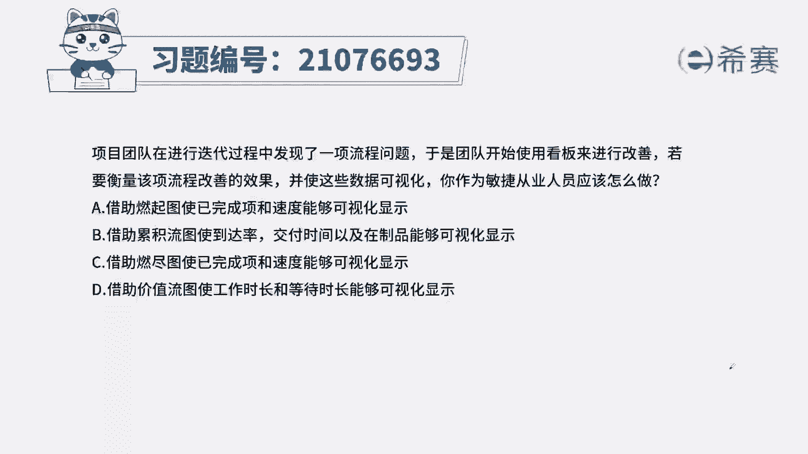
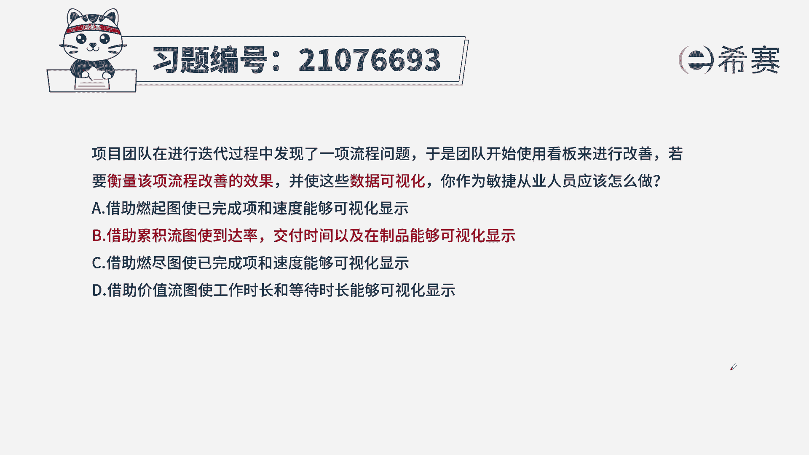
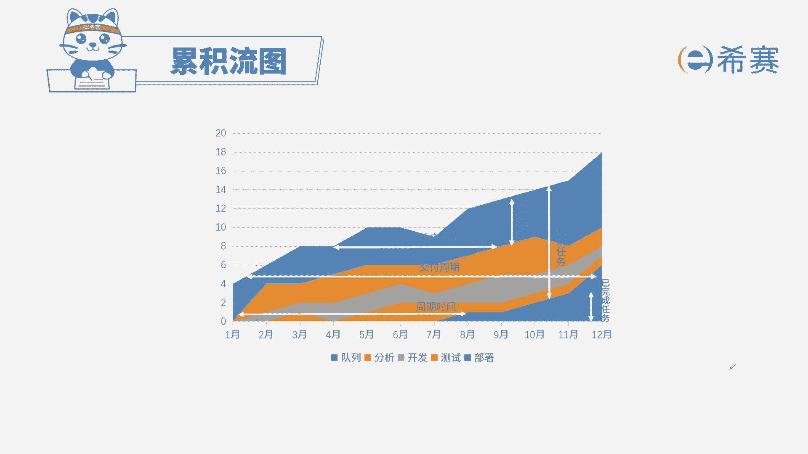

# 24年PMP考试模拟题200道，题目解读+知识点解析，1道题1个知识点（预测+敏捷） - P67：67 - 冬x溪 - BV17F411k7ZD

项目团队在进行迭代过程中发现一个流程问题，于是团队开始使用看板进行改善，若要衡量该项流程改善的效果，并使这些数据可视化，你作为敏捷从业人员应该怎么做，A借助燃起图时，已完成像和速度能够可视化显示。

B借助累积流图使到达率交付时间，以及在制品能够可视化显示，C借助燃尽图，使已完成项和速度能够可视化的全，D借助价值流图，使工作时长和等待时长能够可视化显示，本届考法是考内容和概念，找到题干的关键信息。

要衡量一个流程改善的效果，并且要说句可视化，我们一定要通过看板工具，踏板工具里面包括很多，比如说燃起图软件图啊，价值流图，任务版，累积流图等等，这里我们要聚焦在一个项目改善的效果。

因为燃起图软件图只是进入了一个用户故事，从代办到完成这种状态的展示，比如说某一天你完成了谷歌用户故事，而一个用户故事有不同的状态，比如代办进行检测，上线完成，这些状态只能在累积流图里面展示出来。

所以我们选择正确选项为B选项，通过累计流图，将我们的功能是向用户故事改善的情况，可视化展示出来，来看看其他三个选项，AC燃起图软件图，刚提到它只是展示了一个用户故事完成的状态，无法展示其他的状态。

D价值流图是为了消除浪费，找到哪个环节没有产生价值，把它剔除掉。

这是本题的解析，大家可以暂停看一下，本地的相关知识点累积流图，针对这个知识点，一定是从内容上下，手图的纵轴横轴，不同颜色之间的高差以及斜率代表什么意思。

