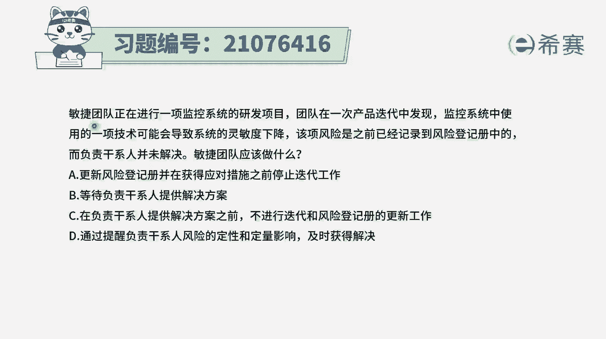
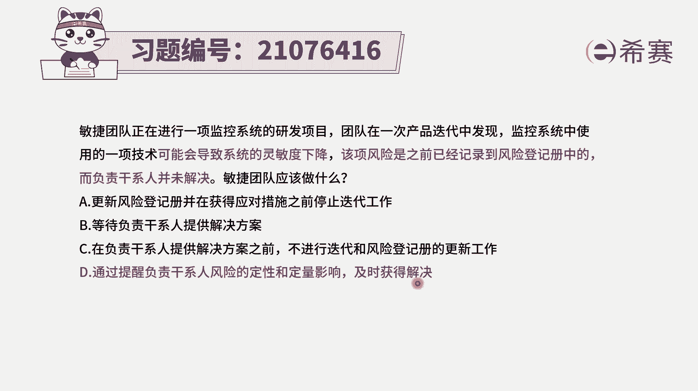
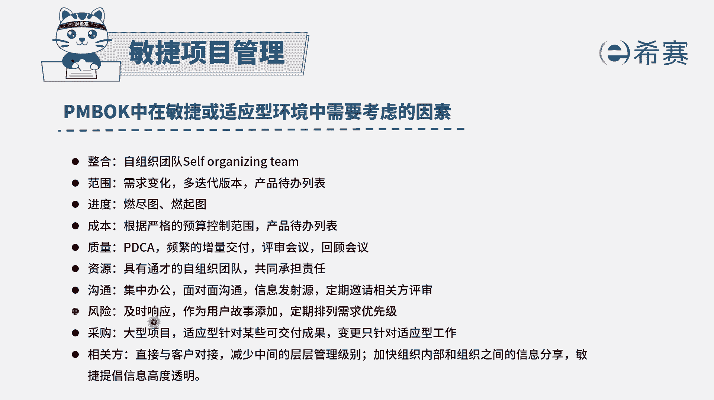
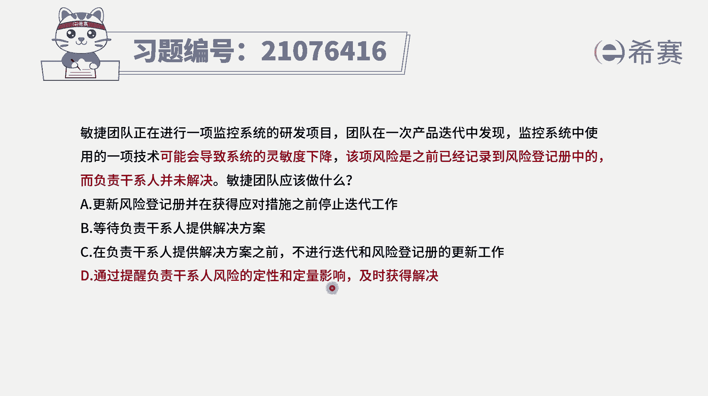
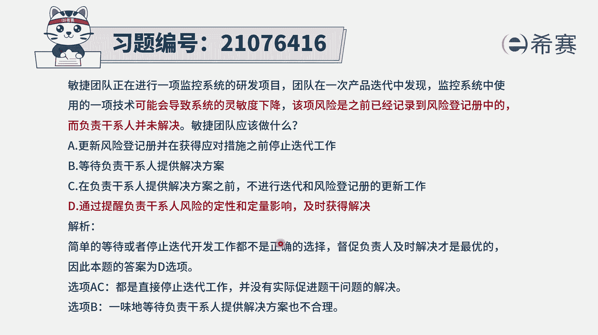

# 24年PMP考试模拟题200道，题目解读+知识点解析，1道题1个知识点（预测+敏捷） - P70：70 - 冬x溪 - BV17F411k7ZD

敏捷团队正在进行一项监控系统的研发，项目团队在一次产品迭代中发现，监控系统中使用的一项技术，可能会导致系统的灵敏度下降，该项风险是之前已经记录到风险能力测中的，而负责干系人并没有解决。

那敏捷团队应该怎么做，那这个呢其实这个题目啊我们到底要怎么做，要看完四个选项可能才能够选出来啊，因为应该怎么做，有很多种不同的解读的方式，我们来看一下选项A更新风险登记册。

并在获得应对措施之前停止迭代项目，那这种停止工作，这是一种非常消极的方式，永远都是错误的啊，永远都是错误选项，选项B等待负责干系人提供解决方案，这个等待这两个字就凸显出这种不主动。

而咱们整个PMIPPACP，它都会是要求项目经理是一个非常积极主动的，能够主动解决问题的人，包括项目团队成员，也都应该是积极主动去解决问题的人，所以等待的这种方式就不匹配，不符合他的这一个价值观。

选项C在负责干系人提供解决方案之前，不进行迭代和风险能力者的更新工作，那这个就跟上面同样的啊，不进行迭代，你开玩笑呢，那最后一个选项也只有他可以选了，所以答案就选它了啊，最后一个选项通过提醒。

负责干系人风险的定性和定量影响，及时获得解决啊，这就是在积极主动的去想要，去寻求解决方案的方式，虽然说这个方案其实在敏捷中，其实不是那么的提倡，但至少是在主动去推进这个事情，所以答案就是选D了。

这个题目是因为前三个都不可选，所以只能选定，而在敏捷中呢，其实它有个特质啊。

一般来讲对于风险，我们应该要采取的措施是及时去响应它，对于某一些风险呢，如果说它的这样一个价值比较大，或者他的损失可能会比较大，那我们是要把它添加一个用户故事，放到这个产品待办事项列表中来。

来进行优先级排序。

要做这样一个事情，而在这里其他都不可选的时候，我们才说要去做定性分析，定量分析，对这个定量分析告诉对方以后，让他快速去做一个应对的措施。

来去响应它，去解决它。

