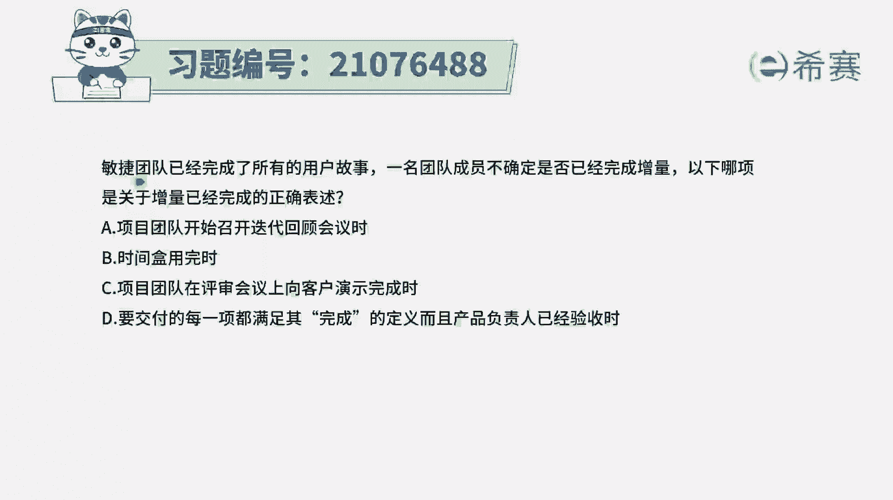
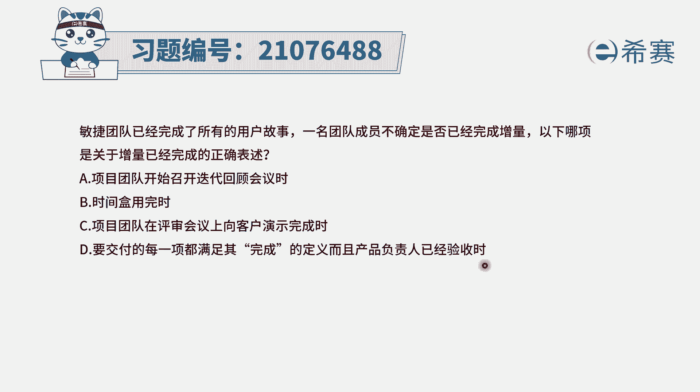
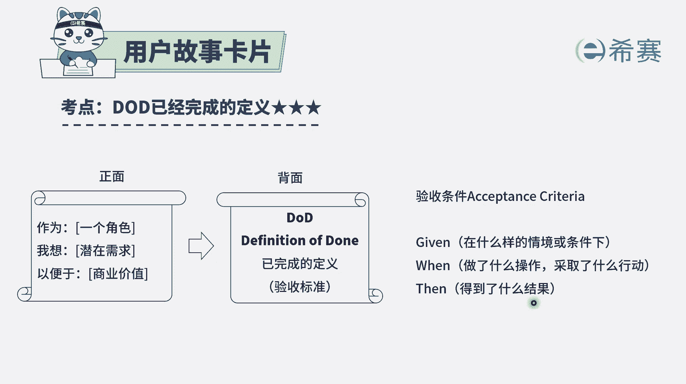
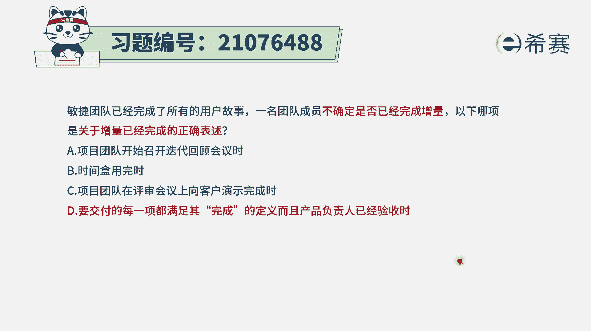
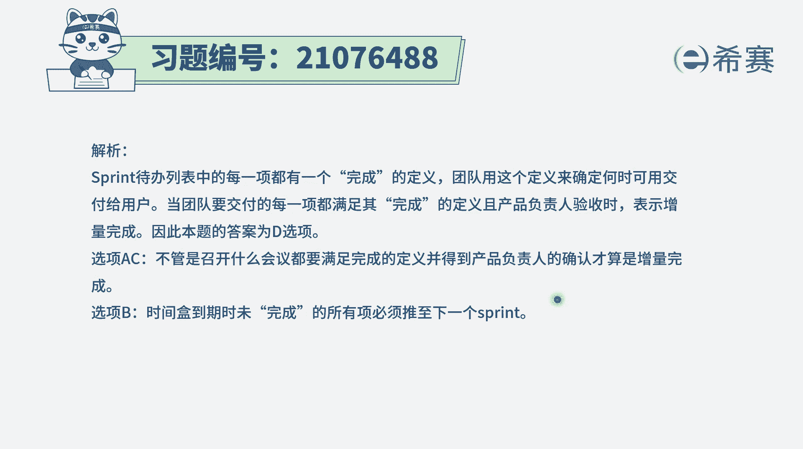

# 24年PMP考试模拟题200道，题目解读+知识点解析，1道题1个知识点（预测+敏捷） - P71：71 - 冬x溪 - BV17F411k7ZD

敏捷团队已经完成了所有的用户故事，一名团的成员不确定是否已经完成增量，以下哪一项是关于增量已经完成的一个，正确表述，那怎么样才算是增量已经完成了，我们来先看一下四个选项啊，选项A。

说是项目团队开始召开迭代回顾会议的时候，那你召开迭代回顾会议，那也只是说刚刚过完了迭代评审会议，但是迭代评审会议段做的怎么样呢，不知道呀对吧，所以不能说是到了这个时间节点，就表示说那个增量已经完成。

选项B时间和用完，时间和用完，只是说这个时间该到了，但并不表示这个东西已经是做完了，选项C项目团队在评审会议上向客户演示完成，你演示完成是一回事，然后客户接受并通过验收是另外一回事，从通常情况下。

一个用户故事这样一个增量已经完成，只要是对方接受，对方验收通过，才算是正儿八经的去完成，那我们再看最后一个选项D，要交付的每一项都满足其完成的定义，也就是在最开始做这个用户故事的时候呢。

我们就已经有了一个叫完成定义，已经是满足了这个完整定义，这是第一部分，第二部分是，并且产品负责人已经验收的时候，那么也就是说在迭代评审会议上，你演示完，并且对方是验收通过了，那这个时候是确确实实表示。

这样一个用户故事都已经完成了，那整个这个项目这一轮迭代的间隔增量，就算是完全完成了，所以答案是选B选项。

那关于完成的定义呢，我们可以简单看一下，其实通常情况下，对于一些用户故事，它会有一个具体的描述，比方说作为什么样的角色，我需要什么功能，以便于实现什么样的一些商业价值，或者以便于如何如何。

通常描述完这些用户故事以后呢，我们还会有一个叫完成的定义，就是做到什么样的程度才算完成呢，就是在什么条件下或在什么情境下，当我们做了什么操作的时候，当我采取什么行动的时候，他就能得到什么结果。

这个软件系统就会做出什么样的反应，得到什么结果，如果做到这样一个程度，那我就说他真的是完成了啊，这是一个完整定义，如果说完整定义我们里面全部都做到了。

并且客户也验收通过了，这就是正儿30%，这一次增量就完成了。

所以答案是选最后一个选项解析。

