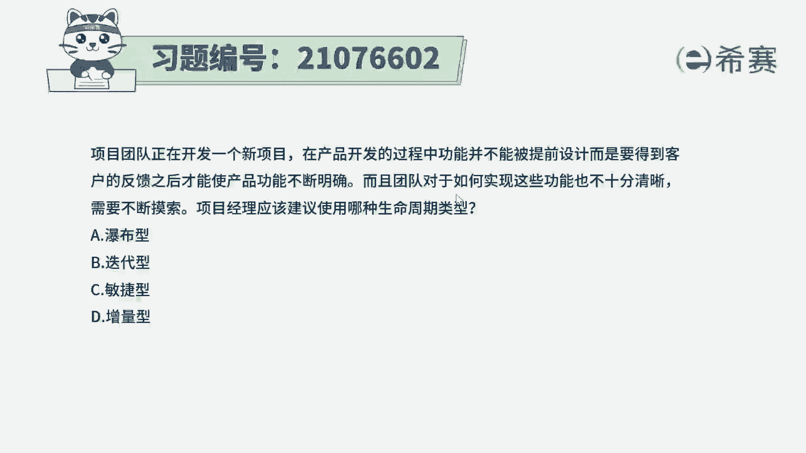
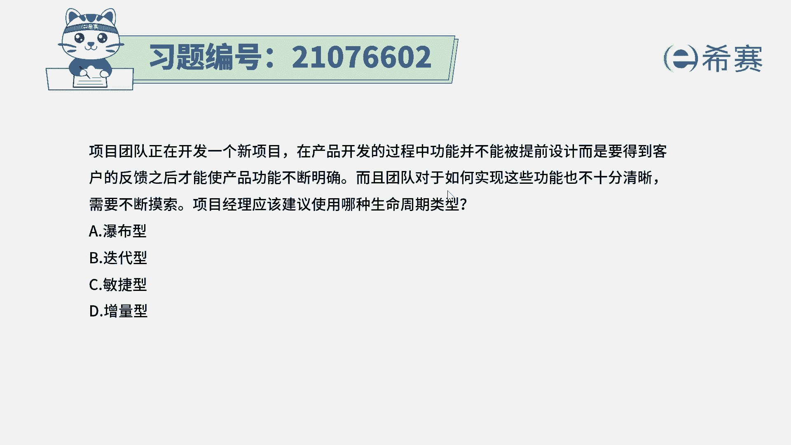
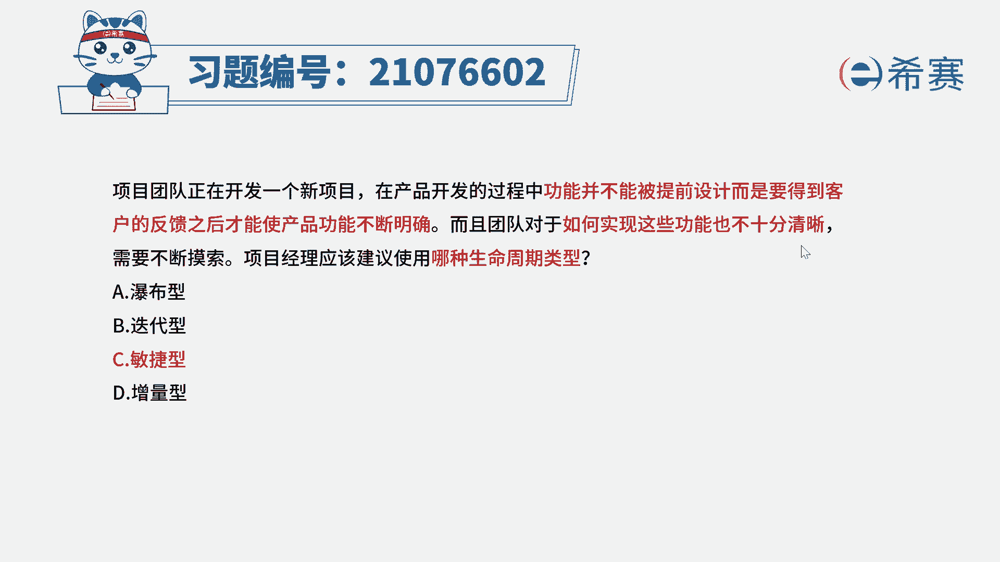
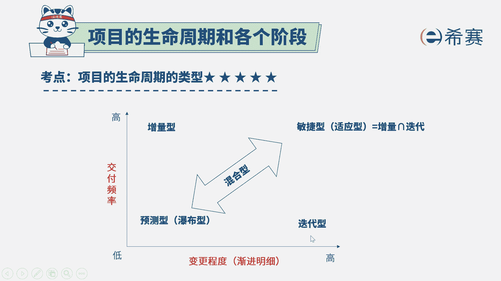

# 24年PMP考试模拟题200道，题目解读+知识点解析，1道题1个知识点（预测+敏捷） - P73：73 - 冬x溪 - BV17F411k7ZD

项目团队正在开发一个新项目，在产品开发的过程中。

功能并不能够被提前设计，而要得到客户反馈之后，才能够使产品功能不断的明确，而且团队对于如何实现这些功能，也不是十分的清晰，需要不断的摸索，项目经理应该建议使用哪一种生命周期，那这里有两个很重要的点。

首先第一个呢就是我们需要得到客户的反馈，要不断交付以后得到反馈，然后才能够明确，所以它的交付的频度是比较高的，也就是说增量这一块肯定是有的，同时呢对于要实现哪些功能，它也不是很清楚。

所以需求肯定会发生很多的变化，那迭代这一部分也是要的，有那既有迭代又有增量，就是用敏捷型，所以这个题目的答案呢就是敏捷型啊。

对于这种有小屏快特性的呢，就用敏捷型，它是既包括了这种增量的方式，又包括了迭代的方式，两者都包含以后。

