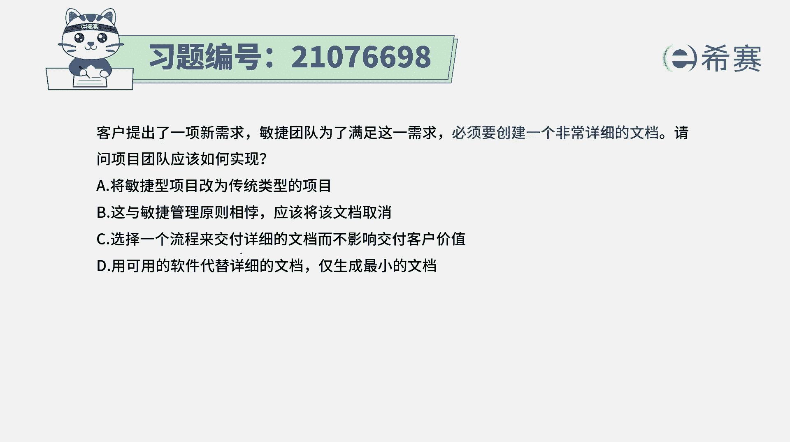
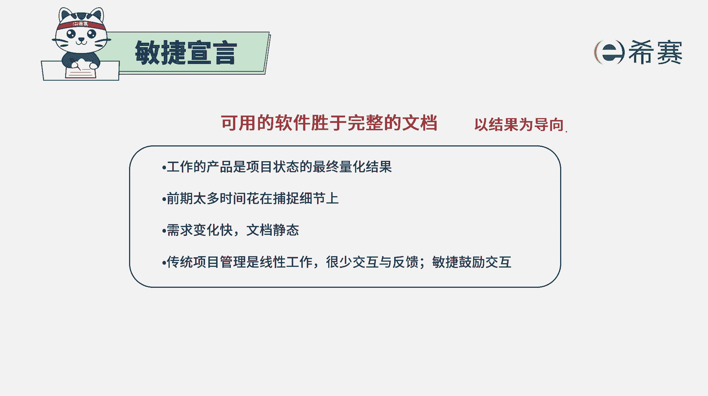
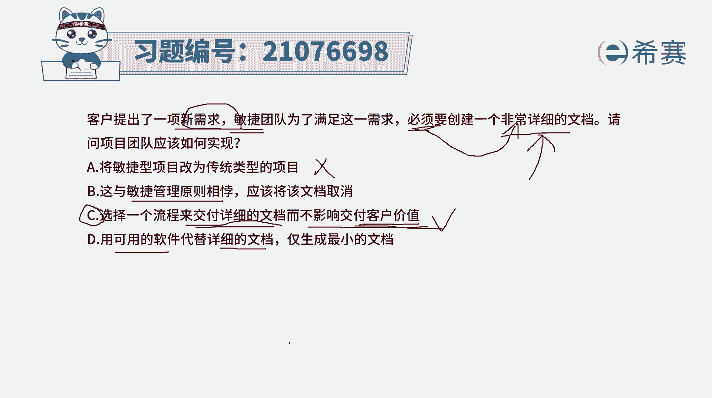
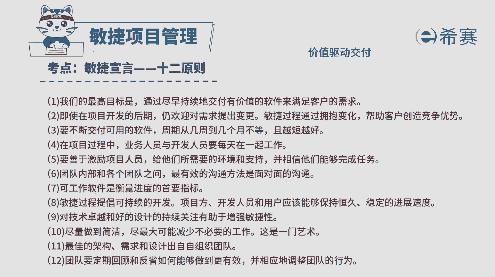
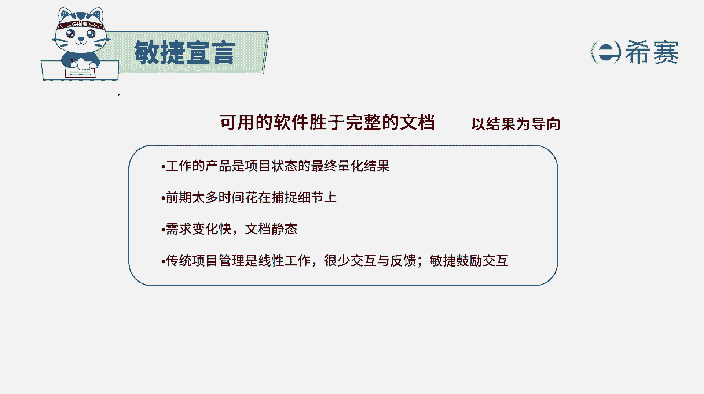
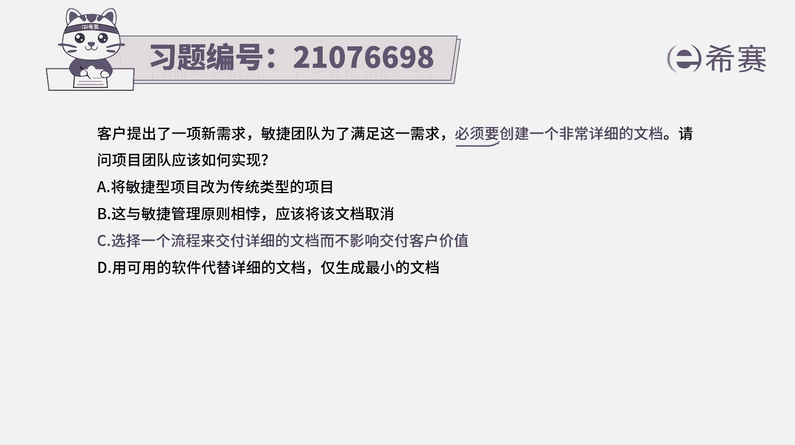
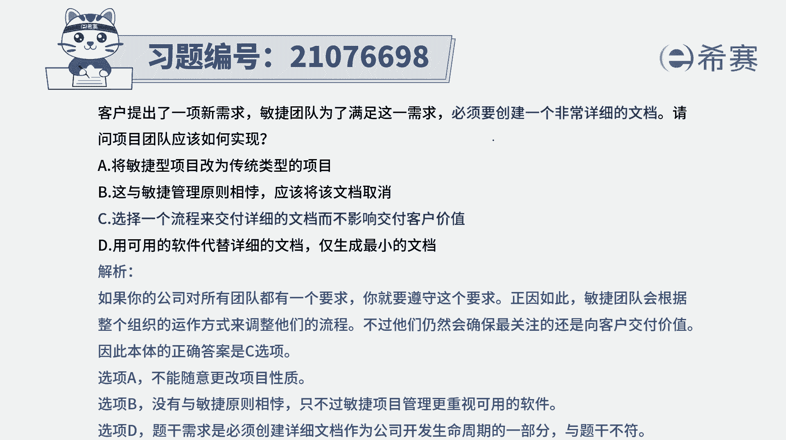

# 24年PMP考试模拟题200道，题目解读+知识点解析，1道题1个知识点（预测+敏捷） - P75：75 - 冬x溪 - BV17F411k7ZD

客户提出了一项新需求，敏捷团队为了满足这一需求，必须要创建一个非常详细的文档，请问项目团队应该如何实现，这里有一个很有意思的点啊，其实有的时候呢如果你看题目看的不仔细。

你一看到说非常详细的文档，你可能就会想到这样一句话，叫可用的软件胜过了完整的文档，我们是项目导向型的，所以其实重点是做那个可用的软件。

而不是去做了一个详细的文档，但是你如果要仔细读，你才会发现说我们为了去满足的要求，必须要做一个文档，那既然为了满足要求，必须要做，那么做这个软件文档，也就是我们做这一个可用的软件中。

所必须要做的事情之一，而咱们本身是一个结果导向，是一个价值驱动导向的，所以这个必须要做的东西你能不能漏掉，还不能漏掉，有了这个信息以后呢，我们再来看一下四个选项，选项A将敏捷型项目改为传统型项目。

就是就是因为有了这个非常详细的文档，所以呢我就是完全改成传统型项目，这方式合适吗，你现在还是敏捷团队在做项目啊，你通过这一条就去改，肯定是不合适的啊，选项B这与敏捷管理原则是相悖，应该将该文档取消。

也是我刚刚给大家看的这一条对吧，跟他一条确实好像是不匹配，可事实上这个题干中已经告诉你，为了去做出这一项新的需求，就需要去做一个详细的文档，所以它是必经之路，你不能说把这个必经之路给砍掉。

选项C选择一个流程来交付详细的文档，而不影响交付价值，也许是这个必经之路，这个必经的这个东西也完成，它，同时呢交付价值这一事情是更加重要的，就是在做这个事情，同时也不影响去交付价值。

是这个事情依然在进行，这是一种非常圆满的这种解释的方式啊，答案就是选C了，看一下最后一个选项，用可用的软件来替代详细的文档就能替代吗，他都已经告诉你，是必须要去创建一个非常详细的文章，它是一个必经之路。

能替代吗，不能替代啊，所以这个这个这个最后的这个表达。

这个是有问题的啊，答案只能选C，而这呢它其实是符合这一条，就是我们在做项目的时候啊，要尽早的交付有价值的软件来去做事情。

然后这个有价值的软件呢，它其实在某种程度上，是胜过那些面面俱到的文档。

比那个文档更重要，但是题干中告诉你的是，这个详细文呢是一个必须的，所以你就不能把它作为那种说啊，那我就不要它了，我就直接去做一个东西出来。

既然是必须就得要满足，所以答案是选C解析。

