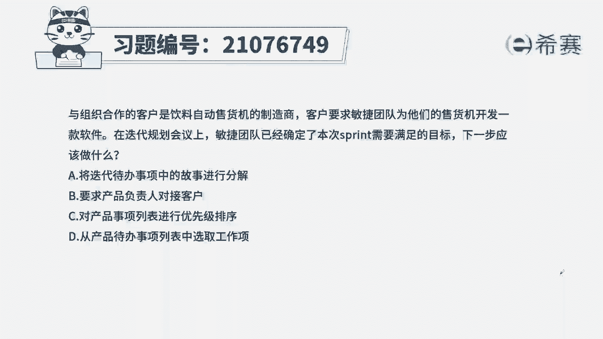
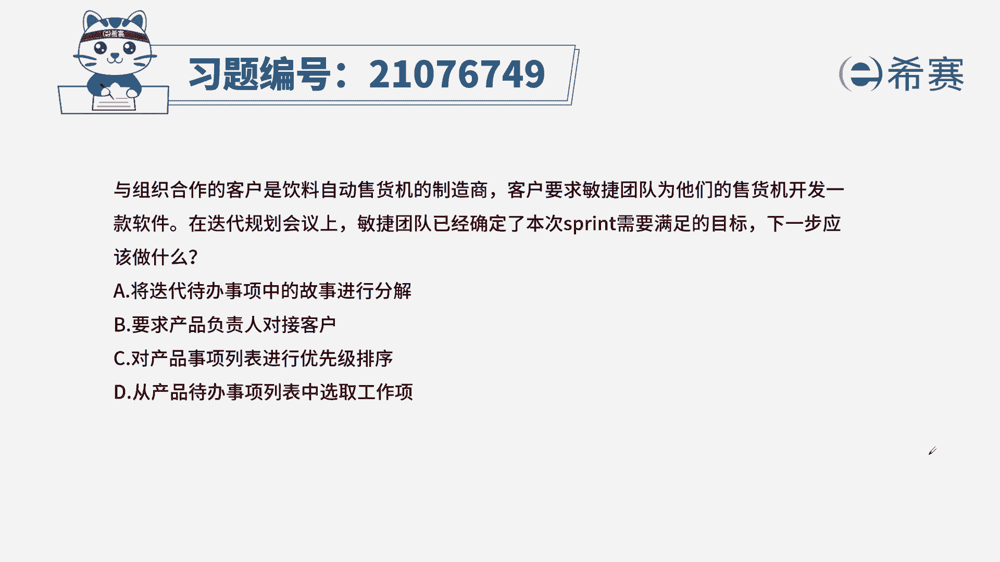
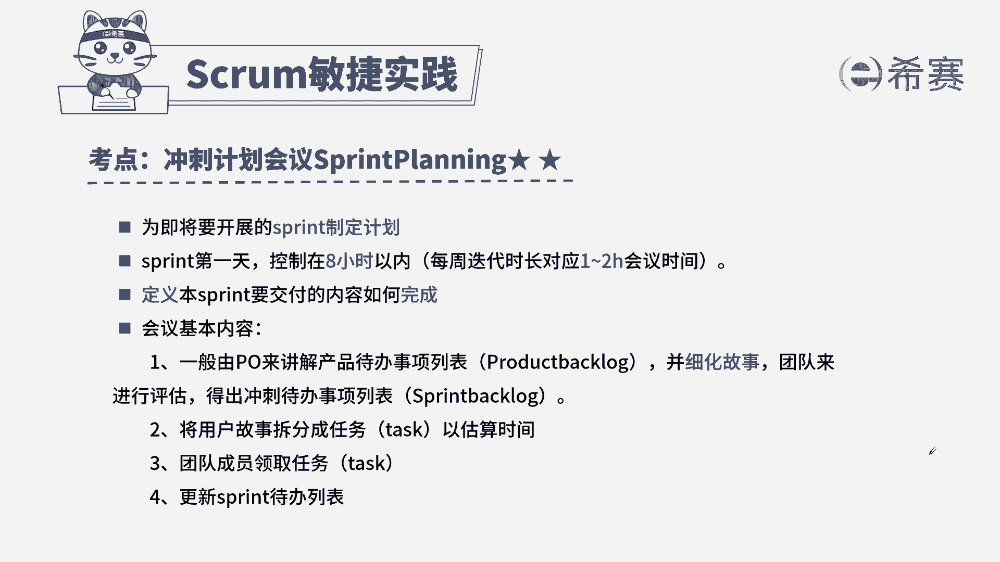

# 24年PMP考试模拟题200道，题目解读+知识点解析，1道题1个知识点（预测+敏捷） - P76：76 - 冬x溪 - BV17F411k7ZD

与组织合作的客户是饮料自动贩卖机的制造商，客户要求敏捷团队，为他们的售货机开发一款软件，在迭代规划会议上，敏捷团队已经确定了，本次sprint需要满足的目标，下一步应该做什么。

将迭代待办事项列表中的故事进行分解，B要求产品负责人对接客户，C对产品时尚列表进行优先级排序，从产品待办事项列表中选取工作项，本题的考法是最佳实践，首先通过题干找到关键信息，提前告诉我们。

我们已经确定了本次迭代的目标，问题问的是下一步，只要问题中出现下一步，首先其次我们的选项一定会有顺序之分，所以我们来看四个选项，A，将我们的迭代代办事项列表中的故事进行分解，A项要做的内容，前提是。

我们先确定迭代代办事项列表中的用户故事，A项表述没有问题啊，但是它前面还有一个步骤好，我们来看B要求产品负责人对接客户，产品负责对接客户，和我们规划会议没有关系，你去对接就好了，和题干无关。

C对产品实项列表进行优先级排序，优先级排序是我们产品负责要做的事情啊，我们团队不去参与进去啊，D从产品待办事项列表中选取工作项，第一项就是确定好本次迭代目标，然后我们再从我们产品待办事项列表中。

确定本次迭代要做哪些事情，接着再做故事的分解，所以A和D它的顺序是先D后A，最佳时间是D选项。

这是本题的解析，本题的相关知识点冲刺计划，会议针对这个知识点，我们一定要从内容方面下手，内容上我们要熟练掌握什么时候开谁参加好，会议的内容是什么，开会的作用是什么。

