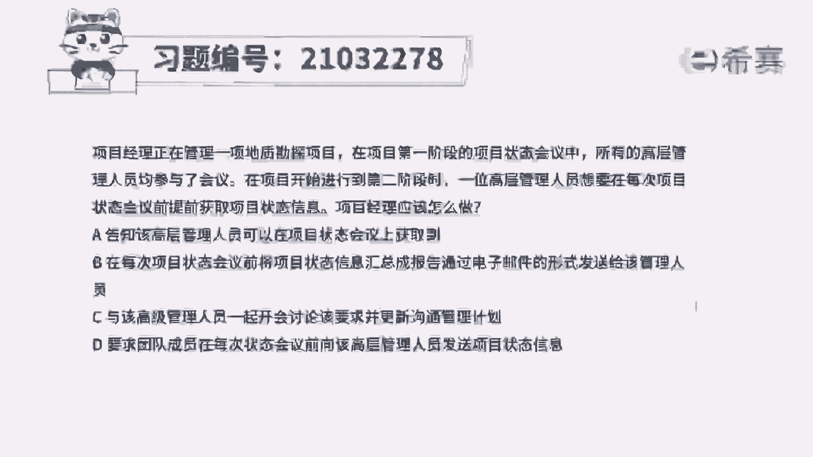
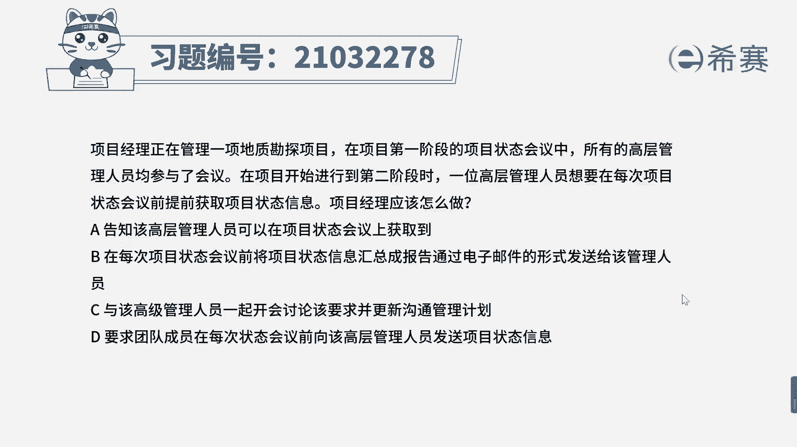
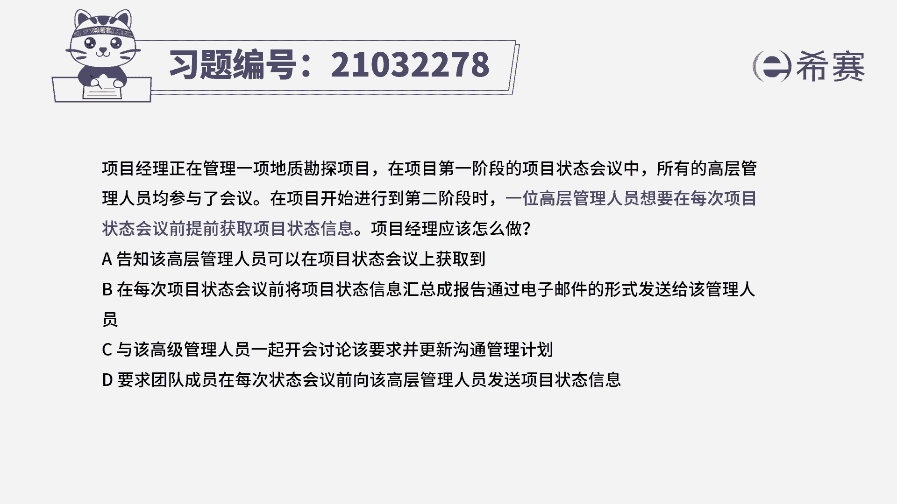
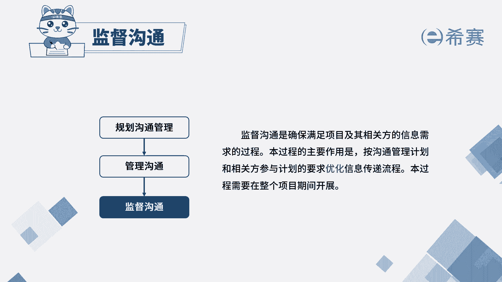
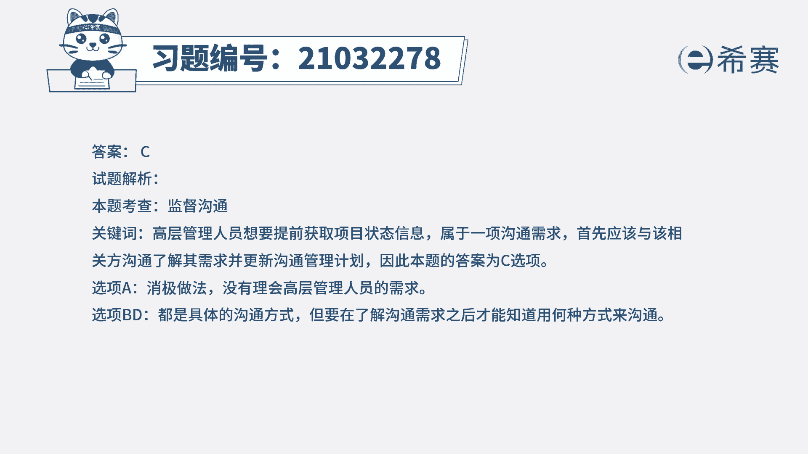

# 24年PMP考试模拟题200道，题目解读+知识点解析，1道题1个知识点（预测+敏捷） - P8：8 - 冬x溪 - BV17F411k7ZD

项目经理正在管理一项地质勘探项目。

在项目第一阶段的项目状态会议中，所有的高层管理人员均参与了会议，在项目开始进行到第二阶段时，一位高层管理人员想要在每次项目状态会议前，提前获取项目状态信息，项目经理应该怎么做，A告知该高层管理人员。

可以在项目状态会议上获取到，B在每次项目状态会以前，将项目状态信息汇总成报告，通过电子邮件的形式发送给该管理人员，C与该高级管理人员一起开会讨论该要求，并更新沟通管理计划。

D要求团队成员在每次状态会议前，向该高层管理人员发送项目状态信息，读完题目，我们可以找到题干的关键词，一位高层管理人员，想要在每次项目状态会议之前，提前去获取项目状态信息。

这就是属于相关方的一项沟通需求，然后问项目经理应该怎么做，我们先来看A选项，A就是在答非所问了，高层管理人员说想要在会前获取信息，你却告诉他要在会上获取，这种做法就是没有理会高层管理人员的需求。

所以是一种消极的做法，A不选，我们再来看B选项，B选项说用电子邮件的形式发送信息，这是具体的沟通方式，是要在了解了沟通需求之后，才能知道何种沟通方式来沟通，比如说该相关方可能想要用电话沟通。

或者是面对面沟通或者其他的沟通方式，所以现在不确定是用电子邮件进行沟通，所以B不选D选项，同理也是不选的，我们最后再来看C选项，一起开会讨论，可以了解到该相关方的沟通需求，然后再更新到沟通管理计划中。

就可以确保按照正确的沟通方式，与该相关方进行沟通。

所以C选项是正确的，本题考察的知识点就是项目沟通管理中的监督。

