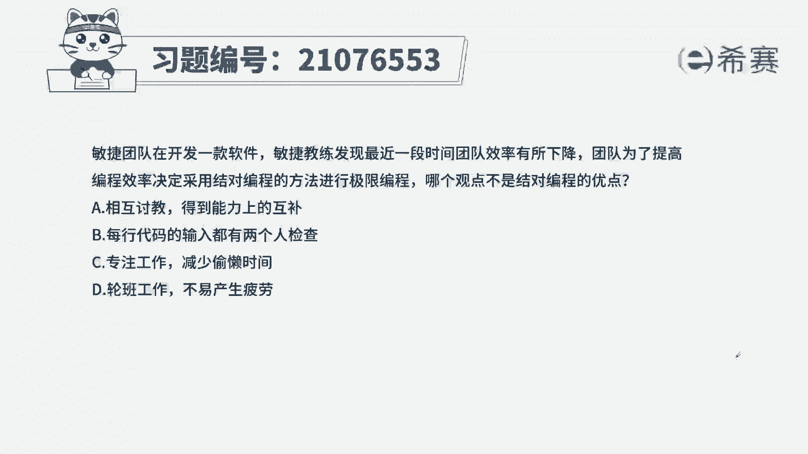
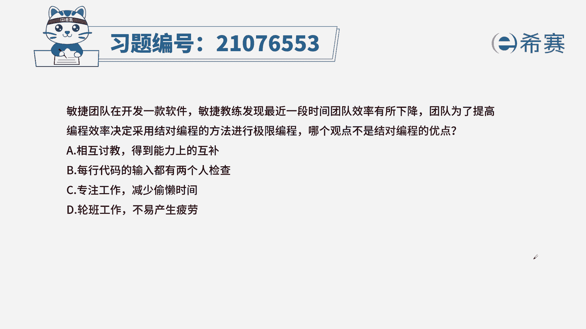
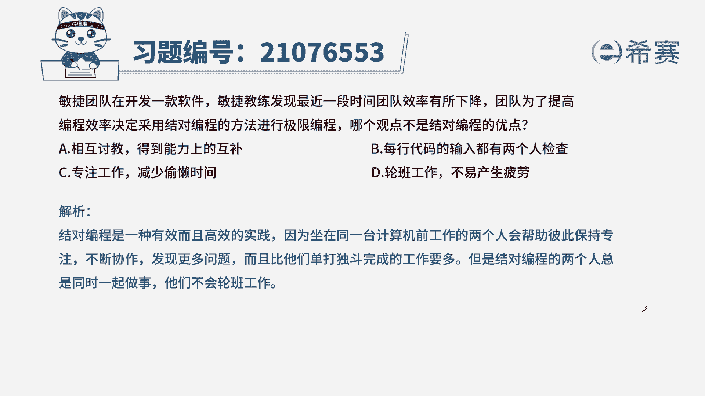

# 24年PMP考试模拟题200道，题目解读+知识点解析，1道题1个知识点（预测+敏捷） - P80：80 - 冬x溪 - BV17F411k7ZD

敏捷团队在开发一款软件，敏捷教练发现最近一段时间团队效率有所下降，团队为了提高编程效率，决定采用结对编程的方法进行极限编程，哪个观点不是结对编程的优点，A互相讨教，得到能力上的互补。

B每行代码的输入都有两个人检查，专注工作，减少偷懒时间，轮班工作不易产生疲劳，本题考法考内容，考概念，通过题干找到关键信息问题，问的是不是结对编程的优点，我们知道结对编程是两个人同时工作，一个人编代码。

一个人进行审查，在这个过程中进行知识共享，技能共享，减少错误的出现，同时提高团队的效率，来看看四个选项相互讨价，B代码仅有两个人检查，C专注工作，这三项全部属于结对编程的优点，轮班工作不易产生疲劳。

绝对编程是两个人同时工作，一个人在编代码，一个人在审查，所以D项是我们的正确选项。

这是本集的解析。

