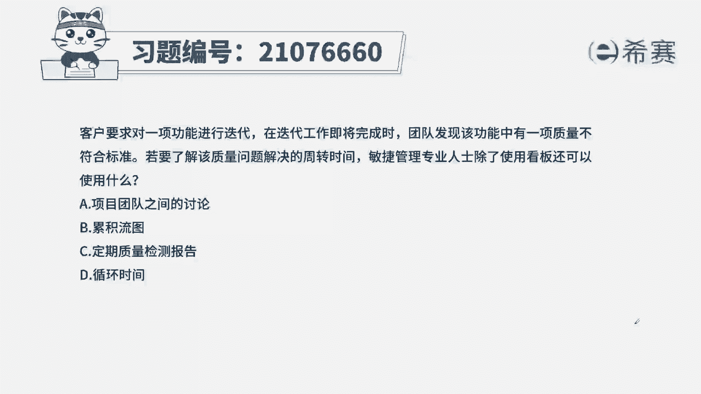
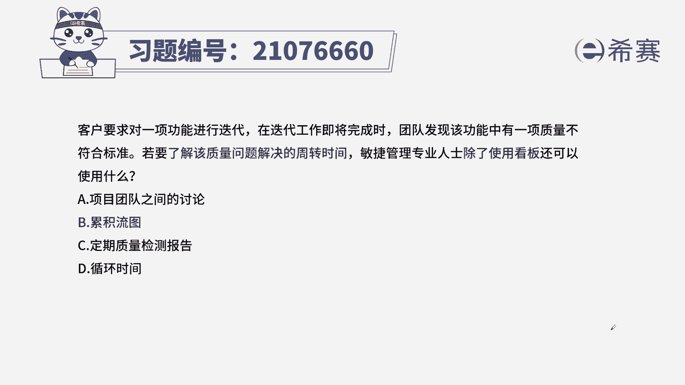
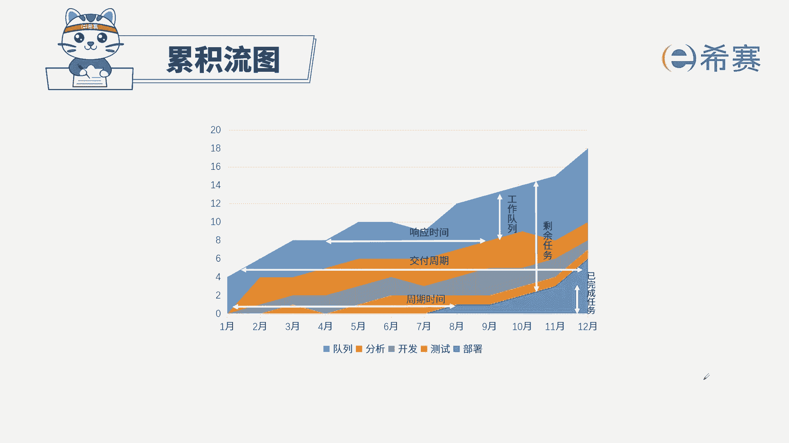

# 24年PMP考试模拟题200道，题目解读+知识点解析，1道题1个知识点（预测+敏捷） - P82：82 - 冬x溪 - BV17F411k7ZD

客户要求对一项功能进行迭代，在迭代工作即将完成时，团队发现该功能有一项质量不符合标准，若要了解该质量问题解决的周转时间，敏捷管理专业人士除了使用看板，还可以使用什么，A项目团队之间的讨论。

B累积流图C定期质量检测报告D循环时间，本期的考法是考概念和内容，找到题干的关键信息，要了解一个质量问题解决的周转时间，他的意思是，当出现了一个问题，从发现问题到这个问题被解决，它的周转时间有多长。

查看一个用户故事，从开始到完成是用看板最方便，同时还有一个叫做累积流图，它的一个特点就是横轴代表周转时间，所以选择B选项一起来看其他三个选项，团队之间的讨论讨论偏主观，而且没有客观的事实。

C定期质量检测报告，检测报告是定期发生，比较滞后，而且只能发现质量问题，它的周转时间是不方便在报告里面显示的，D循环时间是指的一个用户故事，或一个特性的开发时间。

这是本题的解析，大家可以暂停看一下本集的相关知识点，累积流图，针对这个知识点，一定要知道纵轴横轴代表什么信息，以及最重要的两个不同颜色之间的高差，代表什么意思，还有斜率是什么意思。

