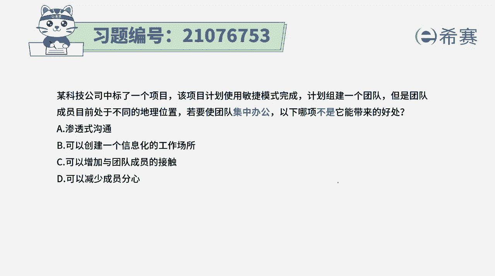
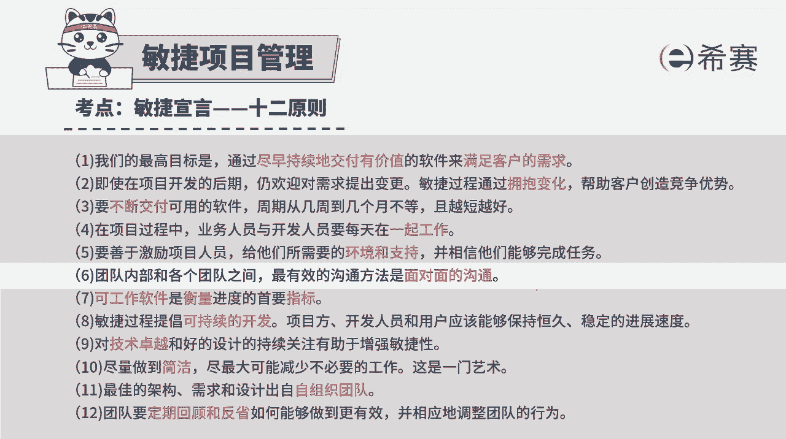
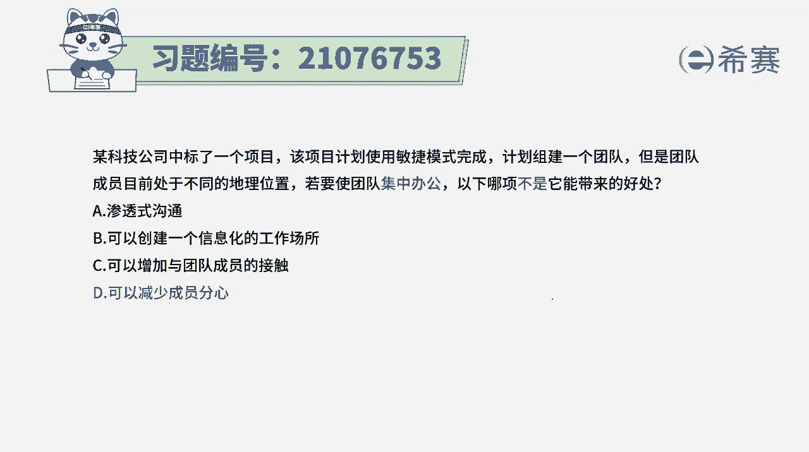
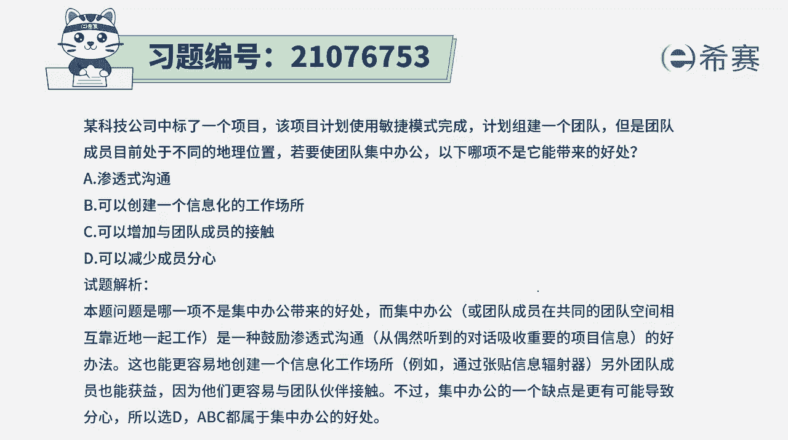

# 24年PMP考试模拟题200道，题目解读+知识点解析，1道题1个知识点（预测+敏捷） - P84：84 - 冬x溪 - BV17F411k7ZD

某科技公司中标了一个项目，该项目计划使用敏捷模式来完成计划，组建一个团队，但是团队成员目前处在不同的地理位置，若要使团队能集中办公，以下哪一项不是他所能带来的好处，请注意这里格式不是，那么也就是说。

以下选项中有三条选项都是集中办公，能够给团队带来的好处，那我们来分别看一下啊，选项A说的是渗透式沟通，如果说我们大家能够去集中办公的话，在一起，那么就是无意之间就能够分享很多信息，获取很多信息。

这肯定是它的好处之一，选项B可以创建一个信息化的工作场所，那如果说我们在一起的话，可以通过啊看板呢，那信息发射语言呢这样一种方式来去传递信息，这也是一种有效的方式，选项C可以增加与团队成员的接触。

那当然了，你都在一起办功能，那肯定是接触更多，了解更多，也更有利于去做团队建设以及带共同去协作，选项D可以减少成员的分析，呃这个呢其实在某种程度上来讲，坦白说他确实可以减少团队成员的分析。

但是从另外一个维度来讲呢，当我们能够在一起工作的时候，大家遇到什么问题的时候，那我们就马上要开会讨论，遇到什么问题的时候，我就开始去交流，他也会分心。

所以这个表达其实是不绝对的，我们这个题目本身它告诉我们就是在敏捷中，其实会以最有效的沟通方式是面对面的沟通，所以呢要集中办公。

但是集中办公的话，他不是说一定能够减少它的成员分析，有可能因为有更多的这种讨论交流，有可能就是呃会让你有一些分心，但从大方向来讲，我个人是觉得他确实可以减少团的成员分析，就是让你专注在某一件事情上。

当我们能专注在某一件事情上的时候。

那这个工作效率啊，速度啊，都会有大量的一个提升解析。

