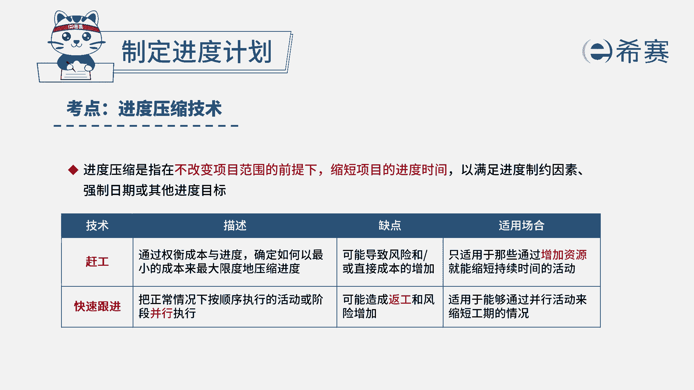
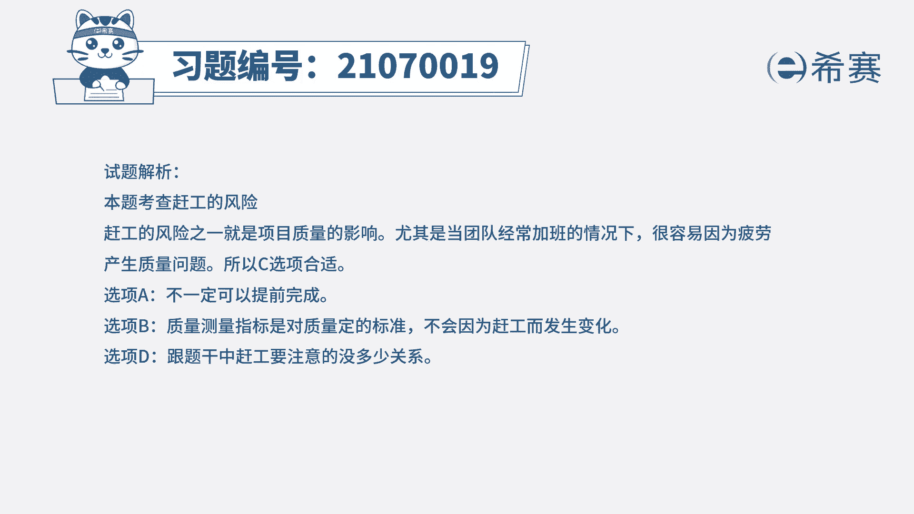

# 24年PMP考试模拟题200道，题目解读+知识点解析，1道题1个知识点（预测+敏捷） - P11：11 - 冬x溪 - BV17F411k7ZD

一个施工项目正在进行中，项目经理确认当前进度已经延迟，由于客户是政府部门，项目经理希望能够按时完成项目，于是让所有团队成员每周加班35个小时，项目经理在执行中应该注意什么，A项目可以提前完工。

质量测量指标可能会出现变化，C可能会不满足质量出现反攻，随时向所有相关方报告进度进展，读完题目，我们可以找到题干中的关键句，题干说，项目经理让所有团队成员，每周加班35个小时，提干的问题是。

项目经理在执行过程中应该注意什么，让团队成员加班是属于赶工的一种方式，而赶工的风险之一就是会出现返工的风险，所以C选项是符合的，我们再看一下其他选项，先看A选项，即使是加班，也不一定能够提前完工。

况且提前完工并不是应该注意的问题，所以A不选，再看B选项，质量测量指标是对质量定的标准，不会因为赶工而发生变化，所以B也不选，最后看D选项，向相关方报告项目进展，跟加班赶工这件事。

要注意的问题并没有什么关系，所以D也不选，因此本题最佳的答案是C选项。

本题考察的知识点是项目进度管理中。

