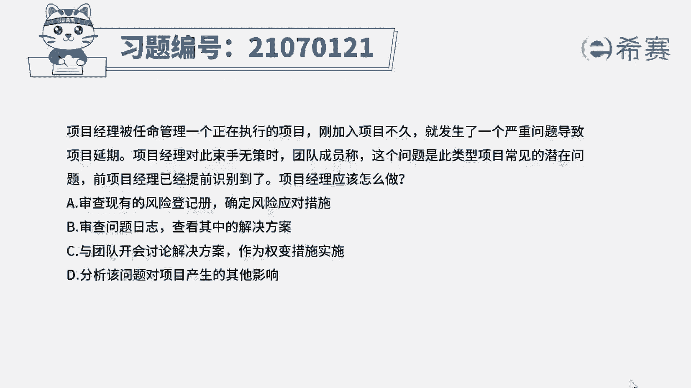
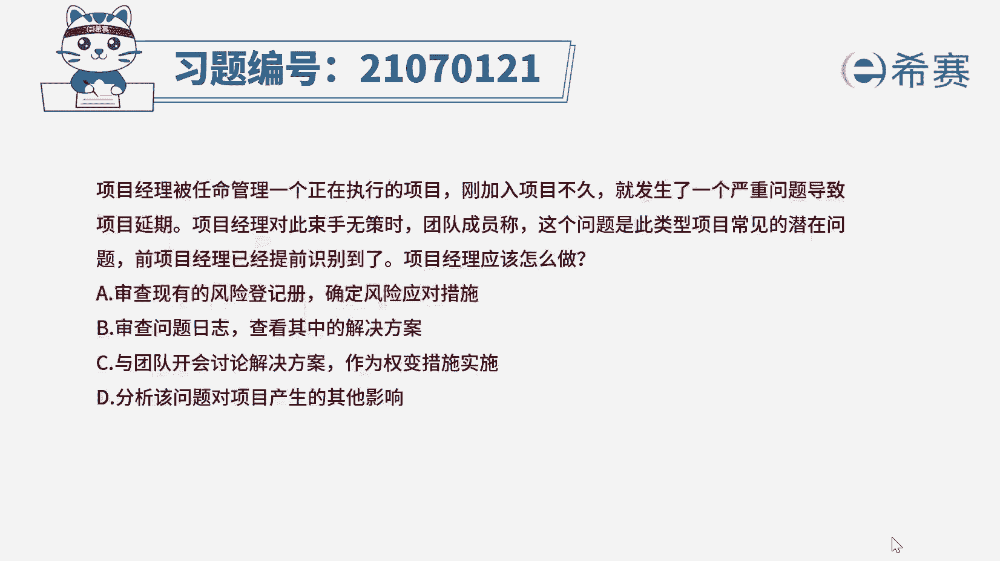
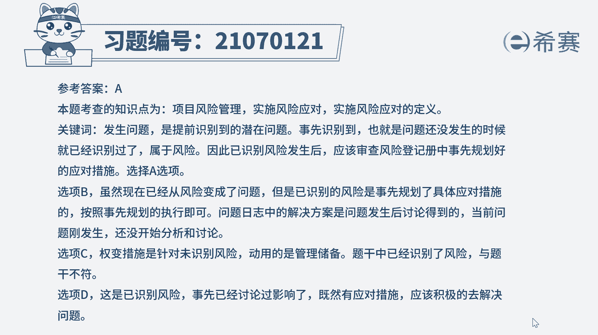
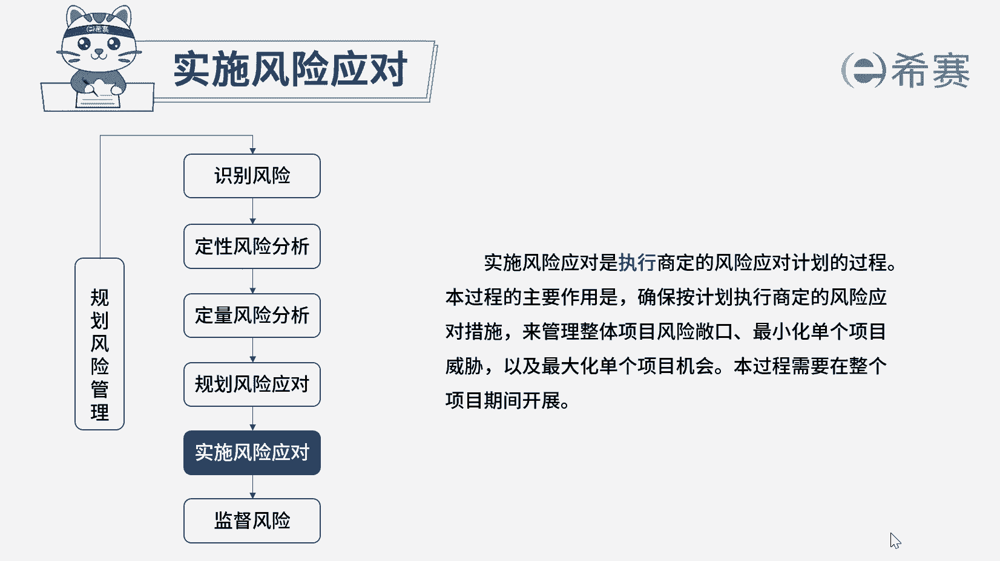

# 24年PMP考试模拟题200道，题目解读+知识点解析，1道题1个知识点（预测+敏捷） - P18：18 - 冬x溪 - BV17F411k7ZD

项目经理被任命管理一个正在执行的项目，刚加入项目不久，就发生了一个严重问题，导致项目延期，项目经理对此束手无策时，团内成员称，这个问题是此类型项目常见的潜在问题，前项目经理已经提前识别到了。

项目经理应该怎么做，A审查现有的风险登记册，确定风险应对措施，B审查问题日志，查看其中的解决方案，C与团队开会讨论解决方案作为全面措施实施，D分析该问题对项目产生的其他影响，好读完题目。

我们先来看一下问题，项目经理应该怎么做，哎我们再回到题干中，可以看到一些关键词项目发生了一个严重问题，导致项目延期，然后团队成员说前项目经理已经提前识别到了，哎，注意提前识别这四个字。

这说明这个炎症问题就是之前识别到的风险，现在风险发生了，就需要实时风险应对，那么我们就需要去审查风险登记册，根据风险登记册中的应对策略，来解决目前的问题，唉所以这道题的最佳答案就是选项A好。

那我们接下来也来看一下其他选项，选项B目前虽然是危险发生变成了问题，但是问题日志中的解决措施，是在问题发生后经过讨论才得到解决措施的，当前还没进行分析讨论，所以问题日志中是没有解决措施的，相比之下。

直接按照事先规划的应对策略来执行，会更合适一点，好谁上C全面措施针对未识别风险的，而题干中是已经识别到的，与题意不相符，哎我们不选选项D哎，就是刚刚在选项B中提到的分析讨论。

但是这里问题是作为风险被提前识别了，在之前就进行了风险分析啊，这里就不需要再重复进行了，好了，这道题我们就先讲解到这里。

大家可以自行参考一下相关的文字解析。

整个题目讲解下来，我们可以知道本题考察的知识点，就是以识别的风险发生时。

