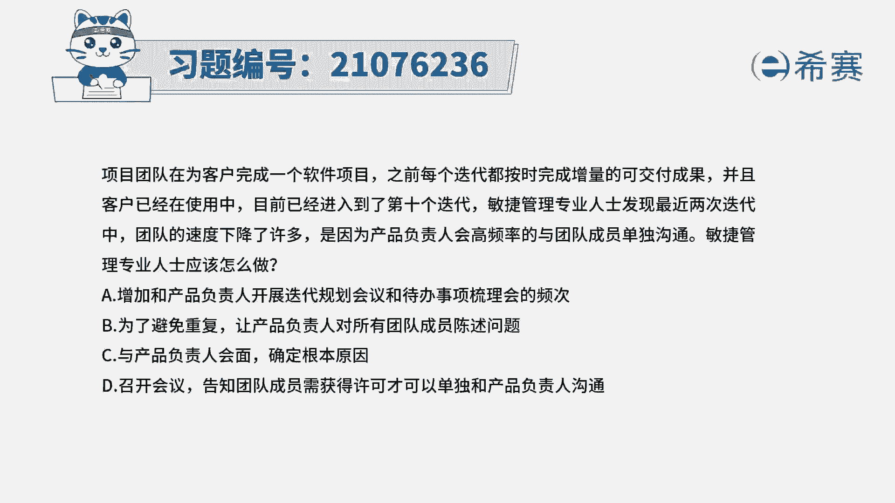
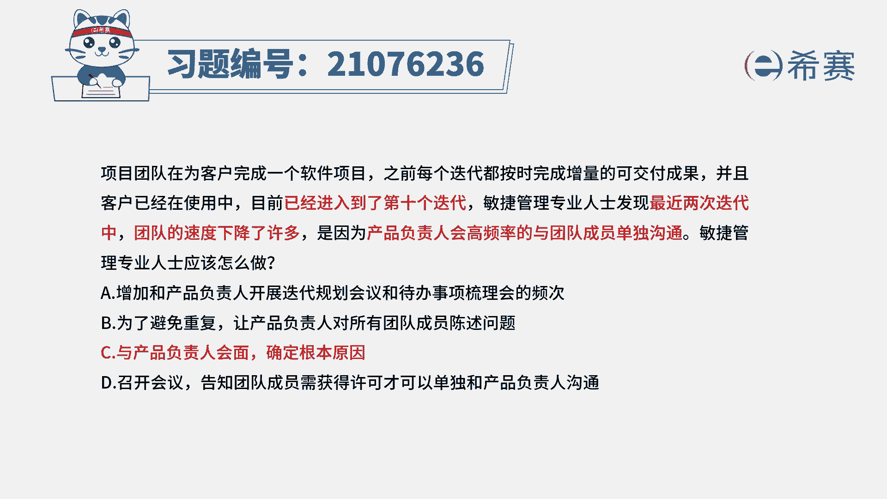
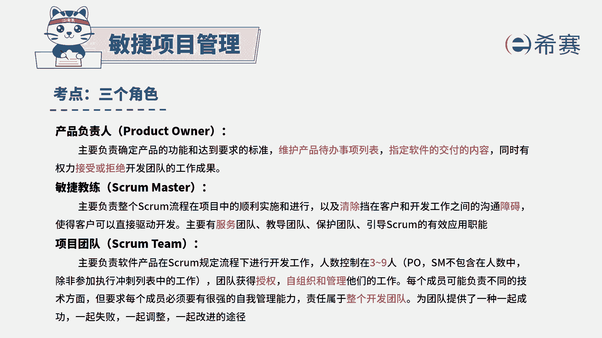
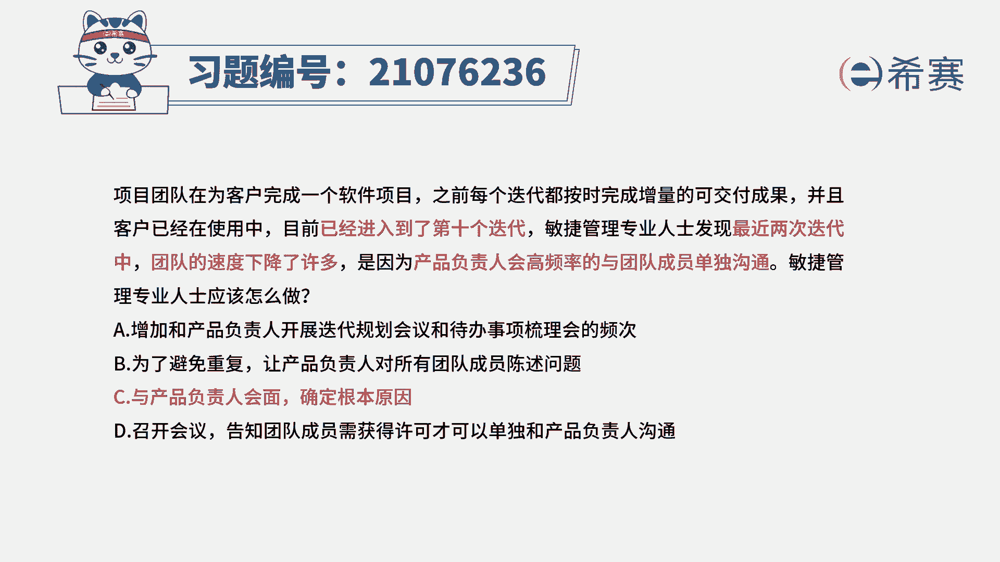

# 24年PMP考试模拟题200道，题目解读+知识点解析，1道题1个知识点（预测+敏捷） - P1：1 - 冬x溪 - BV17F411k7ZD

项目团队在为客户完成一个软件项目之前，每一个迭代都能够按时完成增量的可交付成果，并且客户已经在使用中，目前已经进入到第十个迭代，敏捷管理专业人士发现，最近两次迭代中，团队的速度下降了许多。

是因为产品负责人会高频率地与团队成员，单独沟通，敏捷管理专业人士应该怎么做，那题目中已经告诉你这个问题所在，就是整个团队的迭代速度会变低，也告诉你原因是什么，原因是。

产品负责人会高频率地与团队成员单独沟通，那对于这种情况的话，那你肯定就是有问题去解决问题对吧，既然产品负责人他会高频率的与团队成员沟通，那我们就需要去跟产品负责人来做沟通和交流，从而能够去锁定问题所在。

去解决问题，来看一下四个选项，选项A增加和产品负责人开展迭代规划，会议和待办事项列表的这样一个数据的频次啊，这种话意思是说，可能我如果我们多见几次面，多开几次会，可能他就不会单独找大家沟通了。

是这样的吗，很显然没有对到点子上，题干中说的是单独与团队成员沟通，所以导致会影响速度，选项B为了避免重复，让产品负责人对所有团队成员都去陈述问题，这个还真不是说单独沟通和群体沟通。

而是他通过这种单独沟通方式，可能会导致大家的这种工作内容做了一些调整，那这个调整不管你是跟他一个人讲，还是跟所有人一起讲，都还是一种调整，都会对整个当前的项目进度是一种干扰，选项C与产品负责人会面。

确定根本原因，这才是问题所在，也就是说，既然是因为他的原因导致整个项目的进度落后，那我们就应该是跟他去沟通，来找寻到原因所在，然后再去想下一步应该怎么解决，所以答案是选C，最后一个选项。

召开会议告知团的成员需获得许可，才能够单独和产品负责人沟通，这个的话就有点产品附赠，他都来找你了，你难道是不去跟他配合，并且敏捷中会说到一个很重要的信息，是合作胜于谈判。

那我们应该是面对面的沟通合作的方式，所以你应该是找到问题的根源所在点，也是产品复制人这个角色来去处理解决问题。

那解析呢在这里需要同学可以自行查看一下，我们得要知道产品负责人，他是维系这一个产品代办事项列表，以及是明确我们每一次的这个冲刺流周期，可能需要做哪些事情，然后每一个那个代办事项做到什么程度，才算是验收。

他会是这样的一个角色，他能够代表了客户这个角色，他是我们项目中非常重要的一个角色，但是如果说因为他的原因，导致整个项目的进度有往后延迟，有落后，那作为敏捷教练，您其实要是清除障碍，你要去清除障碍。

说你要去找到问题，解决问题，所以这个题目的答案应该是选C选项，与产品负责人来沟通，确定问题。

