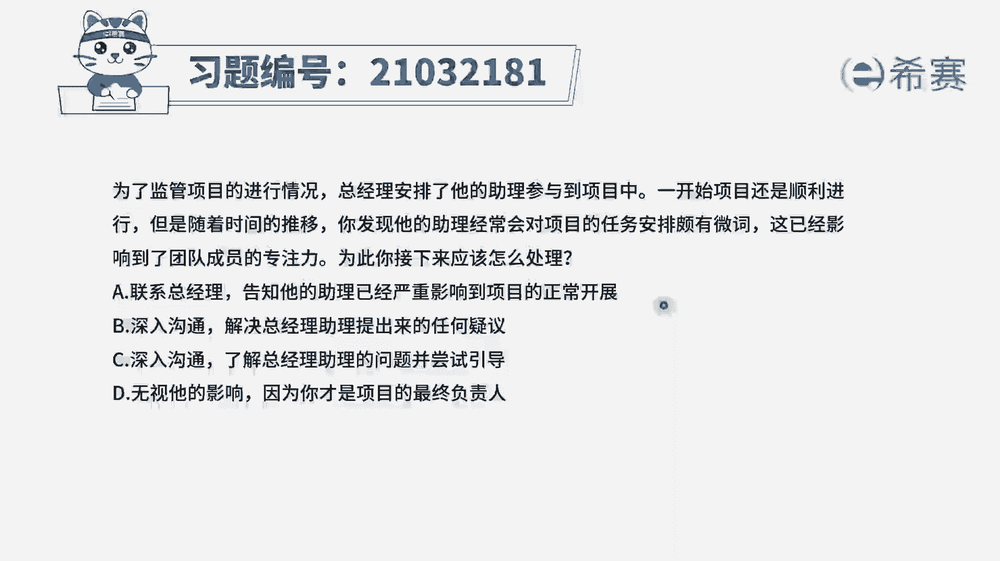
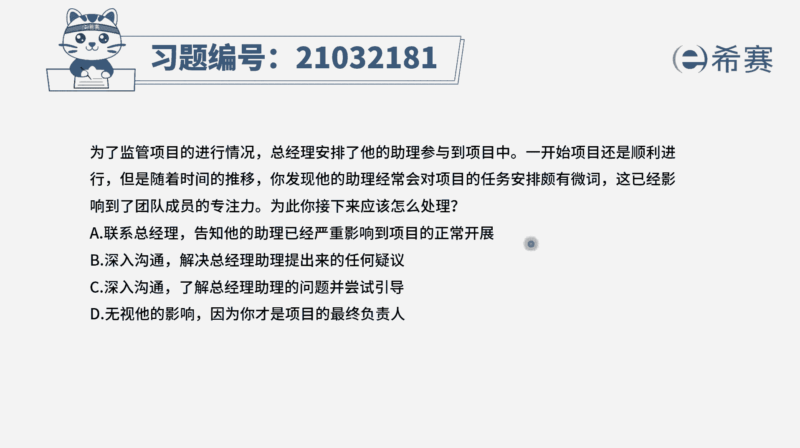
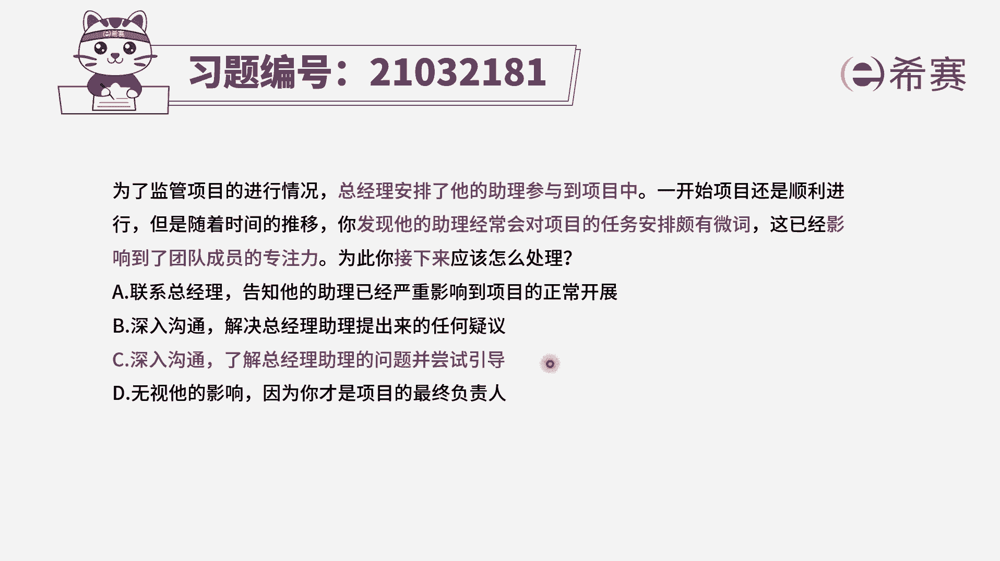
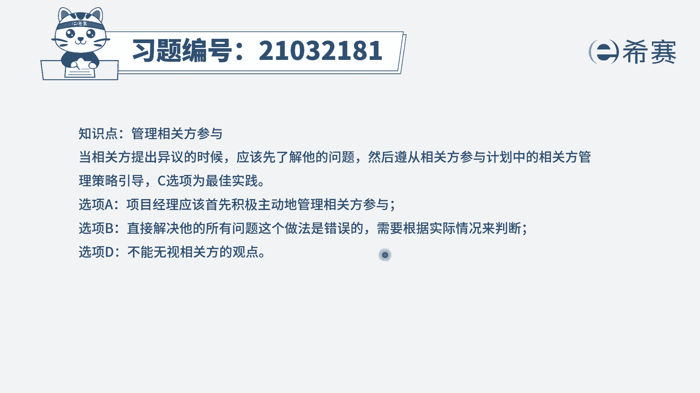
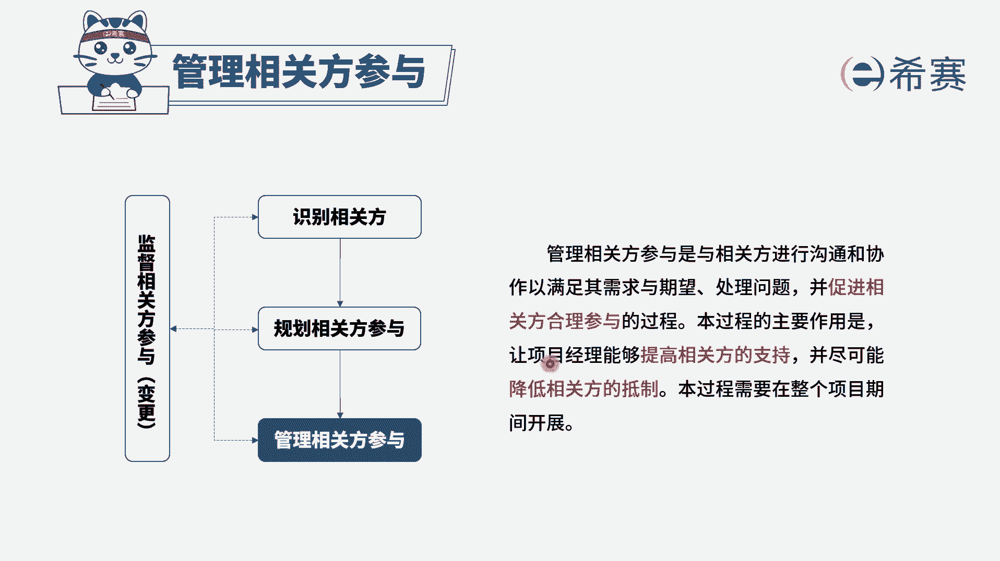

# 24年PMP考试模拟题200道，题目解读+知识点解析，1道题1个知识点（预测+敏捷） - P22：22 - 冬x溪 - BV17F411k7ZD

为了监管项目的进行情况，总经理安排了他的助理参与到项目中。

一开始项目还是顺利进行，但是随着时间的推移。

你发现他的助理，经常会对项目的任务安排颇有微词。

这已经影响到了团队成员的专注力，为此你接下来应该怎么处理，选项A联系总经理，告知他的助理已经严重影响到项目的正常开展，选项B深入沟通，解决总经理助理提出来的任何疑义，选项C深入沟通了解总经理助理的问题。

并尝试引导选项D无视他的影响，因为你才是项目的最终负责人好，我们先来看一下题干的关键词，是不是总经理安排他的助理参与到项目中，目的是为了监管项目的情况，所以这个总经理助理，它本身就属于项目的相关方。

现在相关方对项目的任务安排颇有微词，已经影响到了团队成员，说明相关方已经会对项目造成影响，这是典型的相关方参与程度不符合，我们，首先是不是应该要跟这个相关方，去进行一个沟通，了解他的情况，看一下选项。

首先是不是可以排除D选项，A选项是直接去联系总经理，告知他的项目助理已经严重影响到项目的开展，那么这是属于一个上报项目经理，你应该积极主动的去管理相关方的参与，在这个项目中，相关方就是这个总经理助理。

所以你应该直接去找他进行沟通，而并不是向总经理报告，而D选项直接无视它的影响，这肯定不是一个积极主动解决问题的选项，在剩余的BC选项中，大家觉得哪个更合适呢，B选项是解决总经理助理提出来的任何疑义。

而C选项是先了解他的问题，并尝试引导题干，问的是接下来对不对，我们首先肯定是先去了解它的问题，然后再去想解决方案，并且B选项所说的解决它的任何意义，也不一定是对的，对不对，太绝对了。

我们需要具体问题具体分析，所以四个选项中只有C选项是最合适的，大家可以看一下文字解析。

