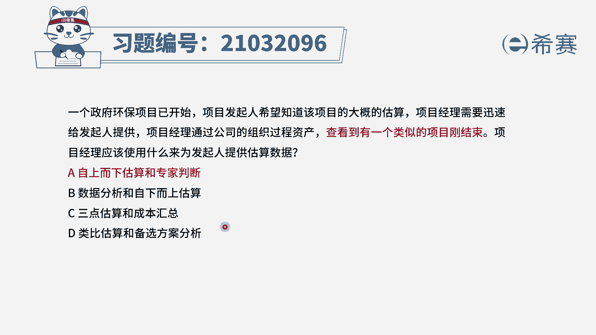
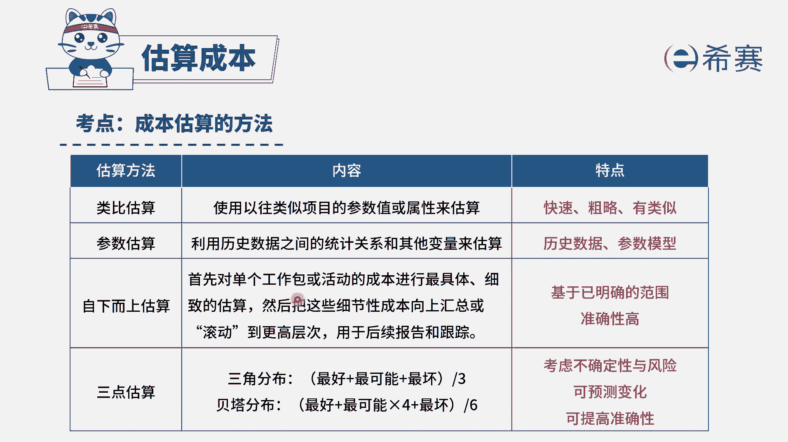

# 24年PMP考试模拟题200道，题目解读+知识点解析，1道题1个知识点（预测+敏捷） - P24：24 - 冬x溪 - BV17F411k7ZD

一个政府环保项目，一开始，项目发起人希望知道该项目的大概的估算，项目经理需要迅速给发起人提供，项目经理通过公司的组织过程资产，才看到有一个类似的项目刚结束，项目经理应该使用什么来为发起人提供。

估算的数据，选项A自上而下估算和专家判断，选项B数据分析和自下而上估算，选项C，三点估算和成本汇总选项D，类比估算和备选方案分析，我们先来看题干，是不是说我们需要迅速的提供一个大概的估算。

并且是有类似项目参考的，我们很容易把它对应到那一笔估算，而在选项中只有AD选项是讲了类比估算，大家一定要看清楚选项AA的前半句，自上而下估算，从上往下的估算，其实它就是类比估算的别称。

而并不是我们讲到的自下而上估算，一定要区分清楚，因此AD选项都讲到了，类比估算是最贴合题意的，再来看他们的后半句，一个是专家判断，一个是备选方案分析，我们应该考虑哪个呢。

A选项专家判断他是征求具有类似项目知识，或者说有过培训的个人或者小组的意见，我们在估算时可以考虑用到专家判断，而D选项的备选方案分析是说，我们如果要去解决问题，对多个方案进行评估，选择最优的方案。

在题干中没有提及到，我们需要去进行方案的选择，而只是需要去进行一个估算，所以D选项不合适，A选项是正确的，再简单看一下BC两个选项，B选项的自下而上估算，它是基于WBS做一个准确的估算，他不满足迅速。

也不满足题干说的大概的估算，C选项的三点估算，它是基于项目的风险不确定性进行一个计算，在题干中也没有信息来支撑它，因此综合分析下来，只有A选项是比较合适的。

大家可以看一下文字解析部分，本题考察的是项目成本管理。

