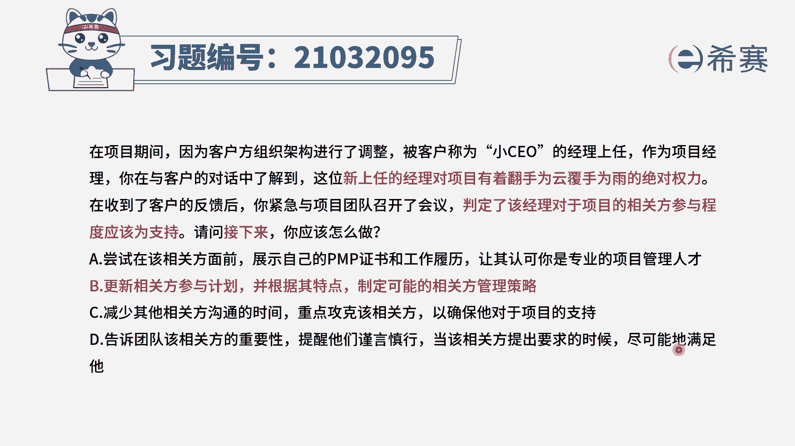

# 24年PMP考试模拟题200道，题目解读+知识点解析，1道题1个知识点（预测+敏捷） - P25：25 - 冬x溪 - BV17F411k7ZD

在项目期间，因为客户方组织架构进行了调整，被客户称为小CEO的经理上任，作为项目经理，你在与客户的对话中了解到，这位新上任的经理对项目有着翻手为云，在收到了客户的反馈之后，以紧急与项目团队召开了会议。

判定了该经理对于项目的相关方参与程度，应该为支持，请问接下来你应该怎么做，选项A，尝试在该相关方面前，展示自己的偏僻证书和工作履历，让其认可你是专业的项目管理人才，选项B更新相关方参与计划。

并根据其特点制定可能的相关方管理策略，选项C减少其他相关方的沟通时间，重点攻克该相关方，以确保它对于项目的支持，选项D告知团队该相关方的重要性，提醒他们谨言慎行，当该相关方提出要求的时候。

尽可能的满足他，那么我们看到题干比较长，它其实就是讲的一个新的相关方，一个关键相关方，他有着一个权力比较大的地位，并且他对于项目目前是支持的，我们在判定了相关方的参与程度之后，接下来应该做什么呢。

按照正常的流程是先识别相关方，然后进行相关方的管理工作，因此我们现在所处的阶段，是已经识别到了相关方，他的参与程度，接下来我们就应该进行相关方管理，那么相关方管理是基于相关方参与计划的，四个选项中。

B选项是最合适的选项，我们应该根据相关方参与计划，根据这个相关方的特点，制定最合适这个相关方它的一个管理策略，那么来看一下其他选项，A选项，在这个相关方面前去展示，你的一个项目管理的一个能力。

这并不是一个必要的选项，C选项减少其他相关方的沟通时间，重点攻克该相关方，虽然说这是一个关键相关方，它有着比较大的权力，但是我们到底如何去对它进行一个管理，我们是根据B选项说的，相关方参与计划去进行的。

所以C选项它可能是B选项其中的某一种方法，但是我们并不能直接就选择C选项，这种方法，直接去减少其他相关方的一个沟通时间，还是应该要先分析，去给他制定一个合适的管理策略，最后D选项D选项错在后半句。

当该向官方提出要求的时候，尽可能的满足他对于相关方的需求，特别是涉及到项目的基准的时候，我们肯定是要有变更走流程，而不是团队尽量的去满足他，这样很可能会造成范围的蔓延，所以四个选项中。

只有B选项是最符合流程的选项。

大家可以看一下文字解析。

本题考察的是相关方参与计划的内容和作用。

