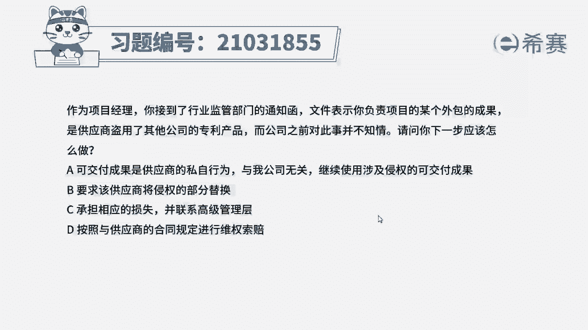
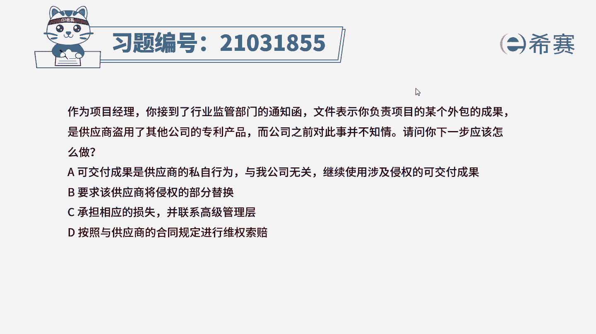
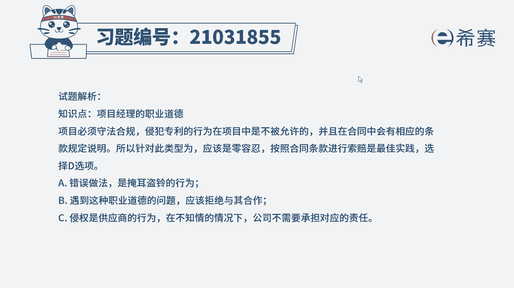
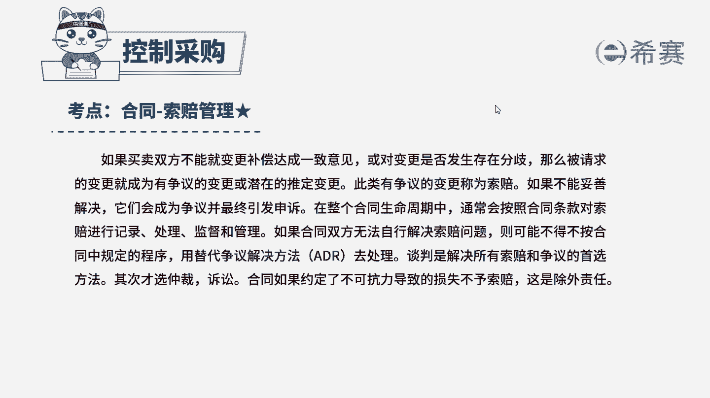

# 24年PMP考试模拟题200道，题目解读+知识点解析，1道题1个知识点（预测+敏捷） - P28：28 - 冬x溪 - BV17F411k7ZD

作为项目经理，文件表示，你负责项目的某个外包的成果，是供应商盗用了其他公司的专利产品，而公司之前对此事并不知情，请问你下一步应该怎么做，A可交付成果是供应商的私自行为，与我公司无关。

继续使用涉及侵权的可交付成果，要求该供应商将侵权的部分替换，C承担相应的损失，并联系高级管理层，读完题目，回答题干，我们来看一下这道题目，它的关键词是什么，现在供应商，他是盗用了其他公司的一个专利产品。

请问下一步你应该做什么项目，必须遵守法律法规，侵权专利的行为在项目当中是不被允许的，在合同签订的时候，双方就会因为这个问题进行讨论，并且在合同当中做出相对应的规定，所以针对这种行为。

我们基本上都是零容忍，我们应该按照合同的条款进行索赔，所以这道题正确选项是D选项，我们再来看一下其他三个选项，A选项可交付成果是供应商的私自行为，与我公司无关，继续使用涉及侵权的可交付成果。

这A选项它其实就是默认了，我们继续再使用这个可交付成果，那我们都已经知道这个可造成果它是侵权的，我们不能够再继续使用了，B选项要求该供应商将侵权的部分替换，B选项是这道题目当中最容易选错的一个选项。

因为我们大多都会认为侵权的部分，我们替换掉就可以了，但是遇到这种职业道德的问题，供应商他的品行有问题，我们就应该直接拒绝而已，跟他合作，以免下次还会发生这样子的问题，再看C选项，承担相应的损失。

并联系高级管理层，这个C选项，它其实现在是已经默默的承担了，这个相应的损失，那侵权其他公司的专利产品，是供应商的一个行为，我们公司是不知情的，我们的公司它不需要承担一个相应的责任，所以C选项也可以排除。

那这道题最佳选项的就是D选项。

这是这道题的文字解析，有需要的同学可以暂停看一下。

整个题目讲解下来，我们就可以知道这道题目，它考察的知识点，是项目经理的职业道德和索赔管理，我们要注意一下，考试当中，项目经理他是一个圣人，遇到违背职业道德的事情。

