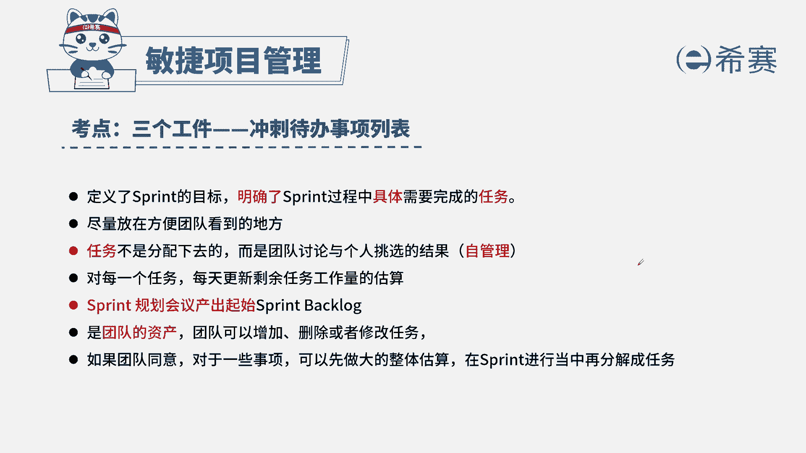

# 24年PMP考试模拟题200道，题目解读+知识点解析，1道题1个知识点（预测+敏捷） - P2：2 - 冬x溪 - BV17F411k7ZD

敏捷团队已经完成了第五次迭代，在执行下个迭代之前，要创建代办时尚列表，以便了解下个冲刺要完成的功能，代办事项列表应该在哪个会议上创建，A规划会议，B评审会议，本题的考法是考内容和概念。

首先通过题干找到关键信息，题目中问我们迭代代办事项列表，创建的时间是在哪里，我们知道迭代代办事项列表，是本次迭代要做的工作，那我们是一定是在开始之前来确定的，所以在本次迭代之前的会议只有规划会议。

选择A好，我们来看其他参选项，B评审会议是在迭代结束的时候，对我们本次迭代的功能进行演示，C回顾会议是在本次迭代结束后，对我们的工作进行复盘，B站会，这在我们迭代的周期期间内进行开的。

团队日常会议，这是本题的解析，大家可以暂停看一下本题的考点。

冲刺代办时尚列表，针对这个知识点，我们首先要了解这个代办时尚列表是谁来负责，什么时候创建。

