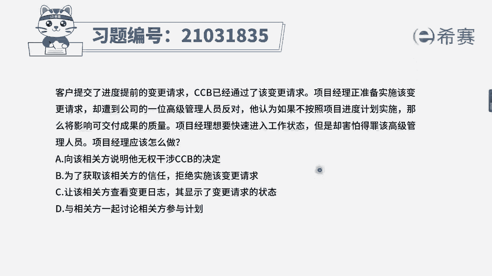
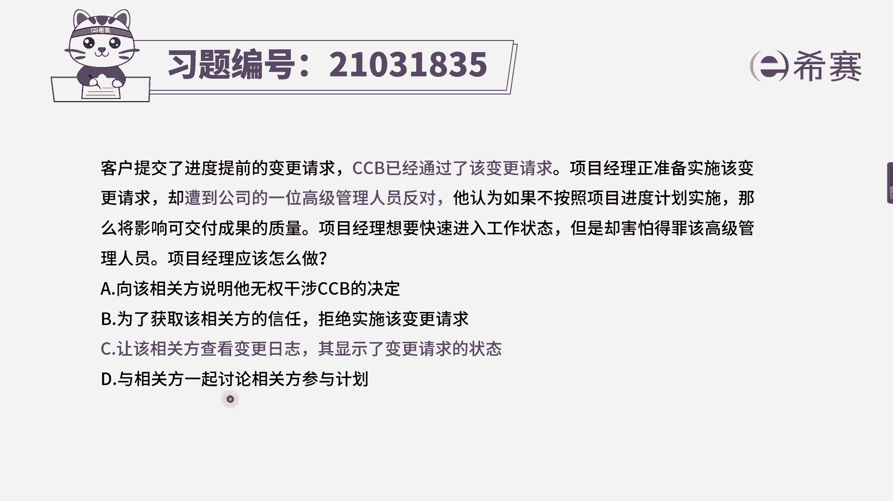
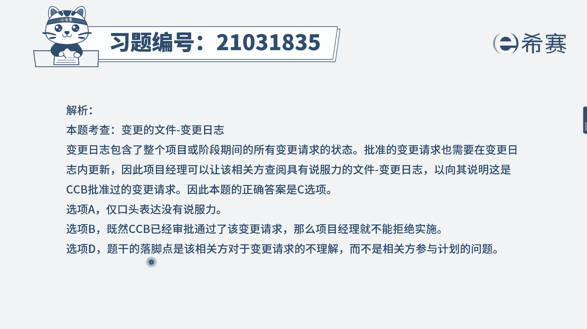

# 24年PMP考试模拟题200道，题目解读+知识点解析，1道题1个知识点（预测+敏捷） - P30：30 - 冬x溪 - BV17F411k7ZD

客户提交了进度提前的变更请求，项目经理正准备实施该变更请求，却遭到一位公司的高级管理人员反对，他认为如果不按照项目进度进行实施，那么将会影响可交付成果的质量，项目经理想要快速的进入工作状态。

但是却害怕得罪该高级管理人员，应该怎么做，选项A向该相关方说明，选项B为了获取该相关方的信任，拒绝实施该变更请求，选项C让该相关方查看变更日志，其显示了变更请求的状态，选项D与相关方一起讨论。

相关方参与计划，客户提交了进度提前的变更请求，CCB已经通过，我们就一定要实施，但是在这个时候，公司的一位相关方，一位高级管理人员，他进行了反对，在这种情况下，项目经理应该怎么做，我们来看一下选项。

A选项向该相关方说明，这个仅仅是你口头的一个说明，并且是过于强硬的，你明明不想得罪这个高级管理人员，你还直接这样口头说，是不是很没有信服力呢，B选项为了获取他的信任，拒绝实施变更，请求这是绝对不对的。

一旦变更被批准，我们是一定要实施的，C选项让该相关方查看变更日志，其显示了变更的状态，变更日志它记录的是变更是否被批准，是否被拒绝批准的理由是什么，所以说相关方他现在反对这个变更。

我们是可以让他查看变更日志，告诉他这个变更已经被批准了，为什么被批准，所以C选项是可选的，D选项与相关方一起讨论相关方参与计划，可能有同学会觉得诶这里是相关方反对，那么是他不支持项目。

所以我们要选跟相关方参与计划相关的选项，但是这里我们首先还是应该对症下药，因为它是反对的，是变更请求，我们应该先让他知道了解，为什么变更请求会被批准，了解影响之后再去考虑其他选项，并且D选项这里的讨论。

这两个词也不是非常的准确，因此综上分析，最合适的选项应该是C选项。

大家可以看一下文字解析部分。

本题考察的是实施整体变更控制流程，考察了两个点，如果相关方仍然有意义的话，我们还是要去执行CCB的一个指令，也就是批准一定要实施，还考察了一个点。

