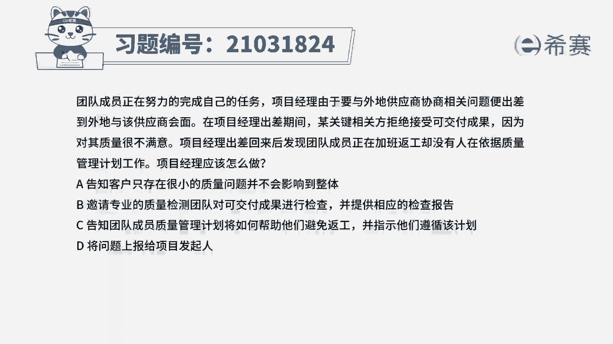
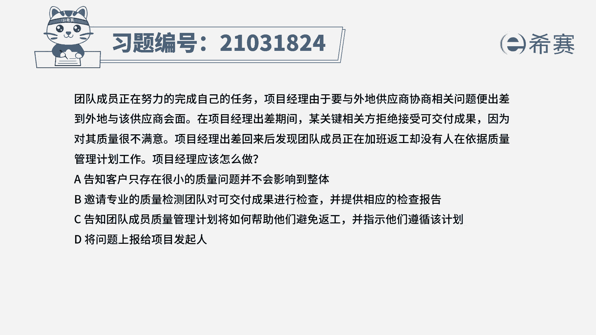
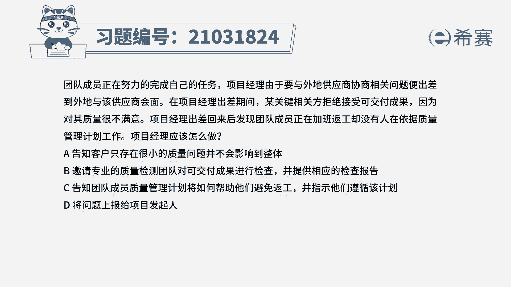
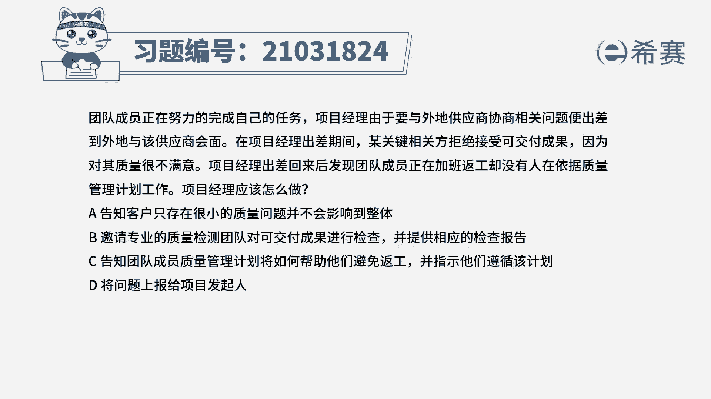
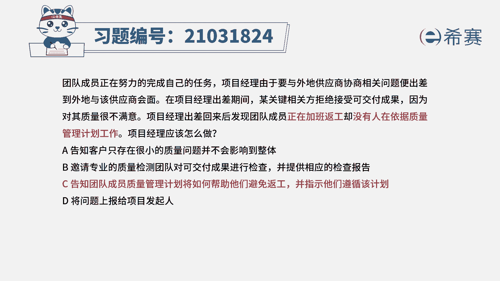
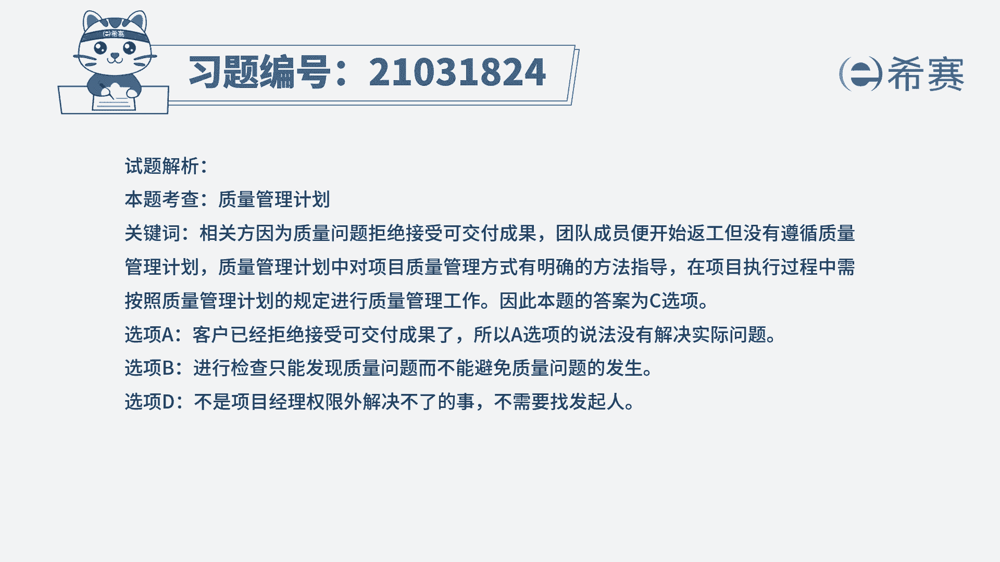
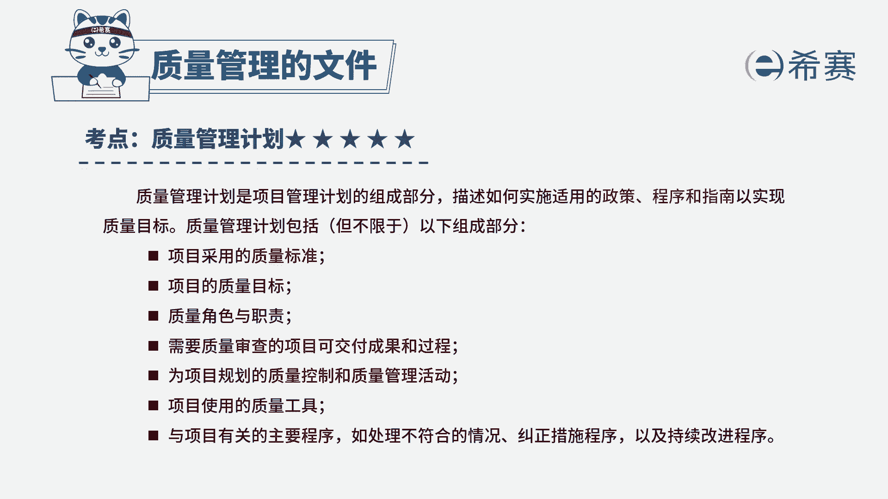

# 24年PMP考试模拟题200道，题目解读+知识点解析，1道题1个知识点（预测+敏捷） - P31：31 - 冬x溪 - BV17F411k7ZD

团队成员正在努力地完成自己的任务，项目经理由于要与外地供应商协商相关问题。

便出差到外地与该供应商会面。

在项目经理出差期间，某关键项目方拒绝接受可交付成果。

因为对其质量很不满意，项目经理出差回来后，发现团队成员正在加班返工，却没有人在依据质量管理计划工作，项目经理应该怎么做，告知客户只存在很小的质量问题，并不会影响到整体。

B邀请专业的质检团队对可交付成果进行检查，并提供相应的检查报告，C告知团队成员质量管理计划将如何帮助他们，避免返工，并指示他们遵循该计划，将问题上报给项目发起人，读完题目回答题干。

我们来找一下这道题目的关键词，现在相关方他拒绝了这个可交付成果，于是团队成员他就开始反攻了，但是都没有按照质量管理计划来进行，问项目经理应该怎么做，质量管理计划，它里面描述了怎么样去实施合适的政策。

还有程序，还有指南等等，然后这样子他就可以方便去实现质量目标，它里面包含了明确的项目管理的方式，在项目的执行过程当中，应该严格地按照质量管理计划的相关规定，来进行质量的管理工作。

所以这道题目最佳选项应该是C选项，高职团队成员质量管理计划，将如何帮助他们避免返工，以只是他们遵循该计划，我们再来分析一下其他三个选项，A选项告知客户只存在很小的质量问题，并不会影响到整体。

现在客户他已经拒绝了可交付成果，你再去告诉客户，这个质量问题很小，不会影响到整体，这就属于逃避找借口的一种做法，它不能够帮助我们实际的去解决问题，所以A选项排除，再看一下B选项。

邀请专业的团队对可交付成果进行检查，并提供相应的检查报告，现在再对可交付成果检查，他只能够去发现问题，但是他并没有避免，我们这个质量问题已经产生了，那题干当中他主要就是想要问团队成员，他都在反攻。

但是他都不是按照管理计划进行的，要避免这种不按程序办事，然后产生了质量问题，我们就应该告诉团队成员，质量管理计划它的一个重要性，才能够避免后面发生同样的问题，所以B选项排除。

D选项将问题上报给项目发起人，这个问题项目经理他完全可以自己解决，应该更加积极主动的去解决问题，上报给发起人，这种方法太过于消极，并且这个还是在项目经理他的权限以内的，所以D选项排除。

所以这道题最佳选项就是C选项。

这是这道题的文字解析，有需要同学可以暂停看一下。

这道题考察的知识点是质量管理计划的重要性，要严格按照质量管理计划当中的规定。

