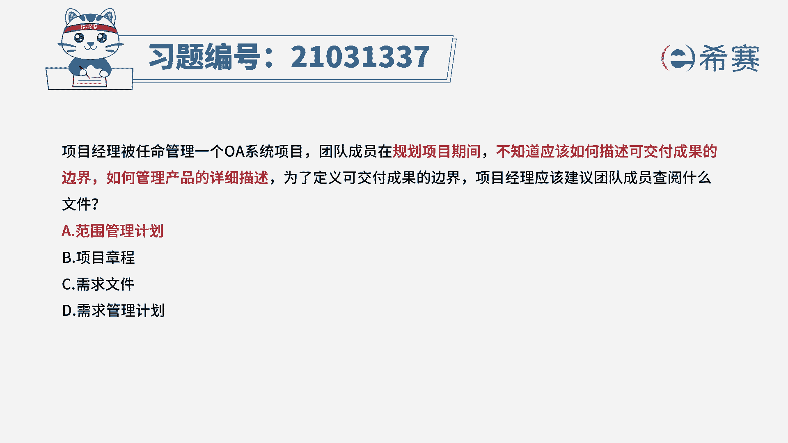
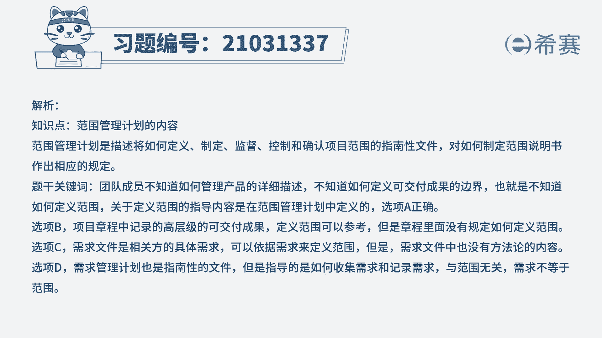
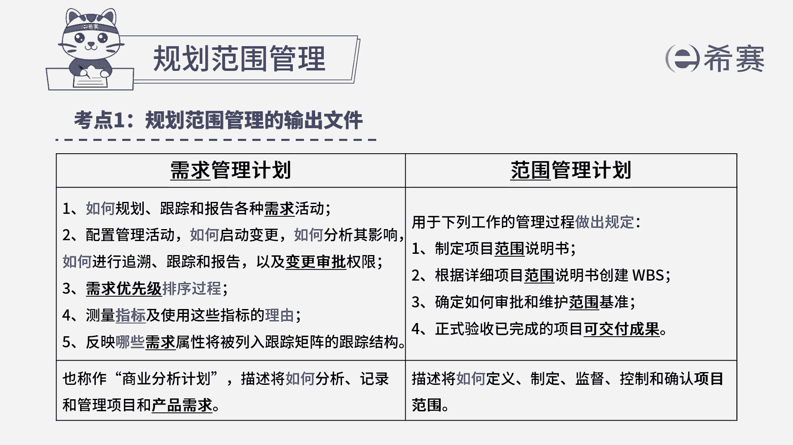

# 24年PMP考试模拟题200道，题目解读+知识点解析，1道题1个知识点（预测+敏捷） - P34：34 - 冬x溪 - BV17F411k7ZD

项目经理被任命管理一个OA系统，项目团队成员在规划项目期间，不知道应该如何描述可交付成果的边界，如何管理产品的详细描述，为了定义可交付成果的边界，项目经理应该建议团队成员查阅什么文件，A范围管理计划。

B项目章程C需求文件D需求管理计划，这道题目当中我们找到关键词，在规划项目期间，团队成员不清楚可交付成果的边界，也不知道怎么去管理产品的详细描述，就是在说这位团队成员并不知道怎么定义范围。

其实考察的就是范围管理计划的内容，范围管理计划，它是根据四项管理过程做出的规定，第一个制定项目范围说明书，第二个根据详细的项目范围数创建WBS，第三个确定如何审批和维护范围基准。

第四个正式验收已完成的项目可交付成果，所以这道题，它描述的就包含在范围管理计划当中，所以这道题我们选择A选项，再来看一下其他三个选项，项目章程是项目只记录了高层的可交付成果，定义范围它可以参考。

但是比较大的范围没有详细的描述，C需求文件，需求文件是相关方的具体需求，也可以依据需求来定义范围，但是需求文件中也没有方法论的内容，也就是说他不会告诉你如何去做D选项，需求管理计划也是指南性的文件。

但是指导的是如何收集需求和记录，需求与范围无关，所以需求不等于范围，这道题我们只能选择A选项。

这是这道题的文字解析，有需要的同学可以暂停看一下。

那这道题目考察的就是第五章当中规划范围，管理范围。

