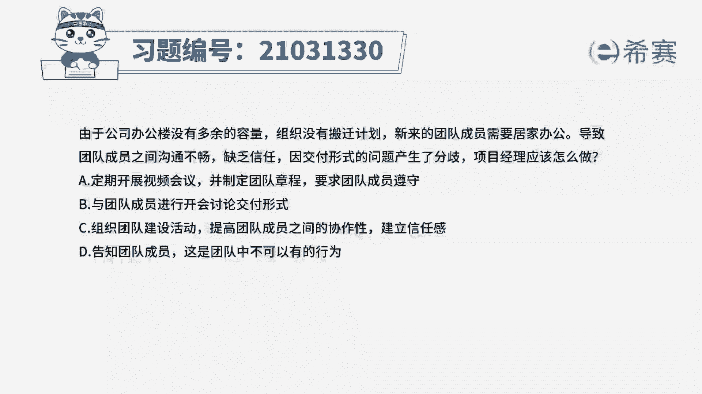
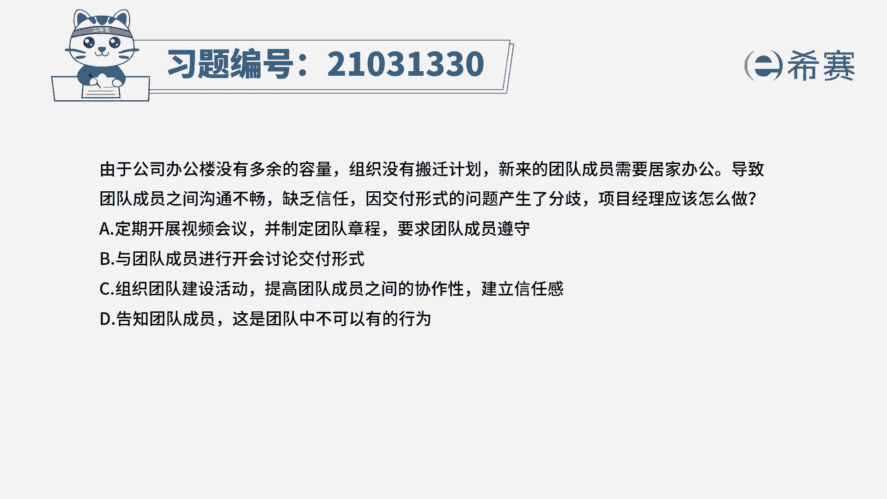
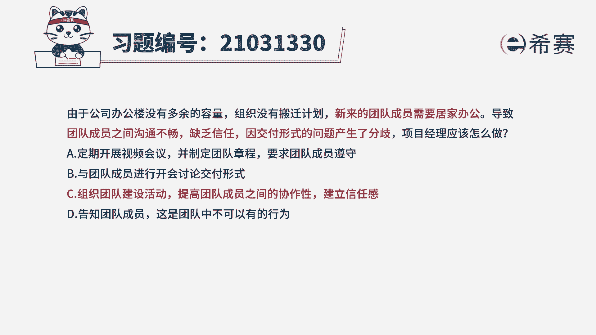
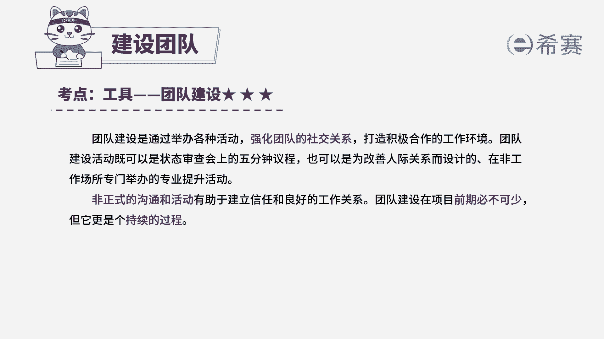
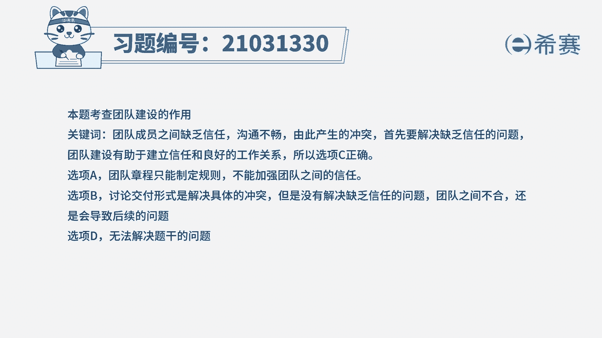

# 24年PMP考试模拟题200道，题目解读+知识点解析，1道题1个知识点（预测+敏捷） - P36：36 - 冬x溪 - BV17F411k7ZD

由于公司办公楼没有多余的容量，组织没有搬迁计划，新来的团队成员需要居家办公。

导致团队成员之间沟通不畅，缺乏信任，因交付形式的问题产生了分歧，项目经理应该怎么做，A定期开展视频会议，并制定团队章程，要求团队成员遵守，B与团队成员进行开会讨论交付形式，C组织团队建设活动。

提高团队成员之间的协作性，建立信任感，D告知团队成员，这是团队中不可以有的行为，读完题目，我们可以找到题干中的关键句，题干说新来的团队成员需要居家办公，导致团队成员之间的沟通不畅，缺乏信任。

因为交付形式的问题产生了分歧，问应该怎么做，所以我们先看选项，我们首先可以排除的是D选项，D选项中直接告知团队成员，并不能解决这个问题，属于一种非常消极的处理方式，题干中已经明确说了，是因为沟通不畅。

而且是缺乏信任，才导致了题干的问题，首先应该做的是，要解决他们的沟通和不信任的问题，所以D不选，我们再看其他选项，先看A选项，A选项，团队章程是大家都需要遵守的规则，并不能增强信任度，B选项。

目前是要解决相互不信任的这个根源问题，讨论交付形式只是暂时解决了当前的冲突，但是没有解决根本原因，所以后续可能还会出现这种问题，最后看C选项，C选项是比较合适的做法，团队建设活动。

有助于建立信任和良好的工作氛围，所以C是可选的，因此我们本题最佳的答案就是C选项。

本题考察的知识点是项目资源管理中。

