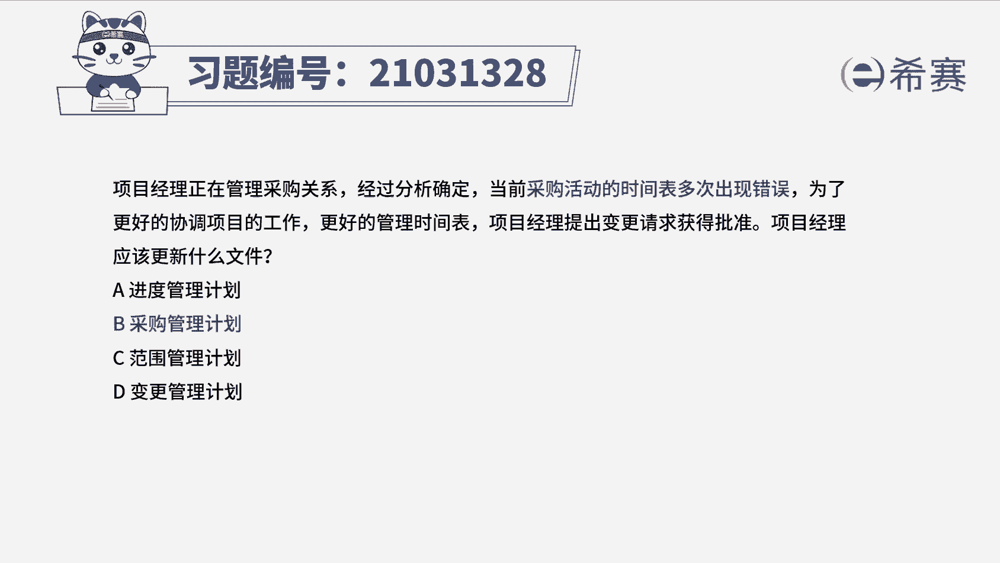
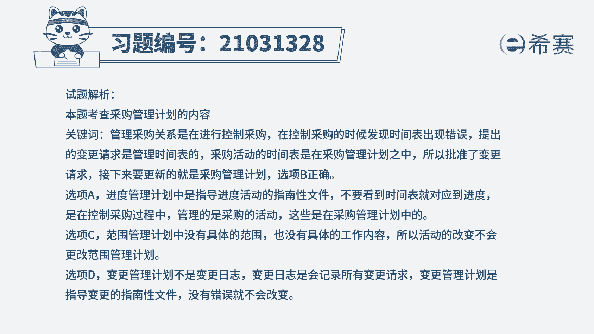
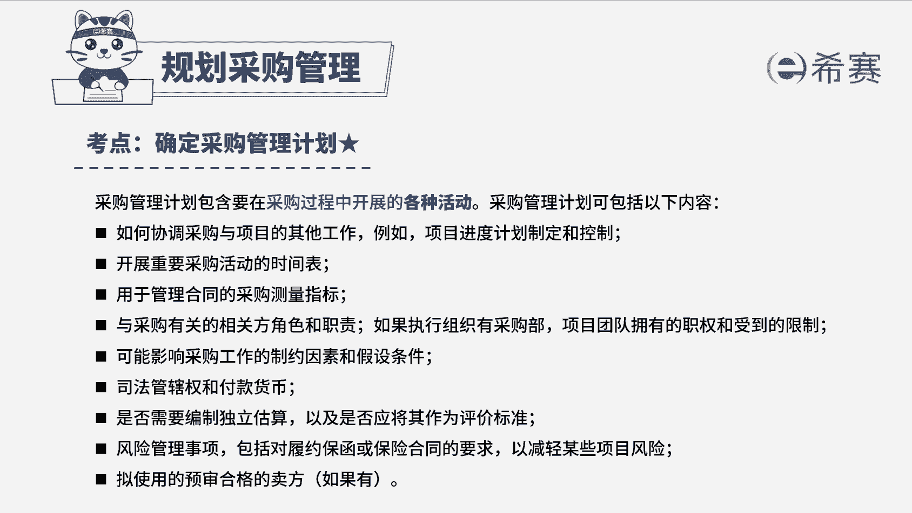

# 24年PMP考试模拟题200道，题目解读+知识点解析，1道题1个知识点（预测+敏捷） - P37：37 - 冬x溪 - BV17F411k7ZD

项目经理正在管理采购关系，经过分析，确定当前采购活动的时间表，多次出现错误，为了更好地协调项目的工作，更好地管理时间表，项目经理提出变更请求获得批准，项目经理应该更新什么文件。

进度管理计划B采购管理计划，范围管理计划，变更管理计划，读完题目，回到题干，我们来看一下这道题目，它的关键词现在是采购活动时间表，多次出现了错误，项目经理他提出了变更请求，并且获得了批准。

现在他应该更新什么文件，当前看到第一句，他正是在进行采购关系的一个管理，说明他是在执行控制采购的这个过程，提出的变更请求，它是对采购活动时间的一个调整，而采购活动时间的一个时间表。

是包含在采购管理计划当中的，所以批准了变更请求之后，他应该是要更新采购管理计划，所以这道题，它考察的其实就是采购管理计划的一个内容，我们可以知道采购管理计划，它包括怎么样去协调采购和项目的。

一个其他的工作，还有开展重要采购活动的一个时间表，用来管理合同的采购测量指标，和采购有关的相关方的角色和职责等等，所以这道题最佳选项是B选项，采购管理计划，我们再来看一下其他三个选项，A选项。

进度管理计划，这个选项他在这道题目当中，它是最容易选错的，虽然看着他有进度这两个字，但是它与项目进度计划是不一样的，它是指导项目进度活动的一个，指南性的一个文件，而题干它是要更新采购活动的一个时间。

具体的采购活动时间，它是记录在采购管理计划里面的，所以A选项可以排除，再看C选项，范围管理计划，范围管理计划，它是描述了怎么样去定义这个项目的一个范围，它不包括产品的一个具体范围和工作内容。

所以活动时间的改变，它不会影响到整个范围管理计划，所以C选项也可以排除，再看看D选项，变更管理计划，变更管理计划，它是指导变更的一个指南性的一个文件，变更程序发生变更的话。

这样子他才要去更新这个变更管理计划，这个地方它出现的变更，需要更新的应该是变更日志，变更日志里面他就记录了所有的变更请求，所以D选项也可以排除，那这道题最佳选项就是B选项，采购管理计划。

这是这道题的文字解析，有需要的同学可以暂停看一下。

整个题目讲解下来，我们就可以知道这道题目。

