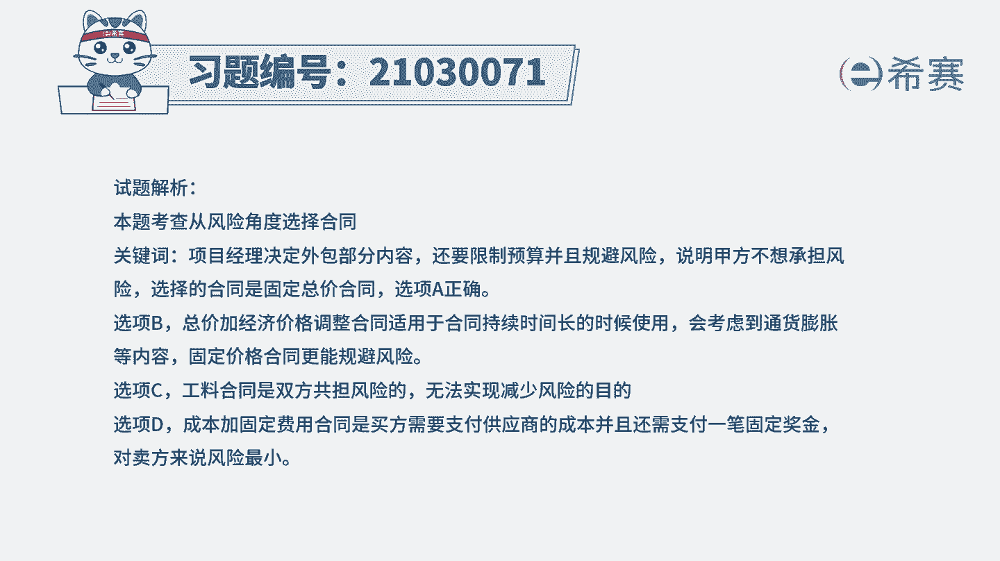

# 24年PMP考试模拟题200道，题目解读+知识点解析，1道题1个知识点（预测+敏捷） - P41：41 - 冬x溪 - BV17F411k7ZD

组织中标了一个办公楼承接项目，经分析，项目经理决定将此项目中的部分内容外包，由于这个项目预算有限，项目经理未减少风险，应该选择什么合同，A固定总价合同，B总价加经济价格调整合同。

C工料合同D成本加固定费用，读完题目回答题干，我们来看一下这道题目，它的关键词是什么，这个项目题干告诉你它预算有限，项目经理他为了减少风险，应该选择什么合同比较合适，那既然我们知道这个项目它的预算有限。

如果要是想预算不超支的话，那最好一开始就能够知道我们这个项目，他应该要支付多少钱，并且后面他还不会再发生变动，这对于买方而言，它的风险是比较小的，固定总价合同它是固定了一个价格，在一开始就已经知道了。

并且后面还不会发生改变，除非你的工作范围发生了变更，然后因为我们的合同他没有履行，而导致产生了一系列的成本增加，那这个风险他都由卖方来承担，所以他买方承担的风险是比较小的。

所以如果要是控制预算减少风险的话，那这道题最佳的选项应该是A选项，固定总价合同，我们再来分析一下其他三个选项，B选项，总价加经济价格调整合同这一类型的合同，它适用的是项目的周期比较长，签订的时间比较长。

这种情况，因为它往往会把通货膨胀考虑在里面，所以他会以现在已经知道的一个价格情况，对合同价格，然后先签订好，然后后面因为我们的通货膨胀了之后，再去做调整，所以固定总价位的合同。

它可以避免通货膨胀这一类的情况，所以这道题B选项肯定不如A选项那么的合适，再看看C选项，公量合同，工料合同，它兼具了成本补偿类合同和总价合同的，这两方的一个特点，但是他买方要承担一个成本的风险。

卖方他要承担一个单价的风险，所以双方它都是一个承担风险的，所以跟题干当中项目经理想减少风险，这个是不相符的，所以C选项也可以排除，再来看看D选项，成本加固定费用，成本加固定费用合同。

这个合同他会根据在合同当中，卖方他为了履行合同而所发生的一系列的成本，进行报销，并且它还会向卖方支付一笔固定的费用，作为利润，它对于卖方而言，这种风险肯定是比较小的，但是对于买方而言。

我们实际要支付多少费用也是不确定的，所以它可能会有一个预算超支的情况，所以D选项也可以排除，那这道题最佳选项是A选项，这是这道题的文字解析，有些同学可以暂停看一下。

整个题目讲解下来，我们就可以知道这道题目。

