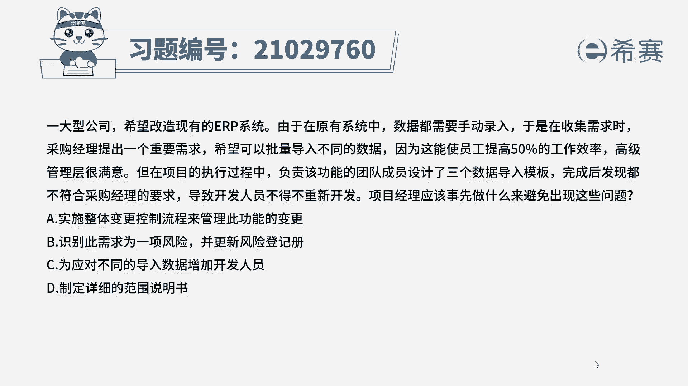
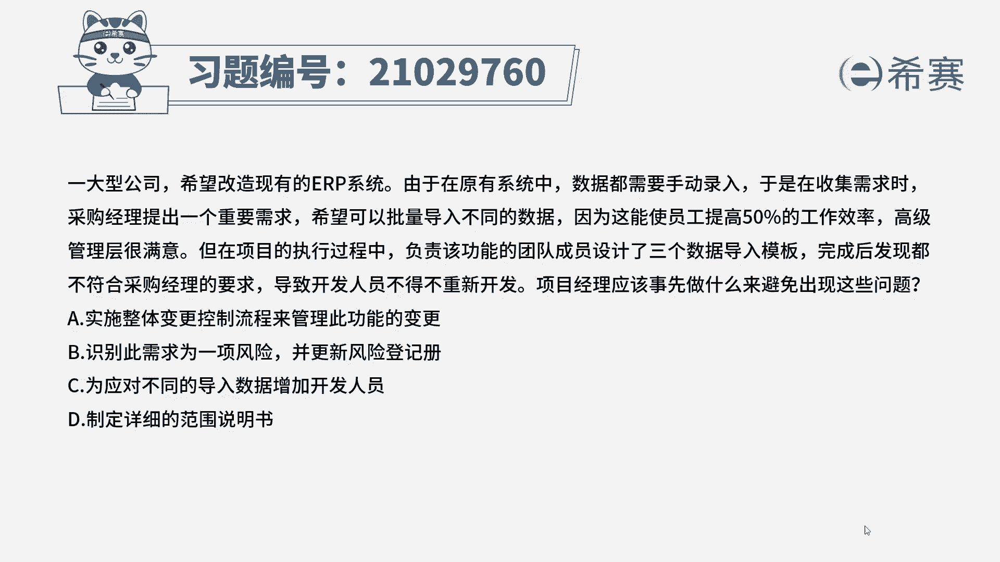
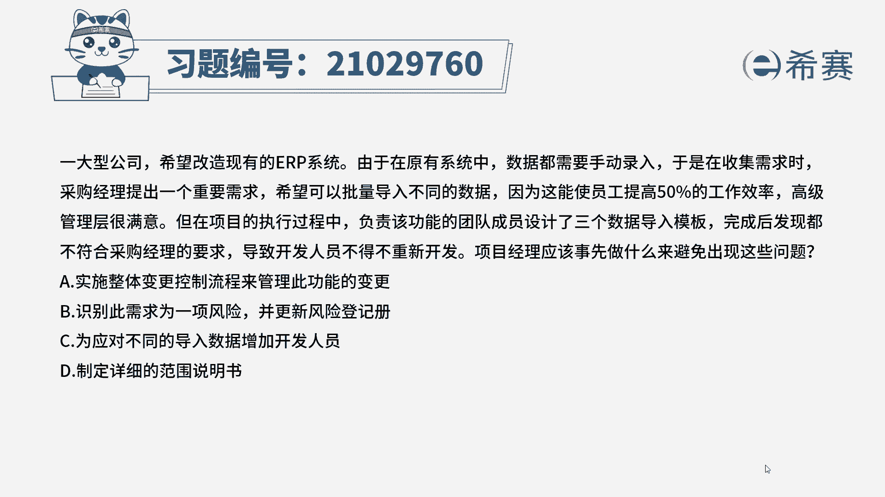
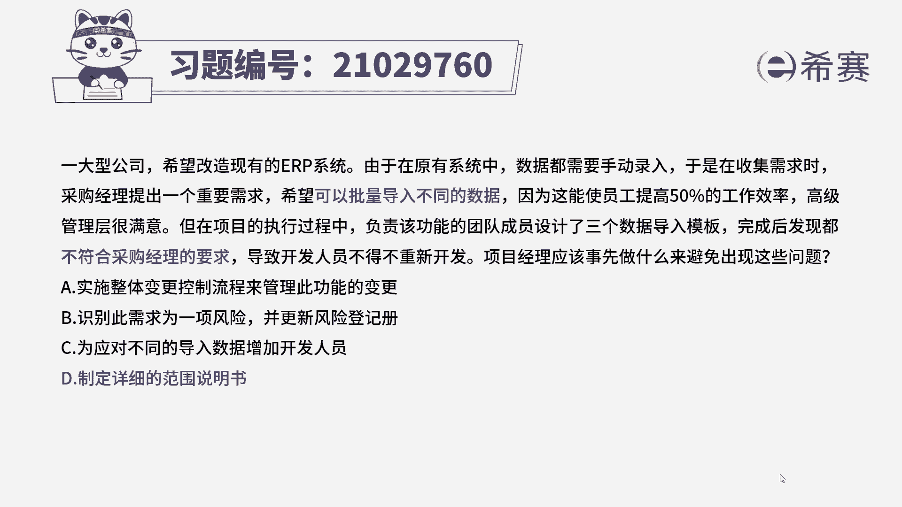
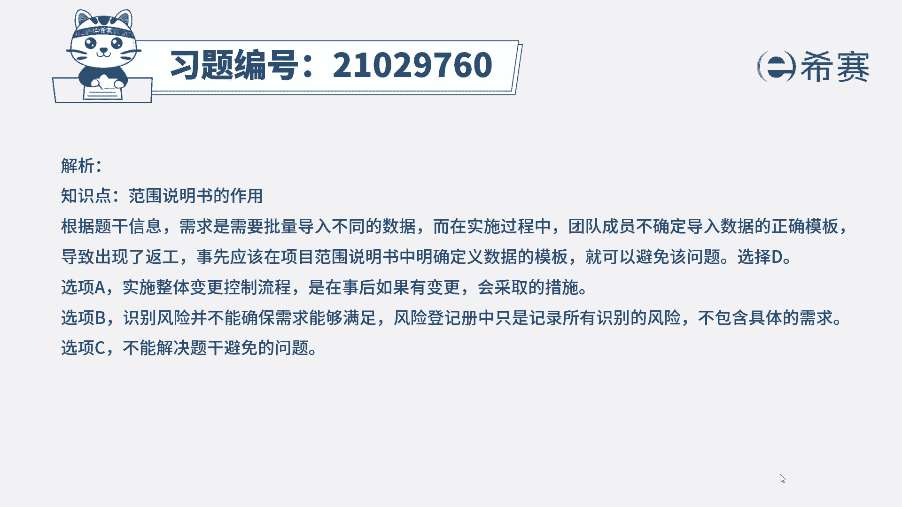
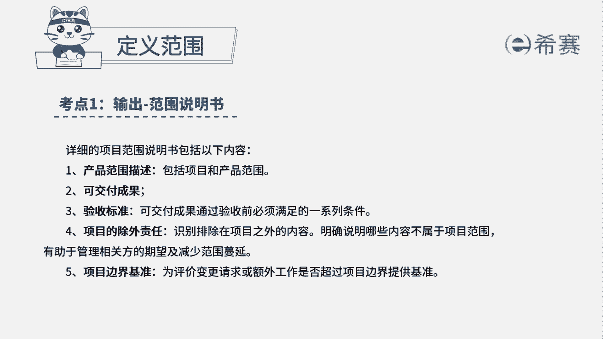

# 24年PMP考试模拟题200道，题目解读+知识点解析，1道题1个知识点（预测+敏捷） - P47：47 - 冬x溪 - BV17F411k7ZD

一大型公司希望改造现有的ERP系统，由于在原有系统中。

数据都需要手动录入，于是在收集需求时。

采购经理提出一个重要需求，希望可以批量导入不同的数据。

因为这能使员工提高50%的工作效率，高级管理层很满意。

但是在项目的执行过程中，负责该功能的团队成员设计了三个数据导入，模板，完成后发现都不符合采购经理的要求，导致开发人员不得不重新开发，项目经理应该事先做什么，来避免出现这些问题。

A实施整体变更控制流程来管理此功能的变更，B识别此需求为一项风险，并更新风险登记册，C为应对不同的导入数据，增加开发人员，D制定详细的范围说明书，那这道题目它比较长，我们根据题干找出关键词，采购经理。

他是希望可以批量导入不同的数据，但是在实施的过程当中，团队成员不确定导入数据的正确模板，设计出了三个模板，但是都不符合他的要求，最后出现了反攻，也就是说数据的导入模板范围不清晰，才导致了我们反攻。

应该在范围说明书中明确定义数据的模板，那就可以避免这样子的问题，所以这道题我们选择第一选项，我们再来看一下其他三个选项，A选项实施整体变更控制流程，这是在事后如果会有变更会采取的措施。

那题目问的是事先采取什么措施，所以排除B选项，识别此需求为一项风险，那识别风险也并不能够保证需求能够得到满足，并且风险登记册它只是记录所有识别的风险，并不包含具体的需求，也排除C为应对不同的导入数据。

增加开发人员，那现在题目表明不是我们人员不够的问题，是因为我们模板没有满足采购经理的要求，所以就算增加开发人员，我们也不能够避免，因为当初没有定义清楚模板，而导致要重新开发的问题，所以也排除。

那这道题最佳选项是D选项。

这是这道题的文字解析，有需要的同学可以暂停看一下。

那这道题考察的知识点是项目范围管理当中。

