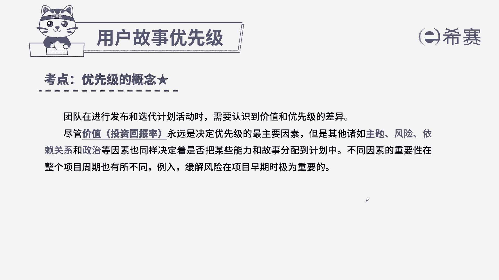

# 24年PMP考试模拟题200道，题目解读+知识点解析，1道题1个知识点（预测+敏捷） - P4：4 - 冬x溪 - BV17F411k7ZD

在项目实施过程中，一位重要干系人询问敏捷教练，在下一个迭代版本的交付中，是否包含某项特定功能，敏捷教练应该做什么，转述给敏捷团队和产品负责人，共同分析该功能的优先级和可能性。

B告知干洗下个迭代将包含该功能，C增大团队规模，已确保完成干洗所期望的功能，D审查上个迭代中团队速度，以此评估完成该功能的可能性，本题考法最佳实践，通过题干找到关键词，一个单型问我们的敏捷教练。

在我们的迭代中是否包含某个功能，我们跟需求跟功能有关的，一定是和我们产品负责和团队有关，而我们的敏捷教练，他的岗位职责是帮助团队践行敏捷原则，以及排除一些组织障碍，所以我们来看四个选项。

A转述给我们的团队和产品负责人，他们来分析研究，所以刚刚提到了吻合我刚刚的分析，所以选择正确选项，A选项，我们来看一下其他三个选项，B告知干弦，下次阶段包含此功能，我们的敏捷教练是没有权利做这件事情的。

因为功能的取舍是由产品负责人和团队来决定，C增大团队规模，以确保包含期望的功能，这项是我们的具体操作，到底我们需不需要子弹的团队，也是在产品负责人团队分析之后，我们再来决定。

而我们的敏捷教练不应该直接操作，D审查上一次迭代的速度，以确保包含进来，这项内容也不是属于我们敏捷教练操作的，所以我们这些选项是A选项。

这是本题的解析，大家可以看一下本题的相关知识点。

关于我们产品或功能的优先级，一定是要找到我们的产品负责人。

