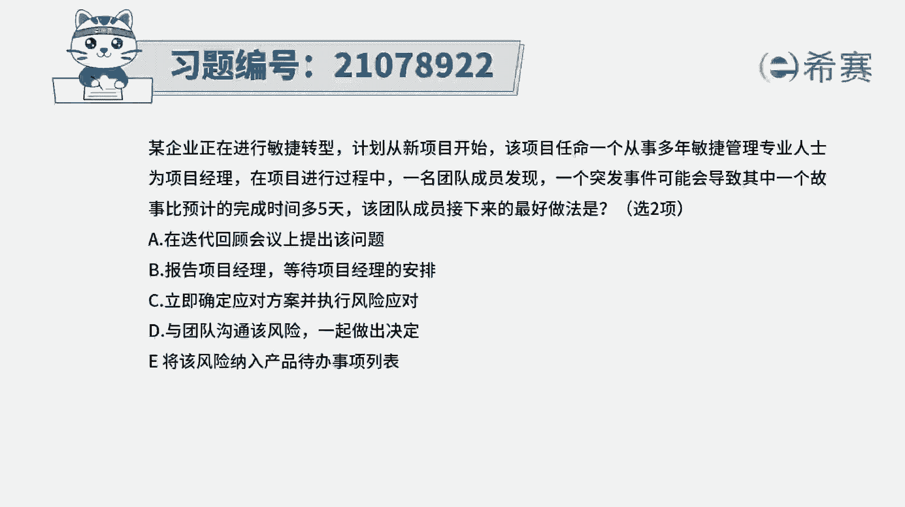
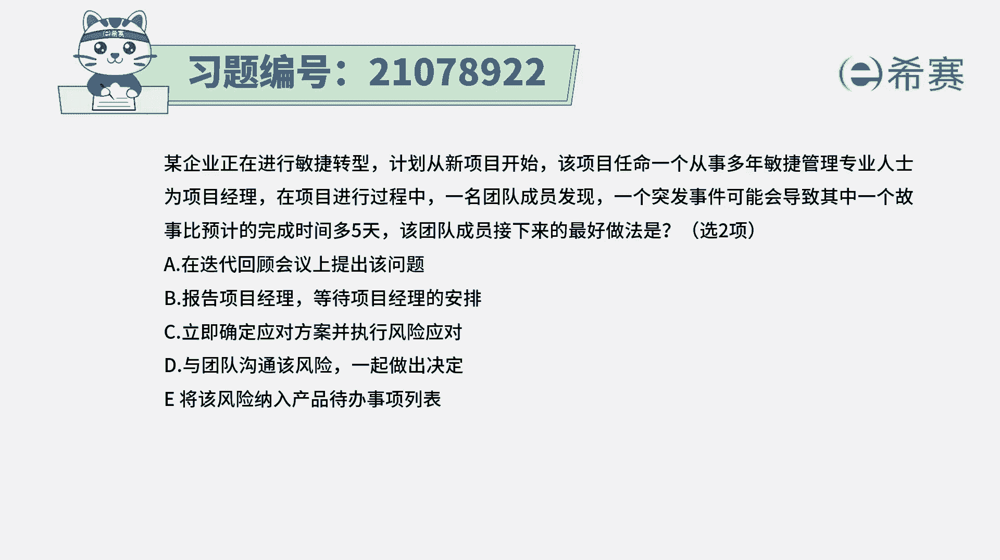
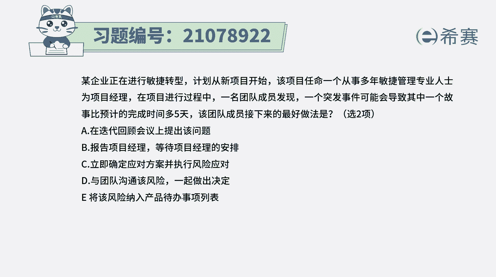
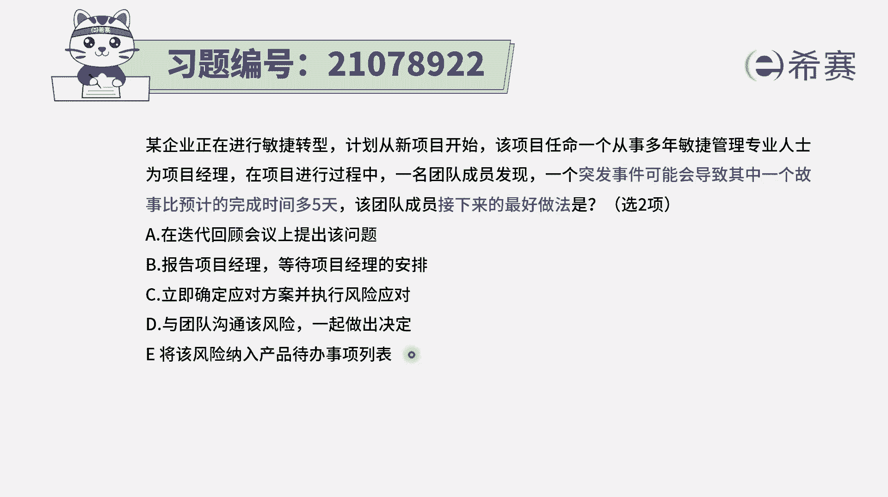
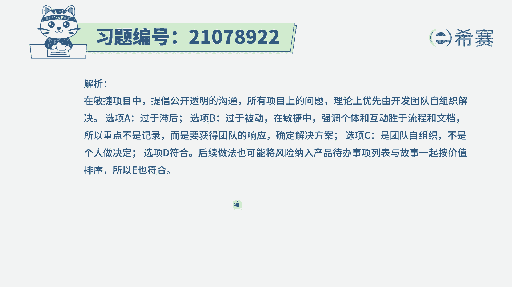
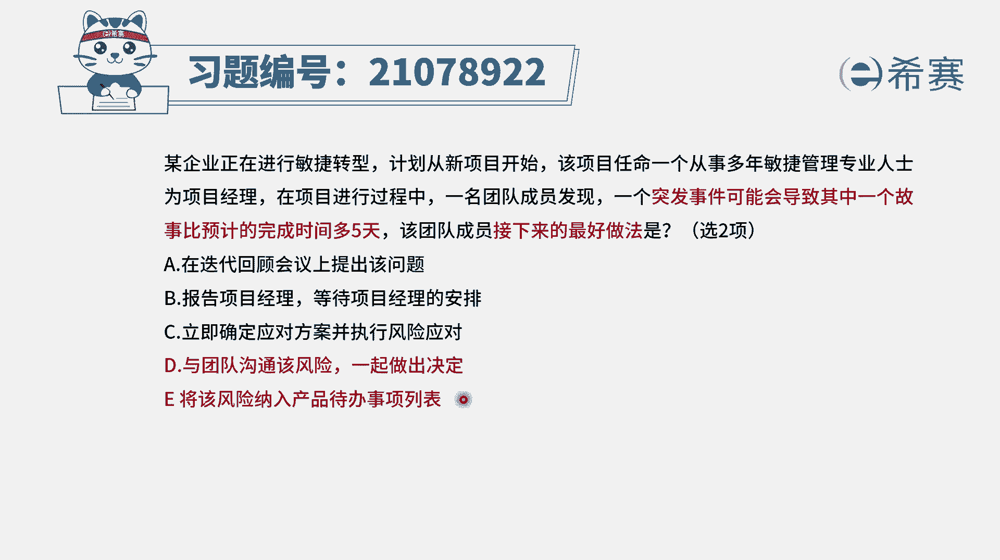

# 24年PMP考试模拟题200道，题目解读+知识点解析，1道题1个知识点（预测+敏捷） - P51：51 - 冬x溪 - BV17F411k7ZD

某企业正在进行敏捷转型计划，从新项目开始。

该项目任命一个从事多年敏捷管理专业人士，为项目经理。

在项目进行过程中，一名团队成员发现一个突发事件，可能会导致其中一个故事。

比预计的完成时间多五天，该团队成员接下来最好的做法是哪两项呃。

这里面的话他明确会告诉你要选两项，一个突发事件，导致可能要完成的时间要延迟五天，这是一个风险对吧，因为他说的是一种可能性，然后我们再来分别看一下这五个选项，选项A说是在迭代回顾会议上来提出这个问题。

那这个有可能会已经是太晚了，理论上来讲应该是发现这种风险，马上就要进行这种相对应的这种操作，后续的操作选项B报告项目经理，等待项目经理的安排呃，在这里的话要提醒一个点，因为它提供的是敏捷转型。

是做敏捷项目管理，那既然是在做敏捷项目管理的话，有一个词叫自组织团队，每一个人都是团队的主人翁，所以在这种情况下呢，其实就等待项目经理安排的这一表达，就显得不太是自组织团队就不太合适。

选项C立即确定应对方案并执行风险应对，而在这里我们需要去了解一下，通常情况下他这种风险呢是一种可能性，他可能会发生，它也可能不会发生，我们确实是可以先去分析它，然后呢做出应对方案。

但是它不是说马上就要去应对的，所以这种表达方式其实有问题，而选项D与团队沟通，该风险一起做出决定，也就是我们一起来去对风险进行分析交流讨论，以及想出应对的解决方案，这个就是可选的啊。

选项一将该风险纳入到产品待办事项列表，也就是说风险在敏捷中会有一个这样的表达，就是风险它是一个反价值叫avenue，那通常来讲的话，这些价值内容，都应该要放到产品待办事项列表中，而风险呢他也要放进来。

也要作为一个待办事项，至于说什么时候去做的话，他可能会有一定的要求，所以这个题目的答案是选D和E。

解析呢在这边需要的同学可以自行查看一下。

我们重点需要去关注点有两个，一个是当风险发生以后呢，我们作为一个自组织团队，应该是自己来一起讨论沟通，交流他的这样一个情况以及应对的方案，第二个呢风险它是反向价值，它是avenue。

他也要去做一个产品代办事项列表中的一项，来列入进来。

